# Architecture

## Feature 027 — Chat Turn Decomposition (Complete — Phases 1–7, Tasks T001–T027 Verified)

- [Feature 027 specification](../specs/027-chat-turn-decomposition/spec.md), [plan](../specs/027-chat-turn-decomposition/plan.md), and [tasks](../specs/027-chat-turn-decomposition/tasks.md) decompose Python chat turn event translation, domain projections, memory coordination, admission, and lifecycle while preserving SSE and security contracts.
- **Phase 1: Event Transport Decoupling (Tasks T001–T003 Complete)**:
  - Transport serialization `format_sse(event: ChatTurnEvent) -> str` relocated from domain definitions into `apps/agent/src/agent/streaming/sse.py`.
  - Domain models in `apps/agent/src/agent/chat_turn/events.py` are strictly pure Pydantic models and discriminated unions with zero transport logic and imports limited to standard library `typing` and `pydantic`.
  - Wire compatibility verified byte-for-byte across all 8 canonical events (`token`, `tool_call`, `tool_result`, `flight_results`, `ACTION_HANDOFF`, `ACTION_REQUIRED`, `done`, `error`).
- **Phase 2: Foundational Graph Behavior Baseline (Tasks T004–T005 Complete)**:
  - Authoritative synthetic graph event fixtures locked in `apps/agent/tests/test_chat_turn_runner.py` before extracting `GraphEventInterpreter` and `ToolResultResolver`.
  - Established validated tool execution invariants: `on_chain_end` for `tools` is the sole source of validated tool messages; `on_tool_end` is strictly timing-only; `ToolResultEvent` strictly precedes specialized events (`FlightResultsEvent`, `ActionRequiredEvent`); invalid readiness fails closed with no `ToolResultEvent`.
  - Established output streaming and fallback invariants: incremental token streaming via `on_chat_model_stream`; empty-stream fallback to `on_chat_model_end`; empty-model-end fallback to final-node message output; chunk deduplication preventing duplicate token emission; all output paths route through the single per-turn `OutputStreamSession`.
- **Phase 3: User Story 1 — Isolate Graph Event Translation (Tasks T006–T011 Complete)**:
  - **Slice 1: ToolResultResolver Extraction (Tasks T006–T007 Complete)**:
    - Pure domain projection engine `ToolResultResolver` in `apps/agent/src/agent/chat_turn/resolver.py` maps validated tool results and handoff node completions to typed `ToolResolution` and `HandoffResolution`.
    - Sanitizes booking readiness, loads active search snapshots, and handles handoff node outcomes fail-closed.
  - **Slice 2: GraphEventInterpreter Extraction (Tasks T008–T009 Complete)**:
    - Pure async generator stream translator `GraphEventInterpreter` in `apps/agent/src/agent/chat_turn/interpreter.py` translates LangGraph v2 event streams into domain `ChatTurnEvent` items.
    - Completely tool-name agnostic: 0 tool name inspections (`git grep -n -E "tool_name\s*(==|in)"` = 0).
    - Pure port isolation: strictly 0 imports or calls to Redis, NestJS client, or Guardrails.
    - Raises typed `ProjectionBlockedException` fail-closed upon blocked tool or handoff node resolution, with zero `ToolResultEvent` emitted.
    - Model streaming, model-end fallback, and node-end fallback deduplicated with raw `TokenEvent` emission.
  - **Slice 3: Runner Wiring & Verification Gate (Tasks T010–T011 Complete)**:
    - Wired `GraphEventInterpreter` and `ToolResultResolver` into `apps/agent/src/agent/chat_turn/runner.py`, eliminating ~560 lines of legacy inline translation.
    - Preserved 4-step causal failure cleanup when `ProjectionBlockedException` occurs, emitting static `ErrorEvent`.
    - Maintained single `OutputStreamSession` routing for all raw token chunks and approved partial response token accounting.
    - Verified 100% pass across all 7 focused test suites (180 passed, 2 skipped, 0 failed; exit code 0).
    - Ruff check & format check: 0 errors (exit code 0).
- **Phase 4: User Story 2 — Coordinate Conversation Memory (Tasks T012–T015 Complete)**:
  - Extracted `ConversationMemory` in `apps/agent/src/agent/memory/conversation.py` providing unified `get_context()` and `schedule_compaction()` interfaces.
  - Encapsulated historical message guardrail scanning, unsafe summary discarding, window size defaults, and typed exception mapping (`SessionNotFoundException`, `MemoryPersistenceException`, `ContextBlockedException`).
  - Preserved `totalMessageCount + 2` post-turn compaction accounting and GC-safe `background_tasks` registration.
  - Wired into `apps/agent/src/agent/chat_turn/runner.py` with exact `AdmissionContext` policy/identity forwarding and preserved direct-call fallback behavior.
- **Phase 5: User Story 3 — Reuse Ordered Admission (Tasks T016–T021 Complete)**:
  - Extracted reusable modular admission package `apps/agent/src/agent/admission/`:
    - `AuthService` (`auth.py`): Decodes and verifies JWT tokens against secret ring, extracts `sub`/`jti`/trace/correlation IDs, and enforces active account status via NestJS client `/access/check`, returning typed `AuthenticatedUser`.
    - `InputAdmissionService` (`input_admission.py`): Enforces max message length, checks gateway health/availability, and validates input through `GuardrailGateway.validate_input()` with deterministic PII fallback, returning typed `InputAdmissionResult`.
    - `QuotaService` (`quota.py`): Enforces Redis daily message limits and burst window rate limiting with structured telemetry, supporting dynamic repository class resolution for test compatibility.
  - Thin FastAPI dependency wrappers in `apps/agent/src/agent/streaming/sse.py`:
    - Implemented ordered dependency providers (`get_auth_service`, `get_authenticated_user`, `get_input_admission_service`, `get_admitted_input`, `get_quota_service`, `check_chat_quota`).
    - Enforced strict ordered progression: `auth` -> `length` -> `gateway_health` -> `input_scan` -> `quota` -> `runner`.
    - Zero-Redis PII short-circuit: Ingress messages with PII immediately return `ErrorEvent(GUARDRAIL_BLOCKED)` SSE stream before quota checks or Redis client initialization.
    - Single-scan guarantee: Validated admission decision forwarded directly through `ChatController.stream()` to runner without redundant re-scanning.
    - Transparent backward compatibility: Direct-call fallback and module-level monkeypatch compatibility for legacy tests.
- **Phase 6: User Story 4 — Sequential Turn Lifecycle (Tasks T022–T024 Complete)**:
  - `chat_turn/coordinator.py` owns session bootstrap, lease acquisition and active-fence checks, active search snapshot loading, conversation memory, graph interpretation, one `OutputStreamSession`, message persistence, one success-path flush, and the post-turn compaction trigger. Every model token passes through `pipeline.process_token(token)`.
  - `chat_turn/runner.py` remains a thin `ChatTurnRunner.run(command, validated_input)` facade; `chat_turn/__init__.py` exports `TurnSessionCoordinator`.
  - Failure cleanup is ordered: approved partial persistence (`asyncio.shield` on cancellation and forced persistence for `HANDOFF_FAILED`), non-flushing `pipeline.close()`/`aclose()`, lease release, then `ErrorEvent` construction. A timed-out partial batch is cancelled and joined before lease release; stale fences suppress `ActionRequiredEvent` and `ActionHandoffEvent` and route to `PERSISTENCE_ERROR`.
  - `ChatController.stream` and `streaming/sse.py` retain their existing validated-input and disconnect handling signatures; neither required a code change.
  - Six-file controller/SSE parity: 126 passed, 1 skipped; full non-Redis agent suite: 1,280 passed, 11 skipped, 12 deselected. Ruff check and format pass for the extracted boundary.
- **Completed module boundaries**:
  - `chat_turn/interpreter.py` translates LangGraph events without tool-name branching or guardrail/gateway construction. Validated `tools` chain-end messages reach `resolver.resolve`; `on_tool_end` records timing only.
  - `chat_turn/resolver.py` owns `ToolResultResolver` domain projections, including search snapshots, booking readiness, and handoff node outcomes.
  - `memory/conversation.py` owns `ConversationMemory` context selection, historical guardrail re-scan, and compaction delegation using the original per-turn admission context.
  - `admission/` provides reusable `AuthService`, `InputAdmissionService`, and `QuotaService`; thin FastAPI `Depends` wrappers in `streaming/sse.py` preserve auth, length/health, input scan, then quota order. The validated input reaches the runner without a second scan.
- **Phase 7: Polish and Cross-Cutting Verification (Tasks T025–T027 Complete)**:
  - Static censuses found no `format_sse` in `chat_turn/events.py`, no tool-name branching or guardrail/gateway construction in `chat_turn/interpreter.py`, and no `Any` in the extracted coordinator, runner, admission, interpreter, resolver, or conversation modules.
  - Full-package Ruff lint and format checks passed. The eight focused decomposition suites passed (184 passed, 1 skipped); the Phase 7 non-Redis regression gate excluding `test_security_performance` passed (1,272 passed, 11 skipped, 20 deselected). Exact commands, exit codes, and timings are in `specs/027-chat-turn-decomposition/verification.md`.

## Feature 028 — Backend Client Unification (Phase 3 User Story 1 complete, 2026-09-26)

- [Feature 028 specification](../specs/028-backend-client-unification/spec.md), [plan](../specs/028-backend-client-unification/plan.md), and [tasks](../specs/028-backend-client-unification/tasks.md) unify the three core web server transport consumers and six booking route response adapters. Dashboard `INVALID_RESPONSE`, booking error-body forwarding, and mutation single-send behavior remain contract requirements.
- **Phase 1: Baseline Characterization (T001–T004 Complete)**: Locks current behavior in dashboard, flight-search, booking-management, and cancellation route specs. Covers 400/422 message forwarding and fallback, transient mutation single-send, response status/body/header mapping, and provider-ID stripping across 103 baseline tests.
- **Phase 2: Foundational Client Contract (T005–T007 Complete)**:
  - Extracted unified server-to-server client factory `createBackendClient` and default instance `backendClient` in `apps/web/lib/server/backend-client.ts`.
  - Enforces `server-only` execution boundary, dynamic `API_URL` resolution precedence (`baseUrl` -> `API_URL` -> `NEXT_PUBLIC_API_URL` -> `localhost:3001`), missing-token short-circuit before fetch (`missing_token`), and mandatory `Cache-Control: no-store`.
  - Enforces strict GET retry matrix (max 3 attempts, 100ms exponential base delay, 502/503/504 and 429 Retry-After support with delta-seconds/HTTP-date parsing; 500 and 4xx fail immediately).
  - Fast-fails all mutations (`POST`, `PUT`, `PATCH`, `DELETE`) on any result with strictly 1 attempt (zero automatic mutation replay).
  - Bounded request deadlines: 10s per attempt via `AbortController`, 31s total request deadline bounding all attempts and wait delays.
  - Discriminated transport results: success with validated Zod payload, HTTP failure with status/body, and transport failure with strictly safe cause codes (`missing_token`, `network`, `timeout`, `invalid_json`, `invalid_payload`).
  - Supports bodyless 2xx handling via `responseMode: 'none'` returning `{ ok: true, data: undefined }` without reading response body.
  - Zero-credential privacy invariant: diagnostics log only fixed categorical causes; zero tokens, request bodies, URLs, or PII emitted.
  - See [execution evidence](../specs/028-backend-client-unification/verification.md).
- **Phase 3: User Story 1 — Resilient Dashboard Reads (T008–T010 Complete)**:
  - Migrated `getDashboardSummary` in `apps/web/lib/server/dashboard.ts` to `backendClient.request('/api/dashboard/summary', DashboardSummarySchema)`.
  - Added bounded transient GET recovery on 502/503/504 and 429 with `Retry-After` header within budget, recovering cleanly on second attempt.
  - Preserved strict single attempt for deterministic 500 (zero retries) returning retryable `UPSTREAM_UNAVAILABLE`.
  - Preserved unauthenticated session short-circuit before dispatching HTTP request.
  - Strictly preserved 100% exact outcome contract parity: reasons (`UNAUTHENTICATED`, `FORBIDDEN`, `INVALID_RESPONSE`, `UPSTREAM_UNAVAILABLE`), exact user-facing error messages, and `retryable` booleans.
  - Purged obsolete duplicated helpers (`apiUrl`, `getAccessToken`, `REQUEST_TIMEOUT_MS`, bespoke `AbortController`) from `dashboard.ts`.
  - Zero credential, token, URL, DB error, or stack trace leakage in failure outcomes.
  - Locked behavior with 24 passing unit tests in `apps/web/lib/server/dashboard.spec.ts` (42 passing across client + dashboard).
  - See [execution evidence](../specs/028-backend-client-unification/verification.md).

## Feature 026 — Agent Boundary Simplification (Complete - Tasks T001–T037)

Planning artifacts: [specification](../specs/026-agent-boundary-simplification/spec.md), [plan](../specs/026-agent-boundary-simplification/plan.md), and [tasks](../specs/026-agent-boundary-simplification/tasks.md).

#### Post-Change Static Censuses, Documentation Sync & Full Gate Verification (Phase 5 / Tasks T033–T037 Complete)
- **Static Ripgrep Censuses (T033)**:
  - Zero (0) references to `agent-gateway` under `apps/api/src/chat/`.
  - Zero (0) references to `@/chat/chat-message-crypto.service`, `GuardrailRegistry`, `create_production_registry`, `OutputPIILayer`, `InputGuardrailPipeline`, or `ToolOutputGuardrailPipeline` across `apps/api` and `apps/agent`.
  - Production `OutputGuardrailPipeline` construction strictly localized inside `apps/agent/src/agent/guardrails/gateway.py`.
  - Zero (0) external imports of `OutputGuardrailPipeline` or `OutputGuardrailBlockedError` from `output_pipeline.py`. Callers import `OutputGuardrailBlockedError` strictly from `agent.guardrails.base`; external callers are strictly limited to stateless `payload_free_config` and re-exported `approved_model_content` from `output_pipeline.py`.
  - Exactly one definition each of `deterministic_pii_match`, `_is_output_guardrail_disabled`, and `approved_model_content` strictly in `apps/agent/src/agent/guardrails/pii.py`.
- **Scope & Diff Guard Confirmation (T034)**:
  - Zero (0) Prisma schema changes or migrations in `apps/api/prisma/`.
  - Zero (0) dependency changes in `apps/api/package.json`, `pnpm-lock.yaml`, or `apps/agent/pyproject.toml`.
  - Zero (0) new endpoints or feature flag additions in `apps/api/src/app.module.ts` or `apps/agent/src/agent/main.py`.
- **Architectural Boundary Invariants (T035)**:
  - **NestJS Architecture**:
    - `AgentChatModule` (`apps/api/src/agent-gateway/agent-chat/`) owns edge persistence, controller, and access adapter under `@UseGuards(AgentApiKeyGuard, ClaimTokenGuard)` with claim token bypass for `/access/check`.
    - `ChatMessageCryptoModule` (`apps/api/src/common/`) is the sole provider and export owner of record-bound AES-256-GCM encryption with 12-byte random nonce and 16-byte authentication tag.
    - Isolated `ChatModule` (`apps/api/src/chat/`) exports strictly only `ChatService` with zero inward edge/gateway dependencies.
    - Decoupled `AttestedFlightSearchModule` consumes `ChatMessageCryptoModule` directly with zero dependency on `ChatModule`.
  - **Python Guardrail Architecture**:
    - `GuardrailGateway` (`apps/agent/src/agent/guardrails/gateway.py`) enforces immutable default 4-tuples for input validation `(LengthValidator, PIIDetector, InjectionDetector, TopicBoundary)` and tool results `(SizeStructureValidator, SchemaValidator, PIIScanner, UntrustedContentInjectionDetector)` validated at constructor time via `assert_layer_order`.
    - `OutputStreamSession` async context manager per-turn lifecycle spans all runner branches (final text, tool arguments, token stream) with one-shot `flush()` and idempotent non-flushing `close()`.
    - Strict causal cleanup ordering enforced across all runner exits: `partial_persist` -> `close` (non-flushing) -> `release` (lease release).
    - Ingress pre-quota admission in `apps/agent/src/agent/streaming/sse.py` terminates early with zero Redis calls on any blocked input.
    - Standalone `agent.guardrails.pii` owns all PII pattern matching and disabled-guardrail detection.
- **Complete Verification Gate Execution (T037)**:
  - NestJS API Gate: 5 unit suites (98/98 passed), 10 E2E suites (123/123 passed), ESLint clean (0 errors, 0 warnings), Shared types (110/110 passed), TypeScript `tsc --noEmit` clean, and production build clean (all exit code 0).
  - Python Agent Gate: Ruff check clean (exit code 0), Ruff format clean (exit code 0), targeted security pytest suite (265 passed, 1 skipped, exit code 0), and full pytest suite excluding redis integration (1141 passed, 4 skipped, 12 deselected, 0 failed, exit code 0).
  - Evidence recorded in `specs/026-agent-boundary-simplification/verification/api-final.md` and `agent-final.md`.

#### Fixture Migration, Dead Code Elimination & US2 Verification Gate (US2 Phase 4 Slice 4 / Tasks T030–T032)
- **Registry Fixture Cluster Migration (T030)**:
  - Migrated test fixtures across 22 test suites (`test_enforcement.py`, `test_gateway.py`, `test_input_layers.py`, `test_lifecycle.py`, `test_memory_boundary.py`, `test_model_output_boundary.py`, `test_registry.py`, `test_rollout.py`, `test_security_performance.py`, `test_tool_authority.py`, `test_tool_boundary.py`, `test_tool_integration.py`, `test_tool_layers.py`, `test_chaos_simulation.py`, `test_chat_turn_runner.py`, `test_graph.py`, `test_guardrails.py`, `test_negative_privacy_audit.py`, `test_rollback_matrix.py`, `test_stream_auth_budget.py`, `test_stream_session_control.py`, `test_tools.py`) from deprecated `create_production_registry()` / `GuardrailRegistry` fixtures to direct `GuardrailGateway()` instantiation or keyword-only tuple injection (`_input_layers`, `_tool_layers`).
  - Verified no test treats `is_healthy()` as constructor recovery.
- **Dead File & Obsolete Symbol Elimination (T031)**:
  - Deleted obsolete files: `apps/agent/src/agent/guardrails/registry.py` (and `OutputPIILayer`), `apps/agent/src/agent/guardrails/input_pipeline.py`, `apps/agent/src/agent/guardrails/tool_output_pipeline.py`, and `apps/agent/src/agent/guardrails/tool_schemas.py`.
  - Repository census confirmed zero lingering imports or references to `GuardrailRegistry`, `create_production_registry`, `InputGuardrailPipeline`, `ToolOutputGuardrailPipeline`, or `OutputPIILayer`.
- **US2 Verification Gate Execution (T032)**:
  - Verified full test suite passes (1141 passed in non-Redis agent pytest suite).
  - Code hygiene verified: clean ruff check & ruff format (0 errors, 0 warnings).
  - US2 is 100% complete.

#### Production Gateway Refactoring, Stream Session, PII Extraction & Ingress Admission (US2 Phase 4 Slice 3)
- **Direct Tuple Composition & Layer Ordering (`assert_layer_order`) (T024)**:
  - `GuardrailGateway` constructs immutable default layer tuples for input validation `(LengthValidator, PIIDetector, InjectionDetector, TopicBoundary)` and tool results `(SizeStructureValidator, SchemaValidator, PIIScanner, UntrustedContentInjectionDetector)`.
  - Layer composition is asserted at instantiation time via `assert_layer_order(stage, layers, expected_types)`: checks exact layer count, correct type per position, unique keys across stages, and linear declaration of same-stage prerequisites. Invalid composition raises fail-closed `ValueError` at constructor time.
  - Keyword-only private parameters `_input_layers` and `_tool_layers` provide explicit seams for unit tests without mutable registries.
  - Sole public tool verification method is `validate_tool_result(context, tool_name, result)`, ensuring raw tool payload evaluation and PII precedence over schema invalidity.
- **`OutputStreamSession` Async Context Manager Facade & Causal Cleanup (T025, T026)**:
  - `GuardrailGateway.stream_output(context, *, config, session_id)` provides an `OutputStreamSession` async context manager.
  - Encapsulates a per-turn `OutputGuardrailPipeline` spanning all three runner branches (final response text, tool call arguments, token streaming).
  - Exposes `process_token(token)` for chunk-buffered token analysis, one-shot `flush()`, and idempotent non-flushing `close()`.
  - `OutputGuardrailBlockedError` is owned by `agent.guardrails.base` preserving `partial_response`, `layer`, `rule`, and message.
  - Causal cleanup ordering is strictly enforced across all runner exits: `partial_persist` -> `close` (non-flushing) -> `release` (lease release).
- **Standalone `agent.guardrails.pii` Ownership (T027)**:
  - `agent.guardrails.pii` is the sole authoritative owner of `deterministic_pii_match`, `_is_output_guardrail_disabled` (covering all 5 legacy disabled shapes), and `approved_model_content`.
  - All duplicate regexes and predicate functions eliminated; `output_pipeline.py` imports directly from `pii.py` while retaining stateless `payload_free_config`. Zero circular imports.
- **SSE Pre-Quota Ingress Admission & Zero Redis on Block (T028)**:
  - `apps/agent/src/agent/streaming/sse.py` validates inputs in strict ingress progression: `access check -> length guard -> gateway health -> validate_input -> Redis/quota`.
  - If `decision.status == "BLOCK"`:
    - If `decision.response_key == GUARDRAIL_INPUT_PII`: returns `ErrorEvent` with `code="GUARDRAIL_BLOCKED"` (`Your message contains protected personal information and cannot be processed.`).
    - Else: returns `ErrorEvent` with `code = decision.response_key or "GUARDRAIL_INPUT_BLOCKED"` (`Input rejected by security guardrail: {code}`).
    - Both paths terminate early as SSE streams before quota admission or Redis client initialization.
    - Zero Redis calls and zero quota consumption on ANY blocked ingress decision.
  - Admitted turns forward `admission_decision` to `ChatController.stream`, preventing redundant input revalidation.
- **Canonical `get_guardrail_gateway` Singleton (T029)**:
  - `apps/agent/src/agent/main.py` provides `get_guardrail_gateway()` with double-checked thread-safe caching.
  - Shared across module-level execution and lifespan lifecycle; failure during production construction aborts startup fail-closed.

#### Output Stream Session, Delegate & PII Utility Characterization (US2 Phase 4 Slice 2)
- **Persistent Stream Session & Runner Lifecycle (T020)**:
  - `GuardrailGateway.stream_output(context, *, config, session_id)` async context manager session characterized.
  - One stream session spans all three runner branches (final response text, tool call arguments, token streaming) per turn.
  - Stream session semantics: `process_token(token)` maintains one shared buffer and cumulative `partial_response`; `flush()` is one-shot after model completion; `close()` is idempotent and non-flushing (never emits buffered undecided bytes); `__aexit__` guarantees `close()` without suppressing exceptions.
  - `OutputGuardrailBlockedError` preserves original `partial_response`, `layer`, `rule`, and message without modification.
  - Strict causal cleanup ordering verified: `approved_partial_persistence` -> `close` (non-flushing) -> `lease_release` across normal completion, blocked output, early return / stale fence, cancellation, and mid-turn exceptions.
- **Delegate Output Pipeline & Stateless Helper Assertions (T021)**:
  - Transitioned `OutputGuardrailBlockedError` imports across 8 delegate test files to `agent.guardrails.base`.
  - Asserted target ownership: `output_pipeline.py` must import `deterministic_pii_match` and `_is_output_guardrail_disabled` directly from `agent.guardrails.pii` with zero duplicate definitions and zero circular imports.
  - `payload_free_config` characterized as a stateless pure helper retaining exactly 6 configurable keys.
  - Streaming-disabled passthrough behavior asserted across all 5 legacy disabled-config shapes in `OutputGuardrailPipeline`.
- **Shared PII Utility Coverage & Lone Fallback Migration (T023)**:
  - Comprehensive characterization for `agent.guardrails.pii`: `deterministic_pii_match` (Luhn credit cards, phones, emails, credentials, passports, safe content, cross-token buffering), `_is_output_guardrail_disabled` (all 5 shapes), and `approved_model_content` (filtering, non-string handling, prefix preservation).
  - Migrated lone fallback in `test_tool_schemas.py` directly to registered tool `args_schema` and `TOOL_INPUT_SCHEMAS`, leaving zero consumers for `tool_schemas.py`.

#### Guardrail Gateway Construction, Ingress Ordering & Authority Characterization (US2 Phase 4 Slice 1)
- **Gateway Constructor & Ordered Composition (T017)**:
  - Default constructor `GuardrailGateway()` instantiation characterized without caller-supplied registry.
  - Keyword-only private injection seam `GuardrailGateway(_input_layers=..., _tool_layers=...)` verified for tests.
  - Layer ordering asserted via `assert_layer_order(stage, layers, expected_types)`: enforces exact count, expected type at each position, unique keys, and earlier same-stage prerequisite declaration. Asserts raises on missing, duplicate, reordered, wrongly typed, unknown prerequisite, or late prerequisite composition.
  - `is_healthy()` represents only post-construction runtime readiness and never recovers an invalid constructor.
- **Fixed 4-Layer Ingress Ordering & Normalization (T018)**:
  - Strict 4-layer fixed input order characterized: `(LengthValidator, PIIDetector, InjectionDetector, TopicBoundary)`.
  - Short-circuiting verified on first blocking decision (length stops before PII; PII stops before injection; injection stops before topic).
  - Unchanged response keys (`GUARDRAIL_INPUT_LENGTH`, `GUARDRAIL_INPUT_PII`, `GUARDRAIL_INPUT_INJECTION`, `GUARDRAIL_INPUT_TOPIC`).
  - Detection-only normalization returns accepted non-Latin input unchanged.
- **Tool Authority & Raw Extra-Field PII Priority (T019)**:
  - Strict 4-layer fixed tool order characterized: `(SizeStructureValidator, SchemaValidator, PIIScanner, UntrustedContentInjectionDetector)`.
  - Sole public result method is `validate_tool_result(context, tool_name, result)` (no alternate aliases).
  - Raw extra-field PII scanning: `PIIScanner` scans original raw tool result before schema pruning; `GUARDRAIL_TOOL_PII` wins over `GUARDRAIL_TOOL_SCHEMA` without tuple indexing.
  - Sealed authority across all intents (GENERAL, SEARCH, CHECKOUT) and whole-batch rejection preserved.
- **SSE Pre-Quota Admission & Single Validation (T022)**:
  - Ingress order: access check -> length guard -> gateway health -> `validate_input` -> Redis/quota.
  - PII input makes zero `get_redis_client` or quota calls, returning exactly one first-and-only `error` event (`event: error`, `code: GUARDRAIL_BLOCKED`, `message: "Your message contains protected personal information and cannot be processed."`, `partialMessageId: null`).
  - Gateway unavailable (503) takes precedence before validation; healthy gateway PII rejection takes precedence over Redis failure.
  - Non-PII admission decision passed to `ChatController.stream` to prevent redundant revalidation.


#### Agent-Gateway Chat Boundary & Shared Crypto Extraction (US1 Complete)
- **Controller-Level Guard Reflection & Order**:
  - `AgentChatController` resides in `apps/api/src/agent-gateway/agent-chat/` and declares `@UseGuards(AgentApiKeyGuard, ClaimTokenGuard)` at the class level.
  - Guard execution order strictly evaluates `AgentApiKeyGuard` before `ClaimTokenGuard`.
- **Claim Token Guard Bypass for `/access/check`**:
  - `ClaimTokenGuard` explicitly bypasses `POST /agent-gateway/chat/access/check` when `X-User-Claim` header is absent, requiring only `X-Agent-API-Key` and `{ sub }` in the request body.
  - Identity verification and token revocation are delegated directly to `AgentChatAccessService.checkUserAccess`.
  - All remaining six session routes (`/sessions`, `/sessions/:sessionId/memory`, `/sessions/:sessionId/messages`, `/sessions/:sessionId/turns`, `/sessions/:sessionId/summaries`, `DELETE /sessions/:sessionId`) strictly enforce `X-User-Claim` and reject missing claims with HTTP 401 `INVALID_CLAIM_TOKEN`.
- **Fencing Token Headers**:
  - Write routes support both lowercase `x-fencing-token` and canonical `X-Fencing-Token` header spellings.
- **Shared Crypto Extraction (`apps/api/src/common/`)**:
  - `ChatMessageCryptoService` relocated to `apps/api/src/common/chat-message-crypto.service.ts` and encapsulated in `ChatMessageCryptoModule`.
  - Sole provider and export owner of chat message encryption. Operates with AES-256-GCM, 12-byte random nonce, 16-byte authentication tag, keyVersion `1`, and hex-encoded envelope format with record-bound AAD.
  - Decoupled from `EncryptionService`.
- **Isolated `ChatModule` & Decoupled `AttestedFlightSearchModule`**:
  - `ChatModule` has ZERO imports from `agent-gateway/`, removed `AgentAuthModule`, and exports strictly only `ChatService`.
  - `AttestedFlightSearchModule` imports `ChatMessageCryptoModule` directly and has ZERO dependencies on `ChatModule`.
  - `AgentChatModule` is mounted into `AgentGatewayModule`.
- **Verified Gate**:
  - Zero static census matches for `agent-gateway` in `chat/` and zero old crypto imports. All 10 affected E2E test suites passed.

## Feature 025 — Booking Umbrella Deletion (Complete - Tasks T001–T039)

Planning artifacts: [specification](../specs/025-booking-umbrella-deletion/spec.md), [plan](../specs/025-booking-umbrella-deletion/plan.md), and [tasks](../specs/025-booking-umbrella-deletion/tasks.md).

#### Domain-Owned Booking Controllers (US1 Complete)
- **Elimination of `BookingModule` Facade**:
  - The umbrella forwarding module `BookingModule` (`apps/api/src/booking/`) and its facade DTO directory have been deleted.
  - `AppModule` now directly imports and mounts `BookingManagementModule` and `CancellationModule`.
- **`BookingManagementController` (`apps/api/src/booking-management/`)**:
  - Directly handles authenticated traveler booking reads: `GET /bookings` (list with pagination & tab filtering) and `GET /bookings/:bookingId` (detail view).
  - Protected with `@UseGuards(JwtAuthGuard)` and parameter UUID validation via `ParseUUIDPipe({ version: '4' })`.
- **`CancellationController` (`apps/api/src/cancellation/`)**:
  - Normalized to canonical REST sub-resource hierarchy under `@Controller('bookings/:bookingId/cancellation')`: `GET /bookings/:bookingId/cancellation` (status), `POST /bookings/:bookingId/cancellation/quote` (quote), and `POST /bookings/:bookingId/cancellation` (cancellation execution with `CancelBookingDto`). Legacy sibling paths (`:bookingId/cancellation-quote` and `:bookingId/cancel`) are rejected with `404 Not Found`.
  - Protected with `@UseGuards(JwtAuthGuard)` and parameter UUID validation via `ParseUUIDPipe({ version: '4' })`.
  - Service boundaries, ownership checks, and DTO validation remain strictly preserved.

#### Normalized Frontend Cancellation Proxy, Client UI & Security Catalog (US3 Phase 5 Complete)
- **Next.js App Router Route Handlers (`apps/web/app/api/booking-management/bookings/[bookingId]/cancellation/`)**:
  - Normalized proxy handlers matching the backend REST sub-resource hierarchy:
    - `cancellation/route.ts`: `GET` (cancellation status) and `POST` (cancel execution forwarding `quoteId`).
    - `cancellation/quote/route.ts`: `POST` (cancellation quote request).
  - All route handlers enforce `export const dynamic = 'force-dynamic'`, standard Next.js route params extraction (`{ params }: { params: { bookingId: string } }`), and `Cache-Control: private, no-store` header on all responses (success and mapped failure).
  - Outcome-to-HTTP mapping preserves `BookingManagementOutcome` contract: `UNAUTHENTICATED` (401), `FORBIDDEN` (403), `NOT_FOUND` (404), `STALE_REVISION` (409), `INVALID_COMMAND` (400), `UPSTREAM_UNAVAILABLE` (503).
  - Obsolete sibling proxy routes deleted: `cancel/`, `cancellation-quote/`, and `cancellation-status/`.
- **Server Client Loader Updates (`apps/web/lib/server/booking-management.ts`)**:
  - `getCancellationQuote()` targets `/api/bookings/${encodeURIComponent(bookingId.trim())}/cancellation/quote` (POST, fast-fail mutation).
  - `cancelBooking()` targets `/api/bookings/${encodeURIComponent(bookingId.trim())}/cancellation` (POST, fast-fail mutation).
  - `getCancellationStatus()` retains `/api/bookings/${encodeURIComponent(bookingId.trim())}/cancellation` (GET, bounded retry).
- **Client UI Migration (`apps/web/components/bookings/BookingDetail.tsx`)**:
  - Status polling targets `/api/booking-management/bookings/${booking.id}/cancellation` (GET).
  - Cancellation quote requests target `/api/booking-management/bookings/${booking.id}/cancellation/quote` (POST).
  - Cancellation executions target `/api/booking-management/bookings/${booking.id}/cancellation` (POST).
- **Security Catalog & OpenAPI Parity (`tests/security/zap/`)**:
  - Migrated `POST /bookings/:id/cancel` to `POST /bookings/:id/cancellation` in `routes.json` and `routes-config.test.mjs`.
  - Migrated OpenAPI operation from `/bookings/{id}/cancel` to `/bookings/{id}/cancellation` in `openapi.json`, maintaining parity with live route catalog.

#### Non-Blocking Stale Read Path & Projection Guard (US2 Phase 4 Slice 1 Complete)
- **Non-Blocking Stale Read Path (`BookingManagementService`)**:
  - `BookingManagementService` read path is decoupled from synchronous provider recovery (`BookingRecoveryService` dependency and `reconcileBookingIfStale()` calls removed).
  - When traveler queries bookings (`GET /bookings` or `GET /bookings/:bookingId`), any booking in `PROCESSING` status older than 15 minutes (`createdAt <= now - 15m`) triggers an asynchronous fire-and-forget event emission: `booking.reconciliation.requested` with payload `{ bookingId }`.
  - The read completes immediately without awaiting provider repair or blocking the traveler on Duffel/Stripe API calls.
  - Inline local terminal completion (`checkAndCompleteBooking()`) remains immediate and synchronously evaluated on read.
- **Early-Return Guard in `BookingProjectionListener` (`apps/api/src/booking-projection/`)**:
  - `BookingProjectionListener` guards its event handler (`handleBookingEvent`) against coordination requests and non-domain events.
  - Events that do not match catalogued `BOOKING_EVENTS` (such as `booking.reconciliation.requested`), or payloads lacking valid `eventId` or `sourceVersion`, are rejected via an early return before entering the `try/finally` block.
  - This early exit ensures coordination requests bypass the hydrator, repository upsert, and all metric recordings/duration timers with zero operational overhead.
- **`BookingManagementModule` Decoupling**:
  - `BookingManagementModule` has been decoupled to import `BookingStateModule` directly instead of `BookingLifecycleModule`.
  - Isolates traveler-facing read services from background reconciliation loops and recovery cron jobs, while `BookingLifecycleModule` retains ownership of `BookingRecoveryService` and its scheduled sweep.

#### Locked Background Recovery Handler & Provider Hardening (US2 Phase 4 Slice 2 Complete)
- **Asynchronous Reconciliation Handler & Distributed Lock (`BookingRecoveryService`)**:
  - Subscribes to `booking.reconciliation.requested` via `@OnEvent('booking.reconciliation.requested', { async: true })`.
  - Unified routing: Both incoming read-triggered events and scheduled cron sweeps (`sweepStaleBookings`) delegate to private helper `reconcileBookingWithLock(bookingId)`.
  - Distributed Locking: Acquires an atomic 300s TTL lock via `CacheService.acquireLock('booking:recon:lock:' + bookingId, token, 300)` using a fresh `randomUUID()` token. If lock acquisition fails (collision or active recovery in-flight), execution silently returns.
  - Guarantees token-verified release inside `finally` via `this.cacheService.releaseLock(lockKey, token)` even if recovery throws, preventing deadlock or premature release by stale workers.
  - Catches and logs all errors, guaranteeing zero unhandled promise rejections or emitter crashes.
- **Latest-State Reload & Pre-Flight Recheck**:
  - Reloads latest full relations directly from database under the lock before initiating any recovery work.
  - Enforces pre-flight eligibility recheck: Verifies `status === BookingStatus.PROCESSING` and `createdAt <= now - 15m`. If booking has already been confirmed, cancelled, or failed concurrently, recovery aborts with zero side effects.
- **Duplicate Provider Side-Effect Hardening**:
  - Reconcile logic guards against repeated remote actions across race conditions and lease expirations:
    - Skips Duffel and Stripe cancellations if `payment.status` is already `'CANCELLED'` or `'REFUNDED'`.
    - Skips Stripe cancellation if Stripe `intent.status === 'canceled'`.
    - Skips Duffel cancellation if `duffel_order_cancelled` `PaymentEvent` already exists.
    - Records `duffel_order_cancelled` `PaymentEvent` (with `source: SYSTEM`, `createdBy: 'system'`) upon successful Duffel cancellation.
    - Handles concurrent state transitions: If `failBooking` or `confirmBooking` returns 0 affected rows, payment updates and event publications are completely skipped, preventing state regression.
- **Module Graph Boundary Assertions (`apps/api/src/app.module.spec.ts`)**:
  - Validates `BookingManagementModule` imports `BookingStateModule` directly and strictly excludes `BookingLifecycleModule`.
  - Validates `BookingLifecycleModule` provides `BookingRecoveryService` and re-exports `BookingStateModule`.

#### Cross-Cutting Verification & Ripgrep Census (Phase 6 Complete - Tasks T037–T039)
- **Static Census Verification (T039)**:
  - 0 references to `BookingModule` in production code or module registrations (only permitted in negative assertions in test files).
  - 0 synchronous `reconcileBookingIfStale` calls in `BookingManagementService`.
  - 0 references to legacy paths (`/cancellation-quote`, `/cancellation-status`, `/cancel`) in production code, web client, or ZAP catalogs (only permitted in explicit negative 404 test assertions in E2E suites).
- **Comprehensive Quality Gates (T038)**:
  - API and Web lint gates pass with 0 errors and 0 warnings (`eslint`, `next lint`).
  - API and Web TypeScript compiles pass with 0 diagnostic errors (`tsc --noEmit`).
  - Full suite of focused unit, server-loader, route-handler, and ZAP configuration tests pass with 100% success.

## Feature 024 — Event-Driven Module Deepening (Phase 6 closure in progress; T001–T040 implemented)

Planning artifacts: [specification](../specs/024-event-driven-module-deepening/spec.md), [plan](../specs/024-event-driven-module-deepening/plan.md), and [tasks](../specs/024-event-driven-module-deepening/tasks.md).

#### Implemented Architecture (Phase 5 / US3 complete; Phase 6 closure in progress)

- **Comprehensive Reconciliation E2E Suite (`apps/api/test/booking-projection-reconciliation.e2e-spec.ts`) (T038)**:
  - Real PostgreSQL E2E suite validating self-healing reconciliation under CI network guard.
  - The recorded T038 evidence proves 6 critical invariants:
    1. *Suppressed Events / Lost Messages*: Repaired missing projections and stale `sourceVersion < version` records to authoritative state.
    2. *Large Backlog Keyset Pagination*: Fair keyset pagination across >100 records (105 seeded) in batches of 100 with `reachedEnd` reset.
    3. *Poison Pill Isolation*: Corrupted rows (0 segments, missing flight details) marked failed/skipped and bypassed without crashing the process.
    4. *5-Worker Concurrency Bound*: Active worker parallelism strictly bounded to at most 5 concurrent tasks.
    5. *Live Concurrent Mutations*: Monotonic version fencing in `upsertGuarded` protects against out-of-order writes from older snapshots.
    6. *Zero Provider Calls*: Verified zero external HTTP/HTTPS calls to Stripe, Duffel, or external providers during background repair.
  - The current fixture also boots `ScheduleModule`, stops registered cron jobs during setup, and checks the named `BookingProjectionReconciliationService` cron entry through `SchedulerRegistry`.
  - Completed legacy-writer compatibility fixture in `apps/api/test/booking-projection-version-migration.e2e-spec.ts`:
    - Verified freshness reset (`sourceVersion = 0`) repairs cleanly with stable `agentReference`.
    - Proved financial tables (`payments`, `refunds`, `ledger_entries`) remain completely unmodified.
- **Observability Telemetry & Bounded Metrics (`apps/api/src/booking-projection/booking-projection.metrics.ts`) (T039)**:
  - Implemented bounded projection and reconciliation metrics using the existing telemetry names:
    - Counters: `booking_projection_reconciliation_pass_total` (outcome: `SUCCESS` | `ERROR`), `stale_found_total`, `repaired_total`, `failed_total`, `skipped_total`, `current_total`.
    - Latency timer: `booking_projection_reconciliation_duration_ms` with percentiles (p50, p90, p95, p99).
    - Failure tracking: `booking_projection_failure_total` (labels: `error_type` in `HYDRATION_FAILED`, `EXTRACTION_FAILED`, `UNEXPECTED_ERROR`, `INVALID_EVENT`, `DATABASE_ERROR`, `UNKNOWN`).
  - Strict bounded cardinality and zero raw identifiers (no booking IDs, user IDs, or PII) in metric labels.
  - `BookingProjectionMetrics` keeps bounded local counters and latency samples, mirrors counters and samples to Redis when available, tracks the latest pass outcome and consecutive errors across replicas, rejects stale timestamped pass-state writes, and reports database/Redis dependency health.
  - Injected into `BookingProjectionReconciliationService` and `BookingProjectionListener`; `GET /health/booking-projection` exposes the health snapshot.
- **Operational Runbook & Quickstart Integration (`docs/runbooks/booking-projection-reconciliation.md`) (T040)**:
  - Authoritative operational guide covering self-healing architecture, keyset traversal mechanics, poison pill triage, multi-replica pod safety, named-cron pause/resume, emergency single-booking repair, and rollback/reactivation without financial disruption.
  - Linked in `specs/024-event-driven-module-deepening/quickstart.md`.

#### Implemented Architecture (Phase 5 Slice 1: US3 Keyset Scan, Background Reconciliation Engine & Backfill Script Unification)

- **Keyset Scan in BookingProjectionRepository (`apps/api/src/booking-projection/booking-projection.repository.ts`) (T035)**:
  - Added `findStaleOrMissingBookingIds(limit: number, afterBookingId?: string): Promise<KeysetScanResult>`.
  - Executes raw SQL keyset scan with LEFT JOIN `"booking_agent_projections"` on `p."bookingId" = b."id"`, selecting candidates where `(p."bookingId" IS NULL OR p."source_version" < b."version")` and `b."id" > cursor`.
  - Monotonic keyset progression with `reachedEnd` detection and `nextCursor` tracking.
- **BookingProjectionReconciliationService (`apps/api/src/booking-projection/booking-projection-reconciliation.service.ts`) (T036)**:
  - Background self-healing repair service scheduled once per minute (`@Cron(CronExpression.EVERY_MINUTE)`) under the runtime-manageable name `BookingProjectionReconciliationService`.
  - Enforces local non-overlapping execution lock (`isReconciling: boolean`) ensuring overlapping cron ticks are safely skipped.
  - Bounded 100-batch / 5-worker concurrency pool processing candidates concurrently without external dependencies.
  - Cursor and overlap lock are process-local; multiple replicas may overlap safely because guarded persistence fences stale writes. No distributed reconciliation lease is used.
  - Safely classifies candidate outcomes into `repaired`, `current`, `skipped`, and `failed`.
  - Poison-pill progression advances keyset cursor over malformed or unprocessable records to prevent scan deadlocks; resets cursor to `undefined` when `reachedEnd === true` without scanning an extra empty page.
  - Exported and registered in `BookingProjectionModule` and `booking-projection/index.ts`.
- **Unified Prisma Backfill Script (`apps/api/prisma/scripts/backfill-booking-agent-projections.ts`) (T037)**:
  - Refactored backfill script to delegate projection extraction to `BookingProjectionService` and persistence to `BookingProjectionRepository.upsertGuarded`.
  - Enforces version fencing (`source_version < EXCLUDED.source_version`) and preserves existing `agentReference`.
  - Bypasses malformed/missing flight records safely without throwing fatal process exits.

#### Implemented Architecture (Phases 3 & 4 Completed: US1 & US2 Safe Payment Orchestration & Event-Driven Safe Booking Projection)

- **IdempotencyModule (`apps/api/src/idempotency/`)**:
  - Independent domain module extracted from `PaymentModule`, providing and exporting `PaymentIdempotencyService` and `@IdempotencyKey()` parameter decorator.
  - Encapsulates atomic key acquisition, 5-minute stale-lock CAS, 409 conflict detection, 422 payload mismatch verification, response caching, and completion recording over Prisma `IdempotencyKey`.
  - **Saga Ownership Fencing (T005)**: Added `assertOwned(ownership)`, `advanceSagaCheckpoint(ownership, target)`, and `completeSagaKeyAtomic(ownership, code, body)` conditioned on full predicate (`key`, `customerId`, `requestPath`, `requestHash`, `lockedAt`, and uncompleted response). Strictly prevents checkpoint regression and rejects stale/stolen/cleared ownership in foreground and post-25s background handoff.
  - Preserves backward compatibility via deprecation re-export in `apps/api/src/payment/payment-idempotency.service.ts`.
- **Payment Fulfillment Ports (`apps/api/src/payment-fulfillment/ports/`) (T006)**:
  - Provider-blind ports decoupled from third-party SDKs: `payment-gateway.port.ts` and `fulfillment-gateway.port.ts` with barrel export `index.ts`.
  - Bound via DI tokens `PAYMENT_GATEWAY_PORT` and `FULFILLMENT_GATEWAY_PORT`.
  - Enforces `PortInvocationControl` (`beforeInvoke: () => Promise<void>`) across all gateway operations for pre-SDK saga ownership assertion.
- **Stripe Payment Adapter (`apps/api/src/common/stripe-payment.adapter.ts`) (T007)**:
  - Implements `PaymentGatewayPort` and bound to `PAYMENT_GATEWAY_PORT` in `StripeModule`.
  - Injects `StripeService` and guards calls with `BoundedSemaphore` admission control (`activeLimit=20`, `queueLimit=100`, `timeoutMs=5000` configurable via env).
  - Implemented `authorizeHold` (status normalization: `requires_capture` -> `authorized`, `succeeded` -> `captured`, `canceled` -> `voided`, others -> `nonfinal`), `capturePayment` (with capture idempotency key), and `voidHold`.
  - Enforces `PortInvocationControl.beforeInvoke()` before SDK calls, immediately releasing admission permit if ownership assertion fails.
- **Duffel Fulfillment Adapter (`apps/api/src/duffel/duffel-fulfillment.adapter.ts`) (T008)**:
  - Implements `FulfillmentGatewayPort` and bound to `FULFILLMENT_GATEWAY_PORT` in `DuffelModule`.
  - Injects `DuffelService` and guards calls with `BoundedSemaphore` admission control (`activeLimit=10`, `queueLimit=100`, `timeoutMs=5000`).
  - Maps services, metadata, and idempotency key, redacting passenger PII (`email`, `born_on`, `given_name`, `family_name`, `phone_number`) from persisted order evidence.
  - Enriches fallback snapshot with passenger input and contact email if live upstream order retrieval fails.
  - Enforces `PortInvocationControl.beforeInvoke()` before SDK calls, immediately releasing admission permit if ownership check fails.
- **PaymentMethodsModule (`apps/api/src/payment/payment-methods.module.ts`) (T009)**:
  - Extracted shared payment method management service into dedicated module importing `PrismaModule`.
  - Provides and exports `PaymentMethodService` once; imported by `PaymentModule` (with duplicate provider registration removed) to eliminate circular dependencies with `PaymentFulfillmentModule`.
- **PaymentFulfillmentSaga (`apps/api/src/payment-fulfillment/payment-fulfillment.saga.ts`) (T010)**:
  - Standalone provider-blind payment confirmation orchestrator coordinating `PaymentGatewayPort` (Stripe) and `FulfillmentGatewayPort` (Duffel).
  - Enforces `PortInvocationControl = { beforeInvoke: () => this.idempotency.assertOwned(ownership) }` on every port call (`authorizeHold`, `createOrder`, `capturePayment`, `voidHold`, `cancelOrder`, `retrieveOrderSnapshot`), ensuring immediate preflight abort on lease theft or takeover.
  - Implements 25-second handoff returning HTTP 202 (`PENDING`) with pollUrl, continuing the same in-flight execution promise in the background and executing `handleBackgroundError` under retained lease ownership upon failure.
  - Manages 4-stage checkpointed pipeline: `started` -> `stripe_authorized` -> `duffel_order_created` -> `captured` -> `completed` with atomic terminal completion via `completeSagaKeyAtomic`.
  - Comprehensive compensation matrix: Duffel failure triggers `voidHold`; capture failure reconciles intent and performs clean rollback (`voidHold` + `cancelOrder`) if known failed, or safely preserves for recovery if nonfinal/unknown. Database transactions never span remote provider calls.
- **PaymentFulfillmentModule (`apps/api/src/payment-fulfillment/payment-fulfillment.module.ts`) (T011)**:
  - Registers and exports `PaymentFulfillmentSaga`.
  - Imports `IdempotencyModule`, `StripeModule`, `DuffelModule`, `PaymentMethodsModule`, `BookingLifecycleModule`, `BookingIntentModule`, `PrismaModule`, and `AuditModule`.
  - Strict circular dependency prevention invariant: `PaymentFulfillmentModule` never imports `PaymentModule`.
- **PaymentController Delegation (`apps/api/src/payment/payment.controller.ts`) (T011)**:
  - `PaymentModule` imports `PaymentFulfillmentModule`.
  - `PaymentController` injects `PaymentFulfillmentSaga` and delegates `confirmPayment` directly to `paymentFulfillmentSaga.confirmPayment(dto, idempotencyKey, req.user.id)`, returning HTTP 202 Accepted if result status is `PENDING`.
- **Payment Fulfillment Orchestration Extraction & Test Migration (`apps/api/src/payment/`) (T012)**:
  - Extracted confirmation orchestration entirely from `PaymentService` into `PaymentFulfillmentSaga`.
  - Migrated confirmation portions of `payment.service.spec.ts`, `payment-ancillary-order-recovery.spec.ts`, and `payment-ancillary-pipeline.spec.ts` to saga ownership while preserving payment creation and status verification in `PaymentService`.
  - Captured `previousPaymentStatus` before database mutation and transaction transitions in compensation and terminal success flows to preserve state machine validation semantics under all test harness mocks.
  - Decoupled test harnesses with shallow state cloning preventing in-memory object reference aliasing.
- **AncillariesModule Decoupling (`apps/api/src/ancillaries/`)**:
  - `AncillariesModule` now imports `IdempotencyModule` directly with zero imports from `PaymentModule`.
  - Decoupling verified with unit/compilation tests in `apps/api/src/ancillaries/ancillaries.module.spec.ts`.
- **PaymentModule Clean Composition (`apps/api/src/payment/`)**:
  - `PaymentModule` imports and re-exports `IdempotencyModule` and `PaymentMethodsModule` without duplicate provider registrations, and imports `PaymentFulfillmentModule`.
  - All payment services, controllers, and spec files directly import from `@/idempotency/payment-idempotency.service`.
- **Comprehensive PostgreSQL E2E Failure, Resumption & Compensation Suite (`apps/api/test/payment-fulfillment.e2e-spec.ts`, `apps/api/test/payment-idempotency.e2e-spec.ts`) (T013)**:
  - Validated all saga boundary conditions and edge cases in real PostgreSQL and Supertest environments (25/25 tests in `payment-fulfillment.e2e-spec.ts`, 8/8 tests in `payment-idempotency.e2e-spec.ts`):
    1. **Fenced Checkpoint Resumption**: Resuming from `stripe_authorized` skips hold auth and creates order/captures; resuming from `duffel_order_created` skips order and captures/confirms; resuming from `captured` completes canonical booking without re-invoking capture.
    2. **Duplicate Remote Effects**: Replay of active or completed payments returns cached/reconstructed response with 0 extra calls to Stripe or Duffel.
    3. **Atomic Completion & Rollback**: Booking `CONFIRMED`, Payment `SUCCEEDED`, and dual ledger entries commit together in a single transaction; post-capture DB errors rollback completely without orphan state or canceling capture.
    4. **Stale Owner Takeover & CAS Eviction**: Lease takeover before hold auth, before Duffel order, before payment capture, during compensation, and after 25s background handoff immediately halts execution and prevents further provider calls or state mutation.
    5. **Capture Throw Matrix**: Thrown capture with subsequent `captured` status proceeds to complete canonical booking; thrown capture with `authorized`/`voided` status cancels order, voids hold, and marks booking `FAILED`; thrown capture with unavailable status returns HTTP 502 with `bookingStatus: 'PROCESSING'` without canceling order or hold, keeping state recoverable.
    6. **Failed Compensation & DB Failure**: Duffel order failure with subsequent hold-void failure logs audit error and returns safe HTTP 502 without leaking internal stack traces; DB failure after capture preserves capture and marks state recoverable.
    7. **Replay Asymmetry**: Cached replay returns expected response body with HTTP 200 without altering HTTP status codes.
- **Nest Composition Architecture Gate (`apps/api/test/module-deepening.e2e-spec.ts`) (T014)**:
  - Verifies runtime DI token resolution: `PAYMENT_GATEWAY_PORT` resolves to `StripePaymentAdapter` and `FULFILLMENT_GATEWAY_PORT` resolves to `DuffelFulfillmentAdapter` across `AppModule`, scoped `PaymentFulfillmentModule`, and standalone fixtures.
  - Verifies provider uniqueness: `PaymentMethodService` is registered strictly once in `PaymentMethodsModule` across all modules in `AppModule`, resolving identical singleton references across all consumer modules.
  - Enforces acyclic architecture: `PaymentModule` imports `PaymentFulfillmentModule`, while `PaymentFulfillmentModule` contains zero direct or transitive imports of `PaymentModule` in both static metadata and runtime NestContainer dependency graph.
  - Verifies direct SDK wrapper retention: `BookingRecoveryService` directly injects `StripeService` and `DuffelService` without routing through saga ports.
  - Root AppModule Wiring & DI Architecture (T032): `AppModule` imports `EventEmitterModule.forRoot({ wildcard: true, delimiter: '.', maxListeners: 20 })` and `BookingProjectionModule`; verifies DI registration and resolution of `EventEmitter2`, `BookingProjectionListener`, `BookingProjectionRepository`, `BookingProjectionService`, and `BookingEventHydratorService`.

#### Implemented Architecture (Phase 4 Slice 2: US2 Event Publisher & Acyclic State Module)

- **DomainEventsModule & BookingEventPublisherService (`apps/api/src/domain-events/`) (T018)**:
  - Provides and exports `BookingEventPublisherService`, injected with `EventEmitter2`.
  - Defines `TransactionEventContext` (`{ tx, events }`) and `createContext(tx)` factory for collecting domain events across transactions.
  - Post-Commit Dispatch: Events are dispatched via `EventEmitter2.emitAsync` strictly after transaction commit. Discarding uncommitted contexts emits zero events.
  - Dispatch Error Isolation: Listener rejections are logged via NestJS `Logger` and never re-thrown, protecting committed database transactions and caller HTTP response codes from downstream failures.
- **BookingStateModule (`apps/api/src/booking-lifecycle/booking-state.module.ts`) (T019)**:
  - Acyclic extraction: Imports `PrismaModule` and `DomainEventsModule`, provides and exports `BookingLifecycleService`.
  - Decoupling: `BookingLifecycleModule` imports and re-exports `BookingStateModule`, while removing direct registration of `BookingLifecycleService` from its providers.
  - Downstream modules (`CancellationModule`, `DisruptionModule`, `RefundSettlementModule`) can import `BookingStateModule` to access `BookingLifecycleService` without circular dependency on `BookingLifecycleModule`.
- **Versioned Lifecycle Mutations (`apps/api/src/booking-lifecycle/booking-lifecycle.service.ts`) (T020)**:
  - Injected with `BookingEventPublisherService`.
  - Added optional `context?: TransactionEventContext` to `createBooking`, `updateToConfirmed`/`confirmBooking`, `updateToFailed`/`failBooking`, and `checkAndCompleteBooking`/`completeBooking`.
  - Atomic Version Increment: Valid state transitions advance `Booking.version` atomically by 1 (`version: { increment: 1 }`).
  - Event Emission: Emits `BookingCreatedEvent`, `BookingConfirmedEvent`, `BookingFailedEvent`, and `BookingCompletedEvent` stamped with the new committed version.
  - Idempotency & Bookkeeping: Duplicate creation returns existing record with 0 events. Attaching `paymentId` updates record with 0 events and no version increment.
- **BookingProjectionModule & Projection Consumer Subsystem (`apps/api/src/booking-projection/`, `apps/api/src/domain-events/`) (T021–T023)**:
  - **BookingEventHydratorService (T021)**: Reads cohesive booking snapshot from Prisma (booking row, latest active revision ordered by version desc with segments ordered by `globalOrder: asc`, and passenger snapshot). Deduplicates concurrent calls via a cycle-scoped in-flight promise cache (`Map<string, Promise<CoherentBookingSnapshot | null>>`), sharing a single database fetch and releasing via `.finally()`.
  - **BookingProjectionService (T022)**: Extracts safe flight fields for agent consumption with PII sanitization. Enforces the strict invariant **No Stale Fallback**: if an authoritative revision exists but has empty/malformed segments, throws `MalformedRevisionError` rather than falling back to stale initial `flightSnapshot`. Fallback is permitted only when no revision exists.
  - **BookingProjectionRepository (T023)**: Implements atomic guarded upsert via PostgreSQL `INSERT ... ON CONFLICT ("bookingId") DO UPDATE ... WHERE booking_agent_projections.source_version < EXCLUDED.source_version`. Monotonically persists `Booking.version` as `source_version`, silently ignoring out-of-order/stale deliveries (`outcome: 'STALE_IGNORED'`), and guaranteeing immutable `agentReference` on conflict.
   - **BookingProjectionListener & Metrics (T023, T033)**: Thin asynchronous event listener subscribing strictly to booking domain events (strictly no `refund.settled`) through `@OnEvent('booking.**')`, ensuring multi-segment domain events (`booking.recovery.resolved`, `booking.disruption.synced`, etc.) are caught reliably under EventEmitter2 delimiter semantics. Enforces complete error isolation: all hydrator and projection failures are logged with structured event context (`bookingId`, `eventId`, `sourceVersion`) and measured without throwing unhandled rejections to Node.js. Exposes bounded telemetry counters (`booking_projection_events_total` with `SUCCESS | ERROR | STALE_IGNORED`) and latency tracking (`booking_projection_duration_ms`).
- **PostgreSQL Event & Projection E2E Integration Suite (`apps/api/test/booking-events.e2e-spec.ts`) (T033)**:
  - Comprehensive real-database integration test suite across all 8 domain event categories against PostgreSQL:
    - (a) Creation, Confirmation, Failure, Completion: Verifies hydrated processing projection at version 1, confirmation to version 2, failure transitions, and completion transitions.
    - (b) Recovery Outcomes: Confirms `booking.recovery.resolved` projection synchronization on recovered bookings.
    - (c) Cancellation Claims & Finalization: Validates `booking.cancellation.pending` and final `booking.cancelled` transitions to `CANCELLED_NO_REFUND`.
    - (d) Supplier Revision Sync & Disruption: Confirms `booking.disruption.synced` with material/non-material revisions, and traveler `booking.disruption.acknowledged`/`booking.disruption.accepted` transitions.
    - (e) Refunds & Emission Isolation: Validates `booking.refund.updated` projection updates and asserts strict isolation where direct `refund.settled` emission produces zero projection mutations.
    - (f) Rollbacks & No-Ops: Asserts zero projection writes on rolled-back transactions and zero version increments/events on idempotent replays.
    - (g) Out-of-Order / Replay Fencing: Verifies projection is guarded against overwrite when older or duplicate sourceVersions arrive.
    - (h) Stable References: Confirms `agentReference` generated on initial projection creation remains strictly immutable across subsequent updates.
- **Core Event Producers Rewiring (Saga, Recovery, Cancellation) (T024–T026)**:
  - **PaymentFulfillmentSaga Post-Commit Event Dispatch (T024)**: Replaced projection calls with lifecycle transaction context. In `executeConfirmPayment`, delegates confirmation to `BookingLifecycleService.confirmBooking(..., tx, eventContext)` and dispatches collected events strictly post-commit via `BookingEventPublisherService.publish` with isolated error handling protecting financial execution.
  - **BookingRecoveryService Lifecycle Integration (T025)**: Eliminated direct `BookingAgentProjectionService` calls across all 4 recovery branches. Rewired to delegate outcomes through `BookingLifecycleService` inside atomic transactions with paired payment status writes and version increments: Branch 1 (`confirmBooking` + payment `SUCCEEDED`), Branch 2 (`failBooking(CAPTURE_FAILED)` + payment `CANCELLED`), Branch 3 (`failBooking(SYSTEM_ERROR)` + automated refund outside transaction), Branch 4 (`failBooking(BOOKING_TIMEOUT)`). Dispatches events strictly post-commit.
  - **CancellationService Lifecycle & Event Routing (T026)**: Decoupled `CancellationModule` to import `BookingStateModule` and `DomainEventsModule` (zero imports of `AgentGatewayModule` or `BookingLifecycleModule`). Removed direct projection service calls. In `cancelBooking`, claim acquisition (`CANCELLATION_PENDING`) routes through `BookingLifecycleService.claimCancellation` inside transaction, incrementing version and emitting `BookingCancellationPendingEvent` only on actual status transition (never on stale lease refresh). Final cancellation routes through `BookingLifecycleService.cancelBooking` within outer transaction, atomically bundling obligation upsert, disruption resolution, and audit logs, emitting `BookingCancelledEvent` strictly post-commit. Rollback guarantees zero events published.
- **Remaining Event Producers Rewiring (Disruption Sync, Disruption API, Refund Settlement, Payment Refund) (T027–T030)**:
  - **SupplierSyncService Event Routing (T027)**: Removed all direct calls to `BookingAgentProjectionService`. Injected `BookingEventPublisherService`. Transaction retry loop (`attempts < 3`) allocates a fresh `TransactionEventContext` per attempt; discarded attempts cleanly isolate collectors and prevent phantom event leakage. Atomically advances `Booking.version` by 1 on committed revision updates and collects `BookingDisruptionSyncedEvent`. Bookkeeping exclusions (lease maintenance, fingerprint unchanged, sync timestamps, row-lock touches) advance zero versions and emit zero events. Post-commit dispatch publishes collected events strictly after `prisma.$transaction` commits.
  - **DisruptionService Acknowledge & Accept Aggregate Changes (T028)**: Routed traveler disruption acknowledgement and acceptance through transaction context, advancing `Booking.version` by 1 and emitting `BookingDisruptionAcknowledgedEvent` and `BookingDisruptionAcceptedEvent` post-commit. Enforced idempotency safety: replayed acknowledgement or acceptance returns existing state without incrementing version or emitting duplicate events.
  - **RefundSettlementService Booking Transitions & Separate `refund.settled` Fact (T029)**: `RefundSettlementModule` imports `BookingStateModule` (never `BookingLifecycleModule`) and `DomainEventsModule`. In `applySettlementOutcome`, produces authoritative financial fact `RefundSettledEvent` (`refund.settled`) directly on eligible non-replay success branch (not subscribed by projection listener). Delegates booking status updates (cumulative refund complete or failure needs attention) to `BookingLifecycleService.updateBookingRefundStatus`, which enforces a no-op guard (0 version bump and 0 events if already in target status). Strictly dispatches collected events post-commit.
  - **PaymentRefundService Manual Retry Reset (T030)**: `PaymentModule` imports `BookingStateModule` and `DomainEventsModule`. In `resolveFailedRefundManually` (`RETRY_WITH_FRESH_KEY`), delegates booking reset to `CANCELLED_PENDING_REFUND` via `BookingLifecycleService.updateBookingRefundStatus` within the retry transaction, advancing `Booking.version` by 1 and emitting `BookingRefundUpdatedEvent` post-commit. Preserves refund idempotency and lock order.
- **Obsolete Service Removal & Module Decoupling (`apps/api/src/agent-gateway/`) (T031)**:
  - Removed `BookingAgentProjectionService` from providers and exports in `AgentGatewayModule`.
  - Deleted legacy `apps/api/src/agent-gateway/booking-agent-projection.service.ts` and its unit tests; projection logic now lives exclusively in `BookingProjectionModule`.
  - Decoupled consumer modules: dropped obsolete `AgentGatewayModule` imports from `BookingLifecycleModule` and `CancellationModule`.
  - Removed projection-related `forwardRef(() => AgentGatewayModule)` from `DisruptionModule` while preserving safe query cycles.
- **Root AppModule Wiring & DI Architecture (`apps/api/src/app.module.ts`, `apps/api/test/module-deepening.e2e-spec.ts`) (T032)**:
  - Registered `EventEmitterModule.forRoot({ wildcard: true, delimiter: '.', maxListeners: 20 })` once at the application root.
  - Registered `BookingProjectionModule` in `AppModule` imports.
  - Verified `EventEmitter2`, `BookingProjectionListener`, `BookingProjectionRepository`, `BookingProjectionService`, and `BookingEventHydratorService` tokens resolve cleanly via DI with zero circular dependencies.
- **Eventual Consistency Test Adaptation (`apps/api/test/`) (T034)**:
  - `booking-agent-projection-privacy.e2e-spec.ts`: Seeded test booking and projection deterministically to ensure consistent execution on fresh databases, and adapted projection query to bounded polling (`waitForCondition` up to 5s) while strictly preserving information schema privacy allowlist checks and opaque `agentReference` validation.
  - `characterization/booking-characterization.e2e-spec.ts`: Added `waitForCondition` helper and bounded polling for projection assertions following `updateToConfirmed`.
  - Verified `chat-persistence-migration.e2e-spec.ts` and `safe-booking-read.service.spec.ts` pass cleanly.

### Closure Status

- Phase 5 (US3) is implemented through T040: keyset scanning, minute-scheduled 100/5 repair, guarded backfill, reconciliation E2E coverage, bounded telemetry, and the operational runbook.
- Phase 6 closure is in progress. T041 mutation/import inventory and T042 full gate and smoke execution remain pending; per-task reviews were waived, but the final T044 dual-axis review and signoff remain pending. T043 is the current context synchronization work. This file records no final gate or implementation signoff.

## Stack

| Layer              | Tool                         | Purpose                                                                               |
| ------------------ | ---------------------------- | ------------------------------------------------------------------------------------- |
| Language           | TypeScript & Python 3.11+    | TS for web/API, Python for agent service                                              |
| Backend Framework  | NestJS                       | Deterministic backend services (booking, payments, auth)                              |
| Frontend Framework | Next.js (App Router)         | SSR, SEO, Server Components for the user-facing UI                                    |
| Database           | PostgreSQL                   | Primary transactional store (users, bookings, payments)                               |
| ORM                | Prisma                       | Type-safe queries, declarative schema, versioned migrations                           |
| Cache / Rate Limit | Redis                        | Search result caching, seat map caching (60s TTL), rate limiting, API budget tracking |
| Authentication     | NextAuth.js (Auth.js) + JWT  | Email/password for v1. Social login deferred                                          |
| Payment            | Stripe (Payment Intents)     | PCI-DSS compliant payment processing                                                  |
| Flight Data        | Duffel API                   | Flight search, pricing, seat maps, ancillary services, PNR creation, ticketing        |
| AI Model           | Mimo (OpenAI-compatible URL) | Advisory agents — search assistance, recommendations                                  |
| AI Framework       | LangChain (JS/Python)        | Agent chains, tool calling, conversation memory                                       |
| AI Observability   | LangSmith                    | Agent run tracing, tool call auditing                                                 |
| Code Review        | CodeRabbit                   | Automated PR review for security and code quality                                     |

---

## Project Structure (Current)

```
/
├── AGENTS.md                          → Agent rules and procedural guidance
├── PROJECT.md                         → Project high-level definition
├── TEST_INFRA.md                      → E2E testing infrastructure docs
├── TEST_READY.md                      → E2E test coverage and runbook
├── pnpm-workspace.yaml                → pnpm workspace config
├── package.json                       → Monorepo dependencies and workspaces
├── tsconfig.json                      → Base TypeScript compiler options
├── .gitignore
├── skills-lock.json
│
├── apps/
│   ├── api/                           → NestJS backend API service
│   │   ├── prisma/                    → Prisma database schemas & migrations
│   │   ├── src/                       → NestJS source code
│   │   │   ├── agent-gateway/         → Capability-local gateway umbrella & submodules
│   │   │   │   ├── attested-flight-search/ → V1/V2 search & HMAC selection attestations
│   │   │   │   ├── booking-readiness/     → Advisory readiness projection
│   │   │   │   ├── safe-booking-read/     → Tier-1 & Tier-2 safe booking projections
│   │   │   │   ├── traveler-preferences/  → PII-stripped preferences projection
│   │   │   │   ├── auth/                  → AgentAuthModule (API key & claim token guards)
│   │   │   │   └── audit/                 → AgentToolAuditModule (privacy-safe telemetry)
│   │   │   ├── ancillaries/           → Ancillary services (seats, baggage) importing IdempotencyModule directly
│   │   │   ├── booking-lifecycle/     → Provider-blind lifecycle transitions & recovery (BookingStateModule, BookingRecoveryService)
│   │   │   ├── booking-projection/    → Version-fenced safe projection listener, writer, metrics & reconciliation
│   │   │   ├── booking-management/    → Owner read models, disruption & revision queries (BookingManagementController)
│   │   │   ├── cancellation/          → Cancellation quotes, locks & obligation generation (CancellationController)
│   │   │   ├── chat/                  → Chat persistence & AgentChatController (JTI checks)
│   │   │   ├── dashboard/             → Direct Prisma booking summary read model & stats
│   │   │   ├── idempotency/           → IdempotencyModule providing PaymentIdempotencyService
│   │   │   ├── payment/               → Payment processing & trigger coordinators (imports IdempotencyModule)
│   │   │   ├── payment-fulfillment/   → Provider-blind payment confirmation saga, ports & bounded adapters
│   │   │   ├── domain-events/         → Passive booking/refund events, transaction context & post-commit publisher
│   │   │   ├── refund/                → RefundTransactionService & capacity reservation
│   │   │   └── refund-settlement/     → Provider-blind atomic ledger & projection settlement
│   │   └── test/                      → API E2E & characterization spec tests
│   ├── agent/                         → Python/FastAPI agent service
│   │   ├── src/agent/                 → FastAPI source code
│   │   │   ├── chat_turn/             → ChatController, ChatTurnRunner facade, TurnSessionCoordinator (causal cleanup) & event models
│   │   │   ├── guardrails/            → GuardrailGateway (direct production layer tuple ownership), OutputGuardrailPipeline, bounded PII scanning, pipeline decisions
│   │   │   ├── middleware/            → BodyLimitMiddleware (raw ASGI 64 KiB ceiling), auth & rate limit middlewares
│   │   │   ├── memory/                → MemoryManager (sliding window, lower-trust envelope, summary gateway validation)
│   │   │   ├── trusted_search_snapshot/ → 3-key Redis protocol & safe projections
│   │   │   ├── graph/                 → LangGraph state machine & deterministic nodes
│   │   │   └── streaming/             → Thin SSE transport adapter & pre-stream admission
│   │   └── tests/                     → pytest unit, characterization & integration tests
│   └── web/                           → Next.js frontend UI service
│       ├── app/                       → Next.js App Router pages
│       │   ├── api/booking-management/ → Thin same-origin route handlers (private, no-store)
│       │   ├── bookings/              → Server Components rendering booking views
│       │   └── search/                → Server Actions executing flight searches
│       ├── lib/server/                → Server-only domain modules (flight-search, booking-management)
│       ├── components/                → React UI components (Zero-Client-Credential invariant)
│       └── tests/                     → Playwright UI browser & characterization tests
│
├── packages/
│   └── shared/                        → Shared library for types and constants
│       └── src/types/                 → Strict Zod schemas & inferred TypeScript types
│
├── tests/
│   ├── ci/                            → CI workflow contract & network guard tests
│   ├── security/                      → Security test harnesses, toolchain pins, sast runner, zap runner, corpus manifests, and observability contract
│   │   ├── corpus/                    → schema.json, holdout_input.jsonl, holdout_tool.jsonl, holdout_output.jsonl, invariant_manifest.jsonl, manifest.json
│   │   ├── sast/                      → guardrails.yml, ruleset.yml, snapshots/, and fixtures/ safe/unsafe control matrix
│   │   ├── zap/                       → routes.json (45 route catalog), automation.yaml (AF config), routes-config.test.mjs
│   │   └── dast/                      → test_ownership.py (two-user isolation, JWT/claim validation, replay protection, Redis fencing) & test_adversarial.py (700-case holdout corpus replay, stage reachability)
│   └── smoke/                         → Authoritative whole-stack smoke & sanity test harness
│
├── scripts/
│   ├── ci/                            → CI status and gate evaluation scripts
│   └── security/                      → run-zap.mjs, run-supply-chain.mjs, run-sast.mjs, evaluate-results.mjs, validate-corpus.mjs, write-report.mjs, generate-corpus.mjs
│
├── docs/
│   ├── adr/                           → Architectural Decision Records
│   ├── runbooks/                      → Authoritative operational runbooks
│   └── security/                      → observability.md, rollout.md, performance-validation.md, coverage-validation.md, toolchain.md
│
├── context/
│   ├── architecture.md                → This file
│   ├── code-standards.md              → General coding rules and conventions
│   ├── library-docs.md                → Usage guide for third-party libraries
│   ├── progress-checker.md            → Detailed progress status tracker
│   ├── project-overview.md            → High-level system requirements and flow
│   └── workflow.md                    → The step-by-step development process
│
├── research/
│   ├── decision-boundaries.md         → Architecture decisions from grilling
│   └── tech-stack-decisions.md        → Tech stack decisions from grilling
│
├── .agents/
│   └── skills/                        → Project-level agent skills
│
└── .specify/
    ├── memory/
    │   └── constitution.md            → Project constitution (v2.0.0)
    ├── templates/                     → Spec Kit templates
    └── scripts/                       → Setup and prerequisite scripts
```

## Build and Runtime Output

The root TypeScript configuration is type-check-only and sets `noEmit: true`. Package build configurations override that setting where runtime JavaScript is required: the API emits `apps/api/dist/main.js` for NestJS startup, and the shared package emits `packages/shared/dist` for the API's workspace imports. The API development command builds shared types first and then runs `nest start --watch`; inheriting the root `noEmit` setting prevents the API entrypoint from being created and causes a `dist/main` module-resolution failure.

## Deterministic Security Guardrails & Chat Protection (Feature 023, Phase 3 US1)

Feature 023 establishes a deterministic, multi-layered security architecture that replaces monolithic LLM-judge guardrails with bounded regex, AST analysis, normalization, and strict capability boundaries, guaranteeing zero secondary model latency and reliable fail-closed behavior across every chat turn.

1. **Thin Controller Delegation (`apps/agent/src/agent/chat_turn/controller.py`)**:
   - `ChatController` serves as the single entry orchestrator between transport adapters (SSE) and execution engines (`ChatTurnRunner`).
   - Validates mandatory `GuardrailGateway` presence immediately. If the gateway is unconfigured or absent, it yields `ErrorEvent(code="GUARDRAIL_CONFIGURATION_ERROR")` with 0 downstream runner or model invocations.
   - Enforces pre-execution input admission validation via `gateway.validate_input(context, message)` using an immutable `AdmissionContext`. If rejected, it immediately yields `ErrorEvent(code=decision.response_key)` without touching session state or LLMs.

2. **Mandatory Security Gateway (`apps/agent/src/agent/guardrails/gateway.py`)**:
   - Direct Production Layer Tuple Construction & Ownership:
     - `GuardrailGateway` directly constructs and owns the production layer tuples:
       - Input layers: `(LengthValidator, PIIDetector, InjectionDetector, TopicBoundary)`
       - Tool output layers: `(SizeStructureValidator, SchemaValidator, PIIScanner, UntrustedContentInjectionDetector)`
     - Layer composition and ordering are asserted at instantiation time via `assert_layer_order(stage, layers, expected_types)`: checks exact layer count, correct type per position, unique keys across stages, and linear declaration of same-stage prerequisites. Invalid composition raises fail-closed `ValueError` at constructor time.
     - Keyword-only private parameters `_input_layers` and `_tool_layers` provide explicit seams for unit tests without mutable registries.
   - `validate_input(context, message)`:
     - Strict type checking: enforces `AdmissionContext` (zero tool authority).
     - Sequentially evaluates the owned `_input_layers` tuple and fails closed (`GUARDRAIL_INPUT_INJECTION`) if no input layers are configured or if an unhandled classifier exception occurs.
     - Short-circuits on the first `BLOCK` decision, completely discarding unvalidated payload data.
     - Prevents exception leaks or canary disclosure by catching errors and failing closed with generic response keys.
   - `validate_tool_result(context, tool_name, result)`:
     - Sole public tool verification method; executes owned `_tool_layers` tuple.
     - Evaluates raw tool result payloads with raw extra-field PII scanning before schema projection (`PIIScanner` scans raw result; `GUARDRAIL_TOOL_PII` wins over `GUARDRAIL_TOOL_SCHEMA` without tuple indexing).
   - `execute_tool(context, call, invoke)`:
     - Enforces `TurnCapabilities` validation; verifies the requested tool call is present in `context.sealed_tools`.
     - Denies unauthorized tools with `GUARDRAIL_TOOL_SCHEMA` before invocation.
     - Fails closed on execution crashes without leaking internal traceback details.
   - `stream_output(context, *, config, session_id)`:
     - Exposes an `OutputStreamSession` async context manager facade wrapping `OutputGuardrailPipeline`.
     - Provides `process_token(token)` for chunk-buffered token analysis, one-shot `flush()`, and idempotent non-flushing `close()`.
     - Preserves `OutputGuardrailBlockedError` in `agent.guardrails.base` with original partial response, layer, rule, and message.
   - Tool-result validation is a fixed fail-closed chain: size/iterative structure bounds (max 64 KiB, depth <= 5, nodes <= 500), strict minimized result-schema projection, PII scanning, then untrusted-content injection detection. The live graph seals per-turn capabilities, authorizes an entire proposed batch before invocation, and validates each result before publishing a `ToolMessage`; raw tool callbacks are never exposed on SSE.
   - The six tool-facing NestJS client operations stream decompressed response bytes through a 64 KiB bound before JSON loading; missing or false `Content-Length` values cannot bypass the cumulative check, and pre-parse JSON delimiter scanning rejects structures above the endpoint depth allowance or 5,000 nodes.
   - Upstream responses remain bounded to 64 KiB and 5,000 structural nodes so an unpaginated 50-booking history remains valid. The default depth limit is 5; attested V2 flight search alone permits depth 7 for safe structured match explanations (`{ key, params }`).

3. **Elimination of Dynamic Registry & Direct Gateway Tuple Ownership (Feature 026 / US2)**:
   - `GuardrailRegistry`, `create_production_registry`, `InputGuardrailPipeline`, `ToolOutputGuardrailPipeline`, and `OutputPIILayer` have been eliminated and deleted (`apps/agent/src/agent/guardrails/registry.py`, `input_pipeline.py`, `tool_output_pipeline.py`).
   - In their place, `GuardrailGateway` directly constructs and owns the production layer tuples:
     - Input layers: `(LengthValidator, PIIDetector, InjectionDetector, TopicBoundary)` with keys `("input.length", "input.pii", "input.injection", "input.topic")`.
     - Tool output layers: `(SizeStructureValidator, SchemaValidator, PIIScanner, UntrustedContentInjectionDetector)` with keys `("tool.size_structure", "tool.schema", "tool.pii", "tool.untrusted_content_injection")`.
   - Layer ordering is asserted at instantiation time via `assert_layer_order(stage, layers, expected_types)`: checks exact layer count, correct type per position, unique keys across stages, and linear declaration of same-stage prerequisites. Invalid composition raises fail-closed `ValueError` at constructor time.
   - Individual layer checks execute deterministically:
     - `LengthValidator`: validates max characters (4096) and max UTF-8 bytes (16384) with static `GUARDRAIL_INPUT_LENGTH`.
     - `PIIDetector`: evaluates passport numbers, credit card numbers (Luhn checked), emails, and phone numbers via `detect_pii` with `GUARDRAIL_INPUT_PII`.
     - `InjectionDetector`: evaluates raw text and multi-step normalized variants (`bounded_normalize`, `detect_base64_payloads`) against compiled injection signatures with `GUARDRAIL_INPUT_INJECTION`.
     - `TopicBoundary`: filters out-of-domain requests (code generation, creative writing, medical/legal advice) while permitting greetings and travel inquiries with `GUARDRAIL_INPUT_TOPIC`.
     - `SizeStructureValidator`: validates size (max 64 KiB), JSON depth (<= 5), and node count (<= 500) with `GUARDRAIL_TOOL_SIZE`.
     - `SchemaValidator`: validates projected tool payload schema conformance with `GUARDRAIL_TOOL_SCHEMA`.
     - `PIIScanner`: scans raw tool result payloads for PII leaks with `GUARDRAIL_TOOL_PII`.
     - `UntrustedContentInjectionDetector`: scans tool payload text for prompt injection tokens with `GUARDRAIL_TOOL_INJECTION`.
   - Output PII scanning (`OutputPIILayer` deleted) is handled by `OutputGuardrailPipeline` using centralized `deterministic_pii_match` in `agent.guardrails.pii`.
   - Legacy `tool_schemas.py` has been deleted; schema validation uses registered tool `args_schema` and `TOOL_INPUT_SCHEMAS`.

4. **Normalization & ReDoS Safe Execution (`apps/agent/src/agent/guardrails/normalization.py`)**:
   - `bounded_normalize`: composites Unicode NFKC normalization, zero-width character stripping, recursive nested URL decoding (bounded rounds), and homoglyph translation.
   - `safe_regex_match` & `is_catastrophic_regex`: inspects regex AST for nested quantifiers and repetition alternations, restricting input scanning to sub-millisecond execution (< 5ms) on adversarial inputs.

5. **Immutable Security Contracts (`apps/agent/src/agent/guardrails/base.py`)**:
   - `AdmissionContext`: immutable turn context before routing with zero tool authority.
   - `TurnCapabilities`: post-routing sealed capability bound to effective route intent and sealed tool list.
   - `PipelineDecision[T]`: frozen decision container automatically stripping payload data when `status == "BLOCK"`.

6. **Gateway Health Contract & Zero Fail-Open Ingress (`apps/agent/src/agent/guardrails/gateway.py`, `apps/agent/src/agent/streaming/sse.py`, `apps/agent/src/agent/main.py`)**:
   - `GuardrailGateway.is_healthy() -> bool`: Serves as a post-construction runtime readiness check (returns `True` when gateway instance is ready to serve). It does not perform registry validation (as `GuardrailRegistry` has been eliminated) and never recovers from an invalid constructor failure.
   - Fail-Closed Ingress (`/chat/stream`): If `request.app.state.guardrail_gateway` is `None` or degraded (`is_healthy() == False`), immediately aborts turn creation with HTTP 503 (`GUARDRAIL_GATEWAY_UNAVAILABLE`), preventing any unshielded model or tool invocations. Pre-quota ingress evaluates gateway health and `validate_input` before quota admission or Redis client initialization.
   - Deep Health Probe (`/health`): Monitors `dependencies.guardrails`, `dependencies.redis`, and `dependencies.nestjsApi`. If `guardrail_gateway` is uninitialized or degraded, or if any mandatory HMAC secret (`AGENT_SERVICE_API_KEY`, `JWT_SECRET`, `CLAIM_TOKEN_SECRET`) is missing/empty, `guardrails` reports `status: "down"` and the overall service status degrades to `"degraded"`.
   - Liveness Probe (`/health/live`): Fast (< 10ms), zero LLM model calls, zero guardrail classification overhead, and zero external network/cache I/O for orchestrator probes.

---

## Deterministic Tool Boundary and Handoff Validation (Feature 023, Phase 4 US2)

The Phase 4 tool boundary is implemented across the graph, runner, gateway, and
trusted snapshot lifecycle. Router and checkout-gate code seal output-only
`TurnCapabilities`; graph dispatch reads the seal from state and rejects configuration
capability fallbacks. A proposed tool batch is authorized before any member runs, and
each result passes the size/structure, strict schema, PII, and untrusted-instruction
layers before it can become a `ToolMessage`, graph update, callback projection,
checkpoint, model input, or public event. A gateway with no tool layers fails
closed. Runner events and `ACTION_HANDOFF` use only validated output, while
owner/session snapshot binding and single-lease cleanup remain enforced on block,
error, cancellation, and disconnect.

For graph search, `search_flights` stages its attested envelope in a private
graph-scoped map. It does not allocate a snapshot version, write storage, or update
trusted configuration until the complete tool batch passes validation; a blocked batch
clears staging and publishes no message. The post-pass node validates all stages,
coalesces same-owner entries to the last envelope, and commits through one atomic
`commit_next` lifecycle operation. Direct `search_flights.ainvoke()` calls retain
their existing persistence behavior for compatibility. A failed or multi-owner batch
cannot leave an earlier snapshot committed on a blocked turn.

The follow-up graph-state correction passes the latest `state["trusted_snapshot"]`
into the next tool configuration and writes the validated `TrustedSearchSnapshot`
returned by `commit_next` back into graph state. Commit failures clear staged work
and fail closed. The router benchmark latency was resolved via regex ReDoS AST classification
caching, candidate deduplication in `InjectionSignatureEngine`, and `known_safe=True` bypass for vetted
signatures, with fail-closed rejection for catastrophic patterns on all input lengths.

Owner-bound handoff snapshot read failures emit only the static
`validate_handoff_snapshot_read_failed` warning and the generic safe error; exception
text, identifiers, and payloads stay out of logs. Snapshot commit failures emit only
the static `trusted_search_snapshot_batch_commit_failed` warning with the same
payload-free logging boundary.

The API chat persistence boundary accepts an empty plaintext message only as a complete
AES-256-GCM envelope: an empty ciphertext is valid when nonce, authentication tag, and
positive key version are present; undefined content is still encrypted before storage,
and incomplete envelopes fail closed. The validated command counts and scope-limited
handoff/payment evidence are recorded in
[`docs/security/tool-boundary-validation.md`](../docs/security/tool-boundary-validation.md).
The atomic final-fix commands have green observed checkpoints (`349` agent tests with
one skip and `49` literal GOAL tests), local Redis verifies the new commit primitive,
and the post-atomic T093 flow passed `1/1` with exit `0`. Phase 4 US2 T026–T028 task
closure and workflow signoff are complete for this slice.

### Runtime Penetration & DAST Boundaries (Feature 023, Phase 6 Slice 2: T038 & T039)

1. **Two-User Ownership & Attestation Replay Suite (`tests/security/dast/test_ownership.py` / T038)**:
   - Provisions two synthetic authenticated users (`user_a` and `user_b`) against the isolated local stack.
   - **Cross-User Session & Booking Isolation**: Verifies that `user_a` cannot access, query, or stream `user_b`'s chat sessions, traveler profiles, booking records, or search snapshots. Requests fail with strict HTTP 403/404 or `CHAT_SESSION_NOT_FOUND`, with zero model/graph inference, zero database mutations, and zero PII or metadata leakage.
   - **Claim & Service Key Validation**: Expired JWT tokens reject with 401 Unauthorized; forged HMAC `X-User-Claim` tokens (tampered `userId`, invalid signatures, expired `iat`, or inactive status) reject with 401/403; missing or invalid `AGENT_SERVICE_API_KEY` rejects with 401.
   - **Stale Snapshot & Handoff Replay Protection**: Replaying consumed (HTTP 409) or expired (HTTP 410) handoff tokens fails closed without booking or payment side effects; tampering with flight price, currency, or passenger fields on a signed search snapshot breaks cryptographic HMAC validation and fails closed.
   - **Redis Fencing Concurrency**: Concurrent turns for the same session fail closed via `SessionLockRepository` and `MessageQueueManager`; out-of-order execution with stale fence tokens is rejected from persistence; queue depth exceeding limit raises HTTP 429.

2. **Adversarial Holdout Corpus Replay Engine (`tests/security/dast/test_adversarial.py` / T039)**:
   - Executes the automated in-memory replay engine against all 700 frozen holdout corpus cases (`tests/security/corpus/`):
     - **Input Attack Ingestion (350 cases)**: 100 malicious prompt injections, jailbreaks, PII inputs + 250 benign travel queries and greetings replayed through `GuardrailGateway` and `ChatTurnRunner`. Enforces static safe rejection events (`GUARDRAIL_BLOCKED`, `GUARDRAIL_INPUT_INJECTION`, `GUARDRAIL_INPUT_PII`) with zero downstream model/tool calls. Achieves TPR 100% (100/100 $\ge 95\%$) and FPR 0% (0/250 $\le 2\%$).
     - **Tool Indirect Injection Replay (175 cases)**: 50 malicious tool outputs carrying indirect injection directives, JSON bombs, and PII leaks + 125 benign tool responses. Enforces tool layer tuple via `validate_tool_result` (`SizeStructureValidator`, `SchemaValidator`, `PIIScanner`, `UntrustedContentInjectionDetector`) blocking payloads before LangGraph state publication. Achieves TPR 100% (50/50 $\ge 95\%$) and FPR 0% (0/125 $\le 2\%$).
     - **Output Token Partition Streaming Replay (175 cases)**: 50 malicious model outputs with PII/credentials + 125 benign outputs streamed across variable chunk boundaries (1-char, 3-char, word boundaries). Enforces candidate holdback via `OutputGuardrailPipeline` and `ChunkBuffer`, emitting `OUTPUT_GUARDRAIL_BLOCKED` with 0 sensitive bytes received by the client. Achieves TPR 100% (50/50 $\ge 95\%$) and FPR 0% (0/125 $\le 2\%$).
     - **Stage Reachability Invariant (SEC28)**: Captures payload-free `reachedStageMarker` values tied to turn IDs and validates that unexpected upstream blocks do NOT count as downstream detector true positives.

---

## Authenticated Booking Dashboard (Feature 021, Phase 6 Finalization)

Feature 021 ships `/dashboard` as the authenticated booking hub without introducing a new cache tier, global layout rewrite, or fabricated travel metrics. The production path is split cleanly between a direct Prisma read model in the API and a server-only loader in the web app.

1. **Backend Read Model (`apps/api/src/dashboard/`)**:
   - `DashboardModule` is a thin NestJS composition module that imports `PrismaModule` and exposes `DashboardController` plus `DashboardService`.
   - `DashboardController` serves authenticated `GET /api/dashboard/summary` behind `JwtAuthGuard`, derives the owner from `req.user.id || req.user.sub`, rejects blank identities with `UnauthorizedException`, sets `Cache-Control: no-store, private`, removes `ETag`, and delegates the projection work to `DashboardService`.
   - `DashboardService` captures a single request clock with `const now = new Date()` and reuses that same instant for every time-sensitive boundary plus the returned `generatedAt` timestamp.
   - The service executes exactly five concurrent Prisma reads via `Promise.all`: total booking count, upcoming confirmed count (`departureAt >= now`), completed count (`COMPLETED` plus legacy past `CONFIRMED`), cancelled-family count across the five canonical cancellation statuses, and `findMany` for the five newest bookings ordered by `createdAt desc, id desc`.
   - Recent booking rows are reduced through an allowlisted mapper (`extractFlightDetails`) that reads only `originCode`, `destinationCode`, `airlineCode`, and `flightNumber` from supported snapshot shapes and returns `null` for malformed or unsupported provider payloads instead of leaking raw snapshot data.

2. **Web Server Boundary (`apps/web/lib/server/dashboard.ts`)**:
   - `dashboard.ts` is guarded by `import 'server-only'` and owns all dashboard transport logic.
   - It acquires the access token through `getServerSession(authOptions)` (with a compatibility fallback for the current `next-auth` export shape), returns `UNAUTHENTICATED` before any fetch when no token exists, and keeps the bearer token confined to server-to-server calls.
   - Dashboard fetches use `cache: 'no-store'` and a 10-second `AbortController` timeout against `${API_URL || NEXT_PUBLIC_API_URL || 'http://localhost:3001'}/api/dashboard/summary`.
   - Responses are parsed with the strict shared Zod boundary in `packages/shared/src/types/dashboard.types.ts`: `DashboardSummarySchema` requires four non-negative integer stats, at most five recent-booking items, ISO datetimes, and no extra keys. Loader failures normalize into the typed `DashboardOutcome` union (`UNAUTHENTICATED`, `FORBIDDEN`, `UPSTREAM_UNAVAILABLE`, `INVALID_RESPONSE`).

3. **Entry Routing and Dashboard Shell**:
   - `apps/web/app/page.tsx` checks `getServerSession(authOptions)` on the server and issues a redirect to `/dashboard` only for authenticated users; otherwise it leaves the marketing `LandingPage` in place.
   - `apps/web/app/dashboard/page.tsx` is `force-dynamic`, loads the summary through the server boundary, redirects unauthenticated failures to `/login?callbackUrl=/dashboard`, and throws non-auth failures to the route error boundary instead of rendering stale fallback metrics.
   - The dashboard page also resolves the signed-in display name, evaluates `isBookingReadinessEnabled()`, and derives quick actions so `/profile` appears only when booking readiness is enabled.
   - `DashboardShell` owns the desktop sidebar and mobile navigation strictly inside the dashboard route. The rest of the application keeps its existing global layout.

4. **Freshness and Performance Rationale**:
   - The dashboard deliberately does not use Redis caching, tag revalidation, or background polling. Fresh travel metrics matter more than cache hits for this route, and the read model stays intentionally small enough to rely on indexed PostgreSQL reads.
   - The documented target remains sub-200 ms p95 for the owner-scoped summary using the five-query concurrent Prisma batch and zero cross-service fan-out.
   - Prototype-only claims such as a fake Disruption Shield percentage or static fare alerts remain excluded from production until a real data contract exists.

---

## System Architecture & Module Ownership (Feature 019 Final State)

### High-Level System Overview Diagram

```mermaid
flowchart TD
    subgraph Browser["Browser / Client"]
        ClientUI["Next.js Client Components\n(Zero-Client-Credential Invariant)"]
    end

    subgraph WebServer["Next.js Web Service (apps/web)"]
        ServerActions["Server Actions\n(app/search/actions.ts)"]
        RouteHandlers["Same-Origin Route Handlers\n(app/api/booking-management/*)\nCache-Control: private, no-store"]
        ServerSeams["Server Domain Modules (import 'server-only')\n(lib/server/flight-search.ts)\n(lib/server/booking-management.ts)"]
    end

    subgraph AgentService["Python Agent Service (apps/agent:3002)"]
        ThinTransport["Thin SSE Transport Adapter\n(agent/streaming/sse.py)"]
        TurnRunner["ChatTurnRunner facade → TurnSessionCoordinator\n(agent/chat_turn/runner.py → coordinator.py)\n[Causal 4-Step Cleanup Order]"]
        EventModels["Authoritative Wire Events\n(agent/chat_turn/events.py)\nConfigDict(extra='forbid')"]
        SnapshotLifecycle["TrustedSearchSnapshotLifecycle\n(agent/trusted_search_snapshot/)"]
    end

    subgraph RedisStore["Redis Store (:6379)"]
        RedisSnapshot["3-Key Snapshot Protocol\nchat:snapshot:{user}:{session}\n:version (issued)\n:accepted (tombstone/fence)"]
        RedisSessionLock["Session Fencing Locks\nchat:session-lock:{user}:{session}\n(X-Fencing-Token)"]
        RedisBudget["API Budget & Quota Counters\nbudget:duffel:* | chat:budget:*"]
    end

    subgraph NestJSBackend["NestJS API Service (apps/api:3001)"]
        subgraph GatewayModule["AgentGatewayModule (Pure Umbrella)"]
            AttestedSearchMod["AttestedFlightSearchModule\n(/v2/flights/search + HMAC)"]
            ReadinessMod["AgentBookingReadinessModule\n(/bookings/readiness)"]
            SafeBookingMod["SafeBookingReadModule\n(/users/bookings/summaries & :ref)"]
            PreferencesMod["TravelerPreferencesModule\n(/users/preferences)"]
            AuthMod["AgentAuthModule\n(ApiKey & ClaimToken Guards)"]
            AuditMod["AgentToolAuditModule\n(Negative-Privacy Telemetry)"]
        end

        subgraph ChatPersistence["ChatModule (Independent Persistence)"]
            AgentChatCtrl["AgentChatController\n(/agent-gateway/chat/*)"]
            AgentChatSvc["AgentChatAccessService\n(JTI Revocation & Fencing)"]
            ChatCore["ChatService\n(AES-256-GCM Encryption)"]
        end

        subgraph BookingSubmodules["Booking Domain (Zero Cycles to Payment)"]
            BookingUmbrella["BookingModule (Umbrella)"]
            BookingLifecycle["BookingLifecycleModule\n(BookingLifecycleService: create/confirm/fail)\n(BookingRecoveryService: sync/reconcile)"]
            BookingManagement["BookingManagementModule\n(BookingManagementService: list/detail/revisions)"]
            CancellationDomain["CancellationModule\n(CancellationService: quotes/locks/supplier-cancel)"]
        end

        subgraph PaymentAndSettlement["Payment & Settlement Domain"]
            PaymentMod["PaymentModule\n(PaymentService, PaymentRefundService,\nPaymentWebhookService, PaymentCronService)"]
            RefundTxMod["RefundModule\n(RefundTransactionService: capacity reservation)"]
            SettlementMod["RefundSettlementModule\n(RefundSettlementService: provider-blind settlement)"]
        end
    end

    subgraph PostgresDB["PostgreSQL 16"]
        DBBookings["bookings & itinerary_revisions"]
        DBObligations["cancellation_refund_obligations\n(Minor integer units)"]
        DBRefunds["refunds (Refund Transactions)"]
        DBLedger["ledger_entries\n(refundTransactionId FK, double-entry pairs)"]
        DBProjections["booking_agent_projections\n(PII-free bkref_* references)"]
        DBChat["chat_sessions & chat_messages\n(AES-256-GCM ciphertext)"]
    end

    subgraph ExternalSuppliers["External Third Parties"]
        StripeAPI["Stripe Payments & Refunds API"]
        DuffelAPI["Duffel Flights & Orders API"]
    end

    %% Browser to Web Server
    ClientUI -->|Server Action Invocation| ServerActions
    ClientUI -->|HTTP GET/POST same-origin| RouteHandlers
    ServerActions --> ServerSeams
    RouteHandlers --> ServerSeams
    ServerSeams -->|Private Bearer JWT / API_URL| NestJSBackend

    %% Browser to Agent Service (Direct-Only SSE)
    ClientUI -->|Direct SSE POST /chat/stream| ThinTransport
    ThinTransport --> TurnRunner
    TurnRunner --> EventModels
    TurnRunner --> SnapshotLifecycle

    %% Agent to Redis
    SnapshotLifecycle <-->|Atomic 3-Key Lua CAS| RedisSnapshot
    TurnRunner <-->|Fenced Session Leases| RedisSessionLock

    %% Agent to Gateway & Chat API
    TurnRunner -->|X-Service-Auth + Fencing| AgentChatCtrl
    SnapshotLifecycle -->|Fetch Attested Flights| AttestedSearchMod
    TurnRunner -->|Tool Invocations| GatewayModule

    %% NestJS Internal Wiring & Anti-Cyclic Flow
    CancellationDomain -->|Initiates Refund| PaymentMod
    PaymentMod -->|Transitions Status| BookingLifecycle
    PaymentMod -->|Reserves Capacity| RefundTxMod
    PaymentMod -->|Settles Verified Facts| SettlementMod
    RefundTxMod --> PostgresDB
    SettlementMod --> PostgresDB
    BookingLifecycle --> PostgresDB
    BookingManagement --> PostgresDB
    ChatCore --> PostgresDB

    %% External Interactions
    PaymentMod --> StripeAPI
    CancellationDomain --> DuffelAPI
```



### Subsystem 1: Payment & Refund Settlement Architecture

The payment and refund settlement domain provides deterministic, provider-blind settlement with balanced double-entry accounting:

1. **Provider-Blind Settlement Core (`RefundSettlementModule`)**:
   - `RefundSettlementService.settleVerifiedOutcome()` is a pure in-process deterministic operation with zero external network calls.
   - Idempotently verifies terminal payment/refund facts, writes balanced double-entry ledger reversal pairs (`DEBIT PLATFORM_REVENUE`, `CREDIT CUSTOMER_RECEIVABLE`), calculates derived status transitions (`PaymentStatus.REFUNDED` vs `PARTIALLY_REFUNDED`), and updates booking completion (`CANCELLED_AND_REFUNDED` only when cumulative obligation refunds meet obligation `totalAmount`).
   - Emits structured PII-safe `PaymentEvent` and `AuditLog` records with trace/correlation context.

2. **Cancellation Refund Obligations (`CancellationRefundObligation`)**:
   - Decouples the single customer cancellation debt from individual payment refund transactions.
   - Relational ownership: 1:1 with `Booking` (`onDelete: Cascade`), 1:N with `Payment` (`onDelete: Restrict`), and 1:N with `Refund` (Refund Transactions).
   - Amounts are stored strictly in integer minor units (`totalAmount`, `airlineRefundAmount`) to prevent floating-point rounding errors.

3. **Refund Transactions & Capacity Reservation (`RefundModule`)**:
   - `RefundTransactionService.reserveTransaction()` enforces brief interactive pessimistic locking (`SELECT ... FOR UPDATE` on Payment, then CancellationRefundObligation).
   - Dual-capacity reservation limits: Validates that active (`REFUND_PENDING`, `REFUND_PROCESSING`, `REFUND_RETRY_SCHEDULED`) plus succeeded refunds do not exceed either Payment `amount` or Obligation `totalAmount`.
   - Transaction-scoped idempotency key binding: Keys follow the format `cancellation-refund:${obligationId}:${attemptNumber}`, creating `Refund` rows in `REFUND_PENDING` before external money movement.

4. **Transaction-Linked Double-Entry Ledger Pairs**:
   - `LedgerEntry` links directly to `Refund` records via nullable `refundTransactionId` with compound uniqueness `@@unique([refundTransactionId, accountId, entryType])`.
   - Guarantees exactly one `DEBIT PLATFORM_REVENUE` and one `CREDIT CUSTOMER_RECEIVABLE` per refund transaction.

5. **Unified Trigger Pipeline**:
   - All four refund trigger paths (Inline Cancellation, Stripe Webhook, Background Sweeper Cron, Admin Manual Resolution) execute identically:
     1. Reserve transaction capacity via `RefundTransactionService.reserveTransaction()`.
     2. Execute external Stripe refund API call outside DB locks.
     3. Deliver verified facts to `RefundSettlementService.settleVerifiedOutcome({ provenance: { source } })`.

### Subsystem 2: Booking Submodules & Anti-Cyclic Architecture

To prevent architectural bloat and cyclic dependencies, the monolithic `BookingService` is decomposed into three cohesive, independent domain submodules:

1. **Booking Lifecycle Module (`BookingLifecycleModule`)**:
   - `BookingLifecycleService`: Pure provider-blind core handling booking state transitions:
     - `createBooking`: Transactional creation of `PROCESSING` booking with unique `bookingIntentId`.
     - `updateToConfirmed`: Transitions to `CONFIRMED` upon payment capture and Duffel order completion.
     - `updateToFailed`: Transitions to `FAILED` with non-retryable reason.
     - `applyPipelineOutcome`: Reconciles pipeline outcomes idempotently.
     - Terminal status guards: Enforces that `CONFIRMED`, `CANCELLED`, or `COMPLETED` bookings cannot be overwritten by stale failures.
   - `BookingRecoveryService`: Provider-aware stale booking recovery and background sweeps.

2. **Booking Management Module (`BookingManagementModule`)**:
   - `BookingManagementService`: Dedicated read and query domain for authenticated travelers:
     - `listBookings`: Paginated list filtered by upcoming/past tabs with passenger and flight summaries.
     - `getBookingDetail`: Full booking view with PNR, segments, baggage, and disruption alerts.
     - `getBookingRevisions`: Itinerary revision history and diff displays.
     - Tenant query isolation: Every query strictly filters by `userId` and maps Prisma models to safe view DTOs.
     - Zero payment or refund dependencies.

3. **Cancellation Module (`CancellationModule`)**:
   - `CancellationService`: Dedicated cancellation lifecycle orchestrator:
     - Cancellation status and quote generation (`POST /bookings/:bookingId/cancellation-quote`).
     - Optimistic quote locking via `PENDING_QUOTE` state with expiration deadlines.
     - Supplier cancellation execution with retries (`confirmCancellationWithRetries`) via `DuffelService`.
     - Creation of `CancellationRefundObligation` in integer minor units.
     - Disruption resolution: Atomically marks active disruptions `RESOLVED` with reason `BOOKING_CANCELLED`.
     - Downstream refund initiation: Delegates refund execution to `PaymentRefundService.processCancellationRefund()`.
     - Invariant: `CancellationService` never writes ledger entries or terminal financial statuses directly.

4. **Zero-Cycle Dependency Graph**:
   - Strict one-way acyclic module graph:
     - `BookingModule` (umbrella) $\rightarrow$ imports `BookingLifecycleModule`, `BookingManagementModule`, `CancellationModule`.
     - `CancellationModule` $\rightarrow$ imports `PaymentModule` (for `PaymentRefundService`).
     - `PaymentModule` $\rightarrow$ imports `BookingLifecycleModule` (for lifecycle status updates), `RefundModule`, `RefundSettlementModule`.
     - `BookingLifecycleModule` $\rightarrow$ 0 imports to `PaymentModule` or `CancellationModule`.
     - `BookingManagementModule` $\rightarrow$ 0 imports to `PaymentModule` or `CancellationModule`.
     - `PaymentModule` $\rightarrow$ 0 imports to `BookingModule` or `CancellationModule`.
   - Cyclic dependency count between Payment and Booking domains = **0**.

### Subsystem 3: Python Agent Architecture

The Python Agent (`apps/agent`) operates as a stateless conversational advisor with strict Redis control plane guarantees and causal failure cleanup:

1. **Trusted Search Snapshot Protocol (`apps/agent/src/agent/trusted_search_snapshot/`)**:
   - **Atomic 3-Key Redis Protocol**:
     1. Primary snapshot payload: `chat:snapshot:{userId}:{chatSessionId}`
     2. Issued version reservation: `chat:snapshot:{userId}:{chatSessionId}:version`
     3. Accepted version fence / tombstone: `chat:snapshot:{userId}:{chatSessionId}:accepted`
   - **Lua CAS Operations**:
     - `_NEXT_VERSION_LUA`: Allocates next monotonic version above both counter and stored snapshot.
     - `_REPLACE_SNAPSHOT_LUA`: Atomically validates version ordering ($incoming > effective\_accepted$) and updates payload, issued, and accepted keys.
     - `_DELETE_SNAPSHOT_LUA`: Deletes snapshot payload while retaining accepted version fence as a tombstone with remaining TTL, rejecting delayed or stale writes.
   - **Offer Freshness TTL**: Payload TTL is bounded by positive offer freshness ($\le 900s$).
   - **Safe Projections**:
     - `project_for_llm`: Generates contiguous 1-indexed results without provider UUIDs, Duffel IDs, or attestation signatures.
     - `project_for_browser`: Projects safe flight cards for frontend streaming.

2. **Chat Turn Coordinator & Causal Cleanup (`apps/agent/src/agent/chat_turn/`)**:
   - `ChatTurnRunner` retains the transport-agnostic `run(command, validated_input)` entry point and delegates to `TurnSessionCoordinator`, which produces authoritative `ChatTurnEvent` wire models (`ConfigDict(extra="forbid")`).
   - **Deterministic 4-Step Causal Cleanup Order (`_finalize_cleanup`)**:
     - **Step 1: Persist Safe Partial Turn**: If tokens were emitted and fence is valid, persists partial agent message via NestJS Chat API (`asyncio.shield` protected against cancellation, 1.0s fence check, 3.0s persistence timeout); timed-out work is cancelled and joined before close/release.
     - **Step 2: Finalize Output Guardrails**: Closes guardrail pipeline (`pipeline.aclose()`, 1.0s timeout).
     - **Step 3: Release Session Lease**: Releases Redis distributed lock (`queue_manager.release(session_id, req_id)`, 2.0s timeout).
     - **Step 4: Emit Terminal ErrorEvent**: Constructs typed `ErrorEvent` for client if caller is still attached.
   - **Fenced Lease Validation**: Agent propagates `X-Fencing-Token` acquired from Redis session lock; NestJS validates monotonic fencing on all turn persistence.
   - **Lifespan Shutdown Limits**: `agent.main:lifespan` tracks `active_runners: Set[asyncio.Task]`, gracefully cancels and awaits them within `SHUTDOWN_TIMEOUT_SECONDS=5.0s`, drains stream queues, and closes Redis.

### Subsystem 4: Web Server Seams & Zero-Client-Credential Boundary

The web layer (`apps/web`) establishes a strict server boundary protecting backend credentials and transport topology:

1. **Server Domain Modules (`apps/web/lib/server/`)**:
   - Protected with the `import 'server-only'` sentinel.
   - `flight-search.ts`: Acquires NextAuth session, resolves private `API_URL` (`API_URL || NEXT_PUBLIC_API_URL || 'http://localhost:3001'`), bounds requests with 10s timeout and 3-attempt exponential retry policy, validates responses with Zod, and normalizes into shared `FlightSearchOutcome`.
   - `dashboard.ts`: Acquires the dashboard access token server-side, performs a single `cache: 'no-store'` summary fetch with a 10-second abort boundary, validates the payload with `DashboardSummarySchema`, and normalizes failures into a typed `DashboardOutcome` union without exposing transport details to client components.
   - `booking-management.ts`: Acquires NextAuth session, resolves private `API_URL`, manages bounded retries (3 attempts on GET reads, fast-fail on POST mutations), validates responses with Zod, strips provider identifiers (Duffel IDs, Stripe IDs, raw snapshots), and normalizes into shared `BookingManagementOutcome`.

2. **Thin Same-Origin Route Handlers (`apps/web/app/api/booking-management/`)**:
   - 7 thin route handlers for interactive polling and mutations:
     - `GET /api/booking-management/bookings/[bookingId]`
     - `POST /api/booking-management/bookings/[bookingId]/cancellation-quote`
     - `GET /api/booking-management/bookings/[bookingId]/cancellation-status`
     - `POST /api/booking-management/bookings/[bookingId]/cancel`
     - `POST /api/booking-management/bookings/[bookingId]/disruptions/acknowledge`
     - `POST /api/booking-management/bookings/[bookingId]/disruptions/accept`
     - `GET /api/booking-management/bookings/[bookingId]/revisions`
   - Every handler enforces `export const dynamic = 'force-dynamic'`.
   - Every handler strictly enforces `Cache-Control: private, no-store`.
   - Maps shared domain failure reasons (`UNAUTHENTICATED`, `FORBIDDEN`, `NOT_FOUND`, `STALE_REVISION`, `INVALID_COMMAND`, `UPSTREAM_UNAVAILABLE`) to standard HTTP status codes.

3. **Zero-Client-Credential Invariant**:
   - Client Components NEVER receive JWT access tokens, `NEXT_PUBLIC_API_URL`, or backend transport configuration via props, state, contexts, or hidden DOM fields.
   - Server Components render views with data fetched server-side; Client Components execute commands and polling exclusively through Server Actions or same-origin `/api/booking-management/` routes.
   - Static automated characterization audits verify 0 occurrences of `useSession`, `accessToken`, and `NEXT_PUBLIC_API_URL` across all booking management client components.

### Subsystem 5: Agent Gateway Capability Submodules & Chat Module Separation

The Agent Gateway decomposes the legacy monolithic service into isolated capability modules with negative-privacy telemetry and decoupled chat persistence:

1. **Four Isolated Capability Submodules (`apps/api/src/agent-gateway/`)**:
   - `AttestedFlightSearchModule`: Owns legacy search (`GET /api/agent-gateway/flights/search`) and versioned attested search (`POST /api/agent-gateway/v2/flights/search`) delegating to canonical `FlightsService`, slicing top 5 in exact server-ranked order, with HMAC-SHA256 selection attestation generation and zero direct supplier calls.
   - `AgentBookingReadinessModule`: Owns advisory readiness projection (`POST /api/agent-gateway/bookings/readiness`), internal profile resolution, safe ordinal mapping, and telemetry.
   - `SafeBookingReadModule`: Owns Tier-1 summaries (`GET /api/agent-gateway/users/bookings/summaries`) and Tier-2 details (`GET /api/agent-gateway/users/bookings/:bookingReference`) strictly projected from `BookingAgentProjection` with regex reference validation (`^bkref_...`), 404 tenant isolation, and temporarily retained legacy `/users/bookings`.
   - `TravelerPreferencesModule`: Owns allowlisted preference projection (`GET /api/agent-gateway/users/preferences`) querying Prisma `travelerProfile` without exposing passport PII.

2. **Supporting Infrastructure Modules**:
   - `AgentAuthModule`: Encapsulates and exports `AgentApiKeyGuard`, `ClaimTokenGuard`, and `ClaimTokenService`.
   - `AgentToolAuditModule`: `AgentToolAuditService` emits structured, negative-privacy telemetry (`toolName`, `outcome`, `durationMs`, `responseSizeBytes`, `occurredAt`, `errorCode`) to `AuditLog`, unconditionally discarding raw parameters, customer messages, passenger details, and provider IDs.

3. **Chat Persistence Ownership in `ChatModule` (`apps/api/src/chat/`)**:
   - `AgentChatController` and `AgentChatAccessService` handle `/agent-gateway/chat/*` persistence endpoints directly.
   - Injects `ChatService` with record-bound AES-256-GCM authenticated encryption.
   - Enforces user active status, expiration timestamp verification (`exp > NOW()`), and JTI revocation checking against Redis (`blacklist:jti:${dto.jti}`).
   - `ChatModule` has zero dependency on `AgentGatewayModule`.

4. **Pure Umbrella Composition (`AgentGatewayModule`)**:
   - `AgentGatewayModule` serves as an umbrella composition module importing and re-exporting the 4 capability submodules, `AgentAuthModule`, `AgentToolAuditModule`, and shared providers (`SelectionAttestationService`, `BookingAgentProjectionService`).
   - Obsolete `AgentGatewayService` and `AgentGatewayController` are completely deleted with zero remaining references.

---

## Data Flow

### Flight Search (Deterministic Path)

```
User enters search criteria (origin, destination, dates, adults, children, infants, cabinClass)
        ↓
Next.js → POST /api/flights/search
        ↓
NestJS flights.controller validates input
        ↓
cache.service checks Redis for matching cached results
        ├── Cache HIT → return cached results immediately
        └── Cache MISS ↓
            cache.service checks rate limit + API budget counter
                ├── Budget exceeded → return 429 with friendly message
                └── Budget OK ↓
                    duffel.service calls Duffel API (offerRequests.create)
                        ↓
                    Response cached in Redis (TTL: 15 min)
                        ↓
                    API budget counter incremented (Redis INCR)
                        ↓
                    Results returned to frontend
```

### Airport & Map Integration (Deterministic Path)

```
User visits search results page or homepage map
        ↓
Next.js client-side map calls GET /airports/search, GET /airports/nearby, or GET /airports/all
        ↓
NestJS airports.controller validates query parameters (via DTOs)
        ↓
cache.service checks Redis for cached query response
        ├── Cache HIT → return cached JSON immediately
        └── Cache MISS ↓
            airports.service executes Prisma query against PostgreSQL database
                ├── Standard search/lookup -> SELECT/findUnique/findMany
                └── Proximity search (GET /nearby) -> PostgreSQL clamped Haversine raw SQL query
            ↓
            Response cached in Redis (TTL: 24h for search/all/details, 1h for nearby)
            ↓
            Results returned to frontend
```

### Booking Flow (Deterministic Path — No AI)

```
User selects flight + enters passenger details
        ↓
Next.js → POST /api/bookings/create
        ↓
NestJS bookings.controller validates passenger data
        ↓
bookings.service calls Amadeus Flight Price (confirm pricing)
        ↓
bookings.service calls Amadeus Flight Order (create PNR)
        ↓
Prisma writes booking record to PostgreSQL
        ↓
Returns booking ID + PNR reference to frontend
        ↓
User proceeds to payment
```

### Ancillary Services Flow (Feature 15; Deterministic Path — No AI)

```
User completes passenger details → owned BookingIntent → Ancillaries page
        ↓
Next.js → GET /api/bookings/intent/:intentId/ancillaries
        ↓
API authenticates owner, loads intent, then cache.service checks Redis for seatmap:{offerId}
        ├── Cache HIT (TTL > 3s remaining) → return supplier-native catalog
        └── Cache MISS or TTL ≤ 3s (early expiry buffer) ↓
            duffel.service calls Duffel Seat Maps API (duffel.seatMaps.get)
                ↓
            Response cached in Redis (TTL: 60s)
                ↓
            Supplier-native catalog returned (cabins, rows, elements, available_services with per-seat pricing)
        ↓
API maps Duffel passenger IDs to this intent's passengers in request scope
        ↓
Frontend renders custom seat map + baggage selector
        ↓
Client-side price tracker aggregates: Total = Base Fare + Σ(Seat Prices) + Σ(Baggage Prices)
        ↓
User selects seats (tab-based stepper: one passenger at a time, segment tabs above)
        ↓
User selects baggage (same page, switchable section, per-segment with journey-wide options)
        ↓
User clicks "Continue" → server appends a versioned snapshot to BookingIntent + client writes minimal localStorage recovery record
        ↓
Review page renders read-only summary with [Edit seats] / [Edit baggage] links
        ↓
User clicks "Continue to Payment" → server-side validation pipeline:
    1. CAS-freeze the current snapshot/version, then release DB locks
    2. Re-price exact offer + services with Duffel
    3. CAS-persist authoritative totals on that snapshot and bind it to Payment
    4. Create single Stripe PaymentIntent (manual capture) for full amount
    5. Customer authorizes → Verify requires_capture
    6. Create Duffel order with the Payment-bound services[] array
    7. Duffel confirmed → Capture Stripe | Duffel failed → Cancel authorization
```

- **Seat Map Rendering**: Custom-built renderer (not Duffel `@duffel/components`). Uses semantic/non-color seat states, distinct "selected by your group" indicators, and automatic exit-row age filtering.
- **Multi-Segment**: Segment tabs above passenger stepper. Each segment loads its own seat map. Missing seat maps degrade gracefully with airline-assigned message.
- **Data Schema**: Phase 1 implements additive Prisma models and migration for append-only, versioned `AncillarySelection` snapshots keyed by stable service/passenger/segment identities. `BookingIntent` points to the current version; `Payment` can reference the immutable snapshot it priced for recovery with `ON DELETE RESTRICT`. Newly created intent passengers persist their Duffel passenger ID through deterministic type-and-ordinal matching.
- **Security**: JWT + BookingIntent ownership validation, intent-scoped supplier-to-local passenger mapping, service ID verification, Duffel as final availability arbiter, and idempotency for double-click/retry prevention.
- **Owned Ancillary API**: `GET`/`PUT /bookings/intent/:intentId/ancillaries` load the owned active intent before calling the offer-scoped `seatmap:{offerId}` cache. The cache remains supplier-native; passenger projections are derived only per authenticated request. `PUT` validates authoritative service scopes and currency, appends a snapshot plus child rows, and advances the current pointer through an optimistic version CAS without payment or order side effects.
- **Checkout Foundation**: Protects check-out steps via `protectCheckoutRoute` server helper and `NEXT_PUBLIC_FEATURE_FLAG_CHECKOUT` flag. Resolves owner and active validation for `[intentId]` endpoints, surfacing granular error layouts (Not Found 404, Forbidden 403, Expired 410, Service Unavailable 500). Gathers passengers dynamically, applying profile prefilling, date validations, and conditional passport assertions (mandatory on international segments, optional on domestic). Mocks E2E flows using Playwright route interception and custom `mock-scenario` cookies.
- **Review, Recovery, and Cancellation**: Phase 6 introduces read-only review with targeted edit routing, versioned and PII-safe localStorage recovery, conflict-based re-routing back to selections on payment failure, minimal post-purchase confirmed summaries, and supplier-authoritative cancellation/refund quote fields (`refundTo`, `nonRefundableAncillaryAmount`, `nonRefundableAncillaryCurrency`) serialized/parsed inside the `duffelCancellationQuoteId` DB column to avoid database schema migrations.

### Traveler Profile & Pure Booking Readiness

- **Pure evaluator boundary**: `BookingReadinessEvaluator` lives under `apps/api/src/booking-intent/` and accepts normalized passengers, itinerary country data, trip completion, supported document types, an advisory buffer, and an injected reference date. It performs no database, HTTP, Redis, airport, supplier, agent, LLM, or logging work and does not mutate inputs.
- **Deterministic scope and readiness**: Scope is derived from every normalized segment as `DOMESTIC`, `INTERNATIONAL`, or blocking `UNKNOWN`. Domestic checks require identity/contact fields; international adds the atomic travel-document section. Passport expiry uses date-only comparisons against explicit trip completion and a bounded advisory buffer. Deferred entry eligibility is represented as a non-blocking unknown unless a safe normalized result is already available.
- **Integration boundary**: Later readiness and intent services own profile/source loading, airport-country resolution, persistence, and HTTP mapping. They reuse the evaluator rather than duplicating its rules; missing country reference data remains a domain `UNKNOWN` result rather than an evaluator infrastructure error.
- **Advisory readiness endpoint**: Authenticated `POST /api/bookings/intents/readiness` is a read-only boundary. It gates on `FEATURE_FLAG_BOOKING_READINESS`, loads the local `FlightOffer`, resolves only the authenticated user's profile through `ProfileService`, normalizes every stored segment, batches airport-country reference lookup, and delegates to `BookingReadinessEvaluator`. It returns the shared safe readiness result with `Cache-Control: no-store, private`, never calls Duffel, and never writes intents, passenger snapshots, profiles, or audit rows.
- **Passenger source boundary**: Canonical intent passengers use a nested discriminated `source` union (`traveler_profile` with `travelerProfileId` plus `expectedProfileRevision`, or complete `inline` identity/contact data). `PassengerSourceResolverService` owner-scopes profile reads by `{id,userId}`, rejects stale revisions with `PROFILE_CHANGED`, supports both live user-bound and established backfill-bound expiry ciphertext during migration, returns detached normalized values with provenance, and performs no writes, audits, supplier calls, or profile mutations. The legacy flat shape remains a compatibility path; canonical source payloads reject flat fields and `useProfile + source` conflicts.
- **Immutable passenger snapshots**: `PassengerSnapshotService` preallocates existing zero-based positions before building `BookingIntentPassengerCreateManyInput` rows. It validates complete identity/contact data and atomic international document groups, preserves date-only values and Duffel IDs, encrypts passport number/expiry with existing versioned AES-GCM AAD `{snapshotVersion,intentId,position,fieldName}`, retains only nullable profile provenance, and returns masked summaries that exclude passport, expiry, email, phone, raw sources, and profile IDs. The canonical nested-source path in `BookingIntentService` now resolves and persists these snapshots transactionally; the legacy flat path remains for compatibility until the remaining Phase 8 route/client migration is complete.
- **Observability boundary**: Advisory outcomes emit structured API events with sanitized trace/correlation identifiers and allowlisted aggregate metadata only; observability failures cannot change the endpoint result.
- **Phase 8 canonical intent boundary**: First-party checkout uses `POST /api/bookings/intents/readiness` followed by `POST /api/bookings/intents`; every passenger source is resolved and authoritatively evaluated before a short transaction creates the intent, immutable snapshots, and audit record. The singular `/api/bookings/intent` routes remain deprecated compatibility aliases, and create/get responses expose only masked passenger/document/contact summaries with legacy passport keys set to `null`.
- **Checkout source integrity**: Canonical profile sources carry `expectedProfileRevision`; the server rechecks revisions immediately before persistence and rejects stale profiles without writes. Inline sources carry complete identity/contact data, while browser checkout submits server-provided offer passenger IDs and never derives itinerary scope locally.
- **Phase 12C Final Passenger Safety & Supplier Order Protection**: `BookingPassengerFinalValidatorService` sits immediately before `DuffelService.createOrder()` inside `PaymentService.executeConfirmPayment` step 2 (`stripe_authorized` recovery point). It enforces:
  - Cryptographically bound AES-256-GCM decryption with context `{ snapshotVersion, intentId, position, fieldName }`. Swapped positions or tampered ciphertext fail closed immediately with `SNAPSHOT_INTEGRITY_FAILURE`.
  - Decrypt-then-expiry strict ordering: ciphertext MAC checked prior to date parsing.
  - Live clock and trip completion date revalidation against document expiry (`DOCUMENT_EXPIRED`) and offer expiry (`OFFER_EXPIRED` 409).
  - Ephemeral Duffel passenger DTO generated in memory only for the active payment claim owner.
  - Fail-closed boundary: On validation failure, Stripe authorization hold is automatically voided/cancelled, payment marked `CANCELLED`, booking `FAILED`, durable PII-safe audit log `final_passenger_validation_failed` recorded, and exactly ZERO calls made to Duffel.
  - Zero Plaintext Invariant: Decrypted PII never logged, never persisted, and never returned in API error responses.

### Booking Management Read Model (Deterministic Path — No AI)

```
The payment-confirmation pipeline creates a PROCESSING Booking before Stripe and Duffel work.
        ↓
Prisma transitions it to CONFIRMED (snapshot + PNR) or FAILED (reason + available snapshot).
        ↓
/bookings/[bookingId] renders the status-specific snapshot without a Duffel read.
        ↓
/bookings server-renders GET /api/bookings for the authenticated user.
        ↓
The client list component changes Upcoming/Past tabs and pagination through URL query parameters.
        ↓
Unique bookingIntentId and status-conditional writes make duplicate submit and stale recovery operations converge on one canonical booking. A captured Stripe payment paired with a Duffel order is authoritative and recovers a stale failed booking to CONFIRMED; completed records remain immutable.
```

### Payment Flow (Deterministic Path — No AI)

```
User triggers payment with Idempotency-Key
        ↓
Next.js → POST /api/payments/create
        ↓
PaymentIdempotencyService.acquireOrReplay checks key and request hash
        ├── Key exists & same hash -> Replay cached response
        ├── Key exists & different hash -> Throw 422 UnprocessableEntity
        └── New key -> Lock key and return acquired status
                ↓
StripeService.createPaymentIntent creates Stripe PaymentIntent (capture_method: 'manual')
        ↓
Prisma writes Payment record (status: CREATED) and logs PaymentEvent
        ↓
Next.js confirms PaymentIntent client-side using Stripe Elements
        ↓
Next.js → POST /api/payments/confirm
        ↓
PaymentIdempotencyService checks key and runs pipeline:
        1. Authorize Stripe PaymentIntent
        2. Call Duffel API to create PNR
        3. Capture Stripe PaymentIntent
        ↓
Prisma updates Payment status (SUCCEEDED) using PaymentStateMachine to enforce transitions
        ↓
Prisma writes balanced double-entry LedgerEntries and records PaymentEvent
        ↓
PaymentIdempotencyService completes key, clears lock, and caches response
        ↓
Results returned to frontend
```

### Cancellation Refund Recovery (Deterministic Path)

```
Supplier-confirmed cancellation persists CANCELLED_PENDING_REFUND with one booking-owned Refund.
        ↓
Inline Stripe retries reuse the refund's idempotency key; transient exhaustion schedules the next durable retry.
        ↓
PaymentCronService runs each minute, CAS-claims only due REFUND_RETRY_SCHEDULED records, and retries Stripe with the same key.
        ↓
Success atomically settles Refund, Payment, Booking, ledger entries, and a PaymentEvent.
        ↓
Deterministic errors, retry exhaustion, or a 22-hour-old key move the refund and booking to REFUND_FAILED_NEEDS_ATTENTION without another Stripe call.
        ↓
An ADMIN may schedule a retry with a fresh key or record an externally completed manual resolution through POST /api/admin/refunds/:refundId/resolve.
```

- **Frontend User Experience**: The booking detail page dynamically renders cancellation/refund alerts and provides an inline "Cancel Booking" quote review and confirmation modal, gated by the fare-specific cutoff deadline. Stale pending states are automatically polled every 5s.
- **Operator Dashboard**: Admins use the `/admin/refunds` view to inspect PII-safe escalated refund states and trigger the manual resolution pipeline.
- **Cancellation Refund Obligation & Transaction Foundation (Feature 019 Slice 1A)**:
  - `CancellationRefundObligation`: Decouples the single customer cancellation debt from individual payment refund attempts. 1:1 with `Booking` (`onDelete: Cascade`), 1:N with `Payment` (`onDelete: Restrict`), and 1:N with `Refund` (Refund Transactions). Amounts are stored in integer minor units (`totalAmount`, `airlineRefundAmount`).
  - `LedgerEntry` Transaction Linkage: `LedgerEntry` links directly to `Refund` records via nullable `refundTransactionId` with compound uniqueness `@@unique([refundTransactionId, accountId, entryType])`, guaranteeing exactly one `DEBIT PLATFORM_REVENUE` and one `CREDIT CUSTOMER_RECEIVABLE` per refund transaction.
  - Restart-Safe Backfill: `apps/api/prisma/scripts/backfill-cancellation-refund-obligations.ts` migrates legacy cancellation refunds into obligations with exact Decimal-to-minor-unit conversion (`Math.round(amount * 100)`), validates double-entry ledger balance invariants (`sum(DEBIT) === sum(CREDIT)`), and strictly quarantines ambiguous candidate ledger pairs when multiple pairs match the same payment without durable refund identity.
- **Refund Reservation & Provider-Blind Settlement Core (Feature 019 Slice 1B)**:
  - `RefundTransactionService` (`apps/api/src/refund/`): Enforces brief interactive pessimistic locking (`SELECT ... FOR UPDATE` on Payment, then CancellationRefundObligation). Validates remaining capacities against active + successful refunds on both parents. Manages transaction-scoped idempotency key binding and reuse, creating `Refund` rows in `REFUND_PENDING` before external money movement.
  - `RefundSettlementService` (`apps/api/src/refund-settlement/`): Pure in-process deterministic operation `settleVerifiedOutcome()` without external network calls. Atomically verifies facts, performs idempotent deduplication, writes balanced double-entry ledger reversal pairs (`DEBIT PLATFORM_REVENUE`, `CREDIT CUSTOMER_RECEIVABLE`), calculates derived aggregate transitions (`PaymentStatus.REFUNDED` vs `PARTIALLY_REFUNDED`, preserving `preDisputeStatus` under `DISPUTED`/`CHARGEBACK_LOST`), and derives Booking completion (`CANCELLED_AND_REFUNDED` only when cumulative obligation refunds meet obligation `totalAmount`). Emits structured PII-safe `PaymentEvent` and `AuditLog` records with trace/correlation context.
- **Unified Refund Trigger Pipeline (Feature 019 Slice 1C)**:
  - All four refund trigger paths in `apps/api/src/payment/` route 100% through `RefundTransactionService.reserveTransaction()` and `RefundSettlementService.settleVerifiedOutcome()`:
    1. **Inline Cancellation**: `PaymentRefundService.processCancellationRefund` uses transaction-specific key (`cancellation-refund:${obligation?.id || bookingId}:1`), executes Stripe call outside DB locks, settles via `RefundSettlementService.settleVerifiedOutcome({ provenance: { source: 'INLINE' } })`.
    2. **Stripe Webhook**: `PaymentWebhookService.handleChargeRefunded` verifies webhook payload, matches/late-binds pending `Refund` record, and settles via `RefundSettlementService.settleVerifiedOutcome({ provenance: { source: 'WEBHOOK', externalEventId } })`.
    3. **Background Sweeper**: `PaymentCronService.handleCancellationRefundRecovery` claims lease on pending retries, executes Stripe call, and settles via `RefundSettlementService.settleVerifiedOutcome({ provenance: { source: 'CRON' } })`.
    4. **Admin Manual Resolution**: `AdminRefundController.resolveRefund` extracts caller identity (`req.user?.id`), executes resolution action, and settles via `RefundSettlementService.settleVerifiedOutcome({ provenance: { source: 'ADMIN', actorId } })`.
  - Monolithic `cancellation-refund:{bookingId}` keys replaced with transaction-specific idempotency keys. All disparate, duplicated DB mutations across payment refund services eliminated.

### Disruption Core Domain (Deterministic Path)

```
Authoritative Duffel Order Payload or Local Snapshot Array
        ↓
ItineraryNormalizer maps raw structures to Ordered Canonical NormalizedSegment list (resolving timezones, local dates, durations)
        ↓
ItineraryFingerprint hashes NormalizedSegment list to versioned SHA-256 fingerprint (stable under key/segment ordering, excludes volatile data)
        ↓
SegmentMatcher matches old to new segments using 4-tier confidence cascade (Duffel ID, Flight Key, Route & Time, Position Tie-Breaker)
        ↓
ItineraryDiff compares matched segments, connections, final arrival times to produce segment, connection, and slice shifts
        ↓
MaterialityClassifier checks incremental/cumulative diff against disruption-v1 ruleset (binary & strict threshold checks)
```

- **Functional Decoupling**: Pure core domain functions contain no framework, DB, or external API references. Inputs are fully typed structures; outputs are deterministic diff, fingerprint, and classification results.

### Disruption Synchronization & Concurrency (Phase 3)

```
Supplier Synchronization Run (Webhook or Cron trigger)
        ↓
SyncClaimService acquires claim lock (CAS write on syncLockedAt/syncLockToken; 5-min lease limit)
        ↓
DuffelService retrieves complete order (Remote API call executed OUTSIDE DB transactions)
        ↓
Prisma Transaction starts:
  ├─ Re-verify booking status (race handler: abort if no longer CONFIRMED)
  ├─ Re-verify lock token matches (prevent expired lease takeover issues)
  ├─ Compute Diff & Materiality (using Phase 2 domain core)
  ├─ Version check: if version exists & fingerprint matches → Converge Duplicate
  ├─ Version collision check: if version unique violation is thrown → Retry transaction with incremented version
  ├─ Daily outbox check: count sent notifications today (1st/2nd normal, 3rd with warning, 4th+ throttled & raises attention)
  └─ Save new revision/segments, update booking timing & status, create audit event & outbox row
        ↓
Conditional claim release (clears lock only if token matches)
```

- **Pessimistic Concurrency**: Prevents concurrent execution of sync tasks on the same booking using atomic DB updates.
- **Atomic Operations**: Guarantees database consistency by performing all writes, state transitions, and audit logging in a single, short database transaction.
- **Race and Collision Safety**: Ensures concurrent cancellations always win, and dynamic version collisions resolve gracefully by automatic retrying.

### Disruption Webhook Ingestion & Webhook Inbox Processing (Phase 4)

```
Duffel HTTP Webhook Request
        ↓
DuffelWebhookController receives POST /api/duffel/webhook
  ├─ Verify Feature Flag (FEATURE_FLAG_DISRUPTION_INGRESS)
  ├─ Verify Webhook Secret configured (DUFFEL_WEBHOOK_SECRET)
  ├─ Validate Signature (HMAC-SHA256 of timestamp + '.' + rawBody matches X-Duffel-Signature)
  ├─ Enforce Timestamp Tolerance (replays rejected if older than 5 minutes)
  ├─ Validate minimal envelope (id and type present)
  └─ Call DuffelInboxService.createEvent (Durable insert to DB)
        ↓
DuffelInboxService inserts event:
  ├─ Deduplicate: return existing event if supplierEventId matches (safe convergence)
  ├─ Catch unique constraint violation (P2002) for race condition safety
  ├─ SKIPPED: unsupported event types marked skipped immediately
  └─ PENDING: supported events marked pending (returns 200 fast-ack to Duffel without sync/external calls)

---

DuffelEventProcessor Cron (Every 10s via @Cron)
  ├─ Verify Feature Flag (FEATURE_FLAG_DISRUPTION_PROCESSOR)
  ├─ Claim Batch (leases up to N pending/retry-scheduled events)
  │     └─ CAS update using random token & status PROCESSING on duffelWebhookEvent
  ├─ Recover Stale Claims (PROCESSING events older than 5 minutes reverted and claimed)
  ├─ Process claimed batch concurrently and independently:
  │     ├─ Lookup local booking mapping by duffelOrderId
  │     ├─ If booking exists: invoke SupplierSyncService.syncBooking (runs Phase 3 sync transaction)
  │     ├─ Success: update event status to PROCESSED and clear payload
  │     └─ Failure: compute next retry backoff (1m, 5m, 15m, 15m) or escalate to FAILED_NEEDS_ATTENTION after 5th attempt
  └─ Retention job (runs daily): redact raw payloads older than 30 days to strip PII
```

- **Fast Webhook Acks**: Fast-acks immediately after durable DB insertion, avoiding slow sync operations and external API requests inline to prevent Duffel timeouts.
- **Asynchronous Leasing**: Employs compare-and-swap (CAS) logic with random tokens and status verification to safely lease events across multiple API instances.
- **Independent Processor Boundaries**: Batch failures are isolated; errors processing one webhook event do not impact or stall the execution of other events in the same batch.
- **PII-Safe Retention**: Redacts raw webhook payloads after 30 days to adhere to strict user privacy standards.

### Budget-Aware Reconciliation & Booking Completion (Phase 5)

```
Reconciliation Cron (Every 30m via @Cron or DUFFEL_RECONCILIATION_CRON)
  ├─ Verify Feature Flag (FEATURE_FLAG_DISRUPTION_RECONCILIATION)
  ├─ Complete stale bookings that have passed their final arrival
  │     └─ Fetch CONFIRMED bookings past currentFinalArrivalAt or departureAt
  │     └─ Transition status to COMPLETED and resolve active disruptions as RESOLVED with DEPARTURE_PASSED
  ├─ Fetch eligible bookings for synchronization (up to batch size DUFFEL_RECONCILIATION_BATCH_SIZE)
  │     ├─ Status CONFIRMED, non-null duffelOrderId
  │     ├─ nextUnflownDepartureAt in (now, now + 72 hours]
  │     ├─ nextDuffelSyncAt due (null or <= now)
  │     └─ syncLockedAt not active (null or < 5 minutes ago)
  ├─ Sort: lastDuffelSyncedAt ASC NULLS FIRST, nextUnflownDepartureAt ASC, id ASC
  ├─ For each booking:
  │     ├─ Enforce Monthly API Budget limits (Redis key `budget:duffel:YYYY-MM` vs DUFFEL_BUDGET_LIMIT_TOTAL)
  │     │     ├─ If budget exceeded: defer, record budgetBlocked metric
  │     │     └─ If budget OK: increment counter, call SupplierSyncService.syncBooking
  │     ├─ If SKIPPED_LOCKED or SKIPPED_INELIGIBLE: decrement budget counter back
  │     └─ If Sync Fails: increment failed counter, apply exponential backoff (15 * 2^(failures-1) minutes)
  └─ Return structured results: selected, processed, changed, unchanged, failed, deferred, stale, budgetBlocked
```

- **Stale Completion Sweep**: Resolves active disruptions and marks bookings completed atomically in database transactions after flights have landed.
- **Fair Batch Selection & Ordering**: Reconciliation order ensures bookings closer to departure or not synced recently are synchronized first.
- **API Budget Control**: Protects supplier integration limits by checking monthly API budget before processing each booking, preventing excessive charges.
- **Exponential Retry Backoff**: Prevents starve-out from repeating synchronization failures by scaling retry backoff exponentially.

### Traveller Disruption APIs & Lifecycle (Phase 6)

```
Booking List/Detail Read (GET /api/bookings and GET /api/bookings/:id)
  ├─ Verify Feature Flag (FEATURE_FLAG_DISRUPTION_SURFACING === 'true')
  ├─ Map:
  │    ├─ currentItinerary: Maps active itinerary revision segments (deserializes flat database columns to nested objects) or falls back to ORIGINAL flightSnapshot.
  │    └─ disruption: Maps active disruption revision diffs (isMaterial, incrementalSummary, cumulativeSummary, stabilizationWarning) or falls back to NONE status.
  └─ Return safe, PII-stripped response payload.

Traveller Disruption Actions (Acknowledge and Accept)
  ├─ POST /api/bookings/:bookingId/disruptions/:revisionId/acknowledge -> Transition DETECTED → ACKNOWLEDGED
  ├─ POST /api/bookings/:bookingId/disruptions/:revisionId/accept -> Transition DETECTED/ACKNOWLEDGED → RESOLVED (TRAVELLER_ACCEPTED)
  ├─ Validations:
  │    ├─ Owner validation (ensures only the booking traveler can execute actions)
  │    ├─ Active revision validation (checks that revisionId matches booking.activeDisruptionRevisionId)
  │    │     └─ Mismatch returns 409 Conflict with code 'STALE_DISRUPTION_REVISION'
  │    └─ Idempotency (same-revision retries return success status without re-transitioning)
  └─ Side Effects: Write safe DisruptionAuditEvent with TRAVELLER actor type and userId.

Booking Cancellation Disruption Resolution
  └─ Upon client cancel request, active disruption is resolved atomically to RESOLVED with reason BOOKING_CANCELLED.
```

- **Flat-to-Nested Mapping**: Decoupled database storage (flat columns in segment snapshots) from the customer-facing API contract (fully nested and clean representation).
- **Concurrency & Conflict Safeguard**: Rejects stale revision commands with `409 STALE_DISRUPTION_REVISION` to prevent users from accepting out-of-date flight changes when a newer change is available.
- **Traceable Audit Logging**: Writes audit events for all traveler-initiated lifecycle transitions capturing actor and trace details.

### AI Chatbot Agent Flow (SSE Streaming & Deterministic Handoff)

```
User sends message in chat interface
        ↓
Next.js UI → POST apps/agent:3002/chat/stream (Direct SSE streaming with correlation handling)
        ↓
FastAPI JWTAuthMiddleware validates JWT token (shared JWT_SECRET)
        ↓
FastAPI ChatController requires the deterministic GuardrailGateway and validates input before runner/model execution
        ├── Gateway FAILS/BLOCKS → Emit a static guardrail event and close without model/tool execution
        └── Gateway PASSES ↓
            Agent checks conversation memory (loads history/summary from NestJS Chat API using X-Service-Auth)
                ↓
            Orchestrates LangGraph StateGraph agent (Router → Travel Assistant or Checkout Orchestrator)
                ↓
            Raw model tokens remain private inside OutputGuardrailPipeline until deterministic bounded PII inspection approves a raw prefix
                ├── PII/credential/overflow detected → discard undecided text, close upstream, emit OUTPUT_GUARDRAIL_BLOCKED, persist only approved prefix
                └── Prefix approved ↓
                    Approved raw chunks stream through SSE; payload-free callbacks expose no prompts, tokens, messages, or raw exceptions
                ↓
            If Checkout Intent:
                Checkout Orchestrator validates Trusted Search Snapshot, calls deterministic NestJS handoff service.
                NestJS issues short-lived handoff token → Agent emits ACTION_HANDOFF SSE event.
                Frontend parses handoffEvent, POSTs to CSRF-protected Next.js route, sets HttpOnly cookie, and redirects to clean checkout URL.
                ↓
            Upon completion, full conversation Turn persisted via NestJS Chat API (protected by X-Fencing-Token and AES-256-GCM encryption)
```

- **Agent Security Architecture & Deterministic Guardrails (Feature 023 / US1)**:
  - **ASGI Ingress Protection**: Raw ASGI `BodyLimitMiddleware` enforces a strict 64 KiB ceiling before JSON decoding, inspecting both `Content-Length` headers and streaming chunked bodies to prevent memory exhaustion and buffer saturation attacks. `BodyLimitMiddleware` is registered inside `CORSMiddleware` (which is outermost), and incorporates defense-in-depth inspection of the incoming `Origin` header to ensure 413 responses always carry `Access-Control-Allow-Origin` and `Vary: Origin`.
  - **Admission Control**: `ChatController` serves as a thin delegator performing a single-pass input validation via `GuardrailGateway` before delegating to `ChatTurnRunner`. When validation succeeds, `validated_input` is passed directly to `ChatTurnRunner.run(command, validated_input=decision.validated_data)`, eliminating redundant validation passes.
  - **Input Guardrail Pipeline**: Closed, dependency-ordered pipeline enforcing fail-closed protection:
    1. `LengthValidator` (`input.length`): Enforces 4,000 Unicode codepoints and 16,384 UTF-8 byte caps.
    2. `PIIDetector` (`input.pii`): Redacts or blocks payment cards (Luhn-checked), passport numbers, email addresses, and phone numbers, while permitting reviewed travel domain exceptions (e.g. flight numbers, IATA airport codes, dates).
    3. `InjectionDetector` (`input.injection`): Employs `InjectionSignatureEngine` with 60+ compiled regexes spanning direct overrides, roleplay/delimiter hijacking, jailbreaks, and obfuscation. Operates with bounded multi-round normalization, 16 KiB scanning ceiling, and AST inspection ensuring ReDoS-safe linear matching.
    4. `TopicBoundary` (`input.topic`): Restricts agent interactions strictly to travel, flight bookings, baggage, and airline operations, blocking off-topic requests (code generation, medical, financial, legal advice).
  - **Memory Security Boundary**: Conversation history loaded from persistence is kept strictly isolated from the trusted `SystemMessage(content=SYSTEM_PROMPT)`. Prior turns and summaries are framed within a lower-trust `HumanMessage` data envelope. Loaded history is validated against guardrails (rejecting turns containing historical injection or PII), and newly generated conversation summaries are validated via `GuardrailGateway` prior to database persistence and discarded if blocked.
  - **Deterministic Output Boundary**: `OutputGuardrailPipeline` and `ChunkBuffer` keep detector-relevant normalized suffixes and their raw-source mapping private until a finite policy decision is possible. The versioned policy limits passport matches to 11 ASCII scalars, Luhn-validated cards to 37 scalars, phones to 40, ASCII emails to 254 with a 64-scalar local part, and credentials to 512; pending raw UTF-8 text is capped at 8 KiB. Unsupported/overlong candidates fail closed. Output blocking closes the upstream iterator, discards undecided text, emits the static `OUTPUT_GUARDRAIL_BLOCKED` event, and persists only the already-approved prefix.
  - **Payload-Free Model Dispatch**: Main, travel, checkout, router, final-answer, graph-stream and summarizer invocations replace caller callbacks with a payload-free configuration while retaining trusted turn-local dependencies. Non-streamed `AIMessage` and generated summary content is deterministically validated before graph export, reuse, or persistence. Runtime startup and SSE no longer initialize or call the legacy NeMo/MiMo security classifier; primary advisory models remain unchanged.
- **Browser Transport & Correlation (Direct-Only Lockdown)**: Chat clients stream directly to the public FastAPI agent endpoint (`apps/agent:3002/chat/stream`) via permanent direct-only SSE transport (`POST ${NEXT_PUBLIC_AGENT_URL}/chat/stream`). The legacy Next.js proxy route has been permanently decommissioned and removed (Phase 8D / T101). Both the Python Agent configuration and Next.js web client enforce fail-closed runtime validation against any decommissioned proxy flag (e.g. `FEATURE_FLAG_CHAT_DIRECT_STREAM='false'` or `NEXT_PUBLIC_FEATURE_FLAG_CHAT_DIRECT_STREAM='false'`), throwing a startup/request initialization error. Independently sanitized opaque trace and correlation IDs propagate across browser, agent, and backend; the Python sanitizer is shared by SSE and the NestJS client, and a real loopback integration test verifies identical IDs in NestJS telemetry and audit persistence. Agent and API telemetry enforce per-field closed type/value schemas, fail open on emission failure, and use fixed event names; audit metadata never stores request/session/user/offer/message/token/passenger/payment/passport values.
- **Independent Handoff Gates**: The LLM remains read-only and never creates bookings. When users commit to a flight, the Checkout Orchestrator signals a deterministic NestJS handoff service to issue a token.
- **Secure Handoff Lifecycle**: The `ACTION_HANDOFF` SSE event delivers a hash-only token without URL or offer identifier. A native same-origin form adds the in-memory credential only while constructing the POST body; the bootstrap route validates a renderable safe checkout context, sets a short-lived root-scoped `HttpOnly; Secure; SameSite=Strict` cookie, and redirects to `/checkout/passengers`. The passenger page resolves server-side, and same-origin readiness/intent routes accept only allowlisted passenger inputs, inject the credential from the HttpOnly cookie, use bounded upstream calls, and clear the cookie at the same root scope only after successful intent creation. Tokens are strictly absent from URLs, DOM fields, readable storage, and telemetry.
- **Service-Authenticated Endpoints**: The Python Agent authenticates with the NestJS Chat API using a dedicated `X-Service-Auth` token rather than relying on user credentials or unauthenticated paths.
- **Encrypted Persistence & Cryptographic Audit**: Chat messages (`contentCiphertext`) and session titles (`titleCiphertext`) use strict record-bound AES-256-GCM authenticated encryption (zero fallback). Legacy plaintext columns `title` and `content` have been safely dropped from PostgreSQL (`20260805010000_chat_message_plaintext_cleanup`). Full database schema and raw SQL audits (`phase11d-cryptographic-audit.e2e-spec.ts`) verify 100% AES-256-GCM encryption, 100% SHA-256 hash-only handoff tokens (`tokenHash`, `selectionAttestationHash`, `duffelOfferIdHash`, `idempotencyKeyHash`), zero plaintext in resting stores, and 0 matches for sensitive privacy corpus.
- **Safe Booking Agent Projection**: Dedicated 1-to-1 table `booking_agent_projections` holds pre-computed, safe, allowlisted flight logistics (`agentReference`, `airline`, `origin`, `destination`, `departureAt`, `arrivalAt`, `durationMinutes`, `stopCount`, `flightNumber`, `baggageSummary`, `refundable`, `changeable`). Managed exclusively by NestJS `BookingAgentProjectionService`. Population occurs transactionally on booking confirmation (`CONFIRMED`), cancellation (`CANCELLED`), completion (`COMPLETED`), and failure (`FAILED`), and refreshes on supplier synchronization (`SupplierSyncService`), reconciliation (`ReconciliationService`), and Duffel webhooks (`DuffelEventProcessor`). References are high-entropy, opaque (`bkref_<uuid>`), and never derived from DB IDs. PII, passenger count, passport numbers, payment records, PNRs, financial fields, and raw snapshots are strictly excluded from the schema and queries.
- **Two-Tier Booking Read Tools**: The Python Travel Assistant uses exact two-tier privacy-minimized read tools: `list_user_booking_summaries` (queries `GET /api/agent-gateway/users/bookings/summaries` for tier-1 logistics with `bkref_...` opaque references) and `get_booking_detail` (queries `GET /api/agent-gateway/users/bookings/:bookingReference` for tier-2 on-demand flight numbers, baggage, and fare rules). Legacy broad booking tools (`list_user_bookings`) are completely removed. Outputs never contain financial data, PNRs, DB IDs, or passenger PII.
- **Signed Flight Search Attestation & Snapshot Isolation**: The versioned `POST /api/agent-gateway/v2/flights/search` endpoint validates active `ChatSession` ownership and emits HMAC-SHA256 selection attestations binding `userId`, `chatSessionId`, `snapshotVersion`, `issuedAt`, `expiresAt`, and ordered offers (`flightOfferId` + `duffelOfferId`). The Python `search_flights` tool atomically persists the `TrustedSearchSnapshot` into Redis with TTL bounded by offer freshness, while projecting strictly identifier-free 1-indexed results (zero offer UUIDs, zero provider IDs, zero attestation tokens) to the LLM. Legacy `GET /api/agent-gateway/flights/search` remains byte-for-byte unchanged and unenriched.
- **State-Only Checkout Signal Tool**: The Python Checkout Orchestrator agent utilizes exclusively the state-only, zero-I/O `signal_checkout_intent` tool. It strictly validates the user's selected flight index as a positive integer (1..N) against the active `trusted_snapshot` in `AgentState`, rejecting booleans, floats, non-integers, and out-of-bounds numbers. It returns a JSON signal (`{"signal": {"intent": "checkout", "offer_index": idx, "selected_index": idx}}`) for later deterministic state projection and executes ZERO network calls, database queries, Redis writes, Duffel requests, or token generation.
- **Cryptographic Chat Handoff Token Service**: The NestJS `ChatHandoffTokenService` provides high-entropy credential generation (`chk_handoff_v${keyVersion}_<base64url>`), server-derived idempotency hashing (`HMAC-SHA256(attestationDigest + ":" + selectedOfferIndex, secretKey)` where `attestationDigest = SHA-256(attestation)`), secure token hashing (`SHA-256(rawToken)`) for hash-only database persistence, and constant-time token verification via `crypto.timingSafeEqual`. It supports secret key versioning and rotation (`CHAT_HANDOFF_SECRET_V${version}` with fallback to `CHAT_HANDOFF_SECRET`) with full timing attack mitigation.
- **Deterministic Create & Resolve Handoff Service & Endpoints**: NestJS `ChatHandoffService` and `ChatHandoffController` provide service-authenticated (`POST /api/chat-handoff/tokens`, `POST /api/chat-handoff` guarded by `AgentApiKeyGuard` & `ClaimTokenGuard`) and user-authenticated (`POST /api/chat-handoff/resolve`, `POST /api/bookings/handoffs/resolve` guarded by `JwtAuthGuard`) handoff endpoints. Creation verifies selection attestations, resolves target offer IDs by index from attested offers, derives idempotency internally, converges on active unconsumed unexpired credentials on retry, and gates on `FEATURE_FLAG_CHAT_HANDOFF_ISSUE`. Resolution verifies owner, non-deleted session, unconsumed status, and offer freshness, returning safe allowlisted checkout context (`ChatHandoffSafeResolveResponse`) with `Cache-Control: no-store, private` while strictly excluding internal database IDs and token hashes.
- **Pre-Supplier Claim CAS Lease Protocol & Atomic Consumption**: In `BookingIntentService` and `BookingReadinessService`, token-only requests resolve flight offer and session context internally from the verified `ChatHandoff` record without accepting client `chatSessionId`. Prior to invoking Duffel or any supplier network call, an atomic PostgreSQL Compare-And-Swap (CAS) claim lease is acquired (`UPDATE chat_handoffs SET claimedAt = now, claimTokenHash = hash, claimExpiresAt = now + ttlMs WHERE ...`). Under high concurrency (100 parallel requests), exactly ONE request succeeds while all 99 losing requests fail fast (409 Conflict) with zero supplier or payment API calls. A background watchdog refreshes claim TTL periodically with supplier hard deadlines (25s) strictly buffered below lease TTL (30s). On recoverable supplier errors, claims are automatically released back to ACTIVE. Inside a single Prisma `$transaction`, unexpired claim ownership and active non-deleted `ChatSession` are revalidated before creating `BookingIntent` and transitioning `ChatHandoff` to `CONSUMED` with `consumedByBookingIntentId` linkage.
- **Rollback Matrix, Chaos Recovery & Continuous Privacy Governance**: The system enforces strict multi-phase rollout/rollback matrix governance (`ISSUE=false, ACCEPT=true` safely halts new credential minting while honoring active unexpired tokens; `MULTI_AGENT=false` safely falls back to single-agent Travel Assistant). Redis outages fail closed with HTTP 503 `CHAT_CONTROL_PLANE_UNAVAILABLE` before LLM inference, preventing unbudgeted compute. Upstream supplier timeouts safely execute `releaseClaim` in `finally` blocks, clearing claim locks back to NULL with zero orphaned locks. Monotonic session fencing tokens reject stale turn persistence during abrupt client disconnects. Continuous automated scanners across PostgreSQL, application logs, telemetry, and Redis verify 100% absence of raw tokens, plaintext chat, passport numbers, card numbers, PNRs, or supplier IDs.
- **Metadata-Only Action Card & Secure Chat Handoff (`BookingActionCard`)**: The Next.js frontend renders `BookingActionCard` upon receiving `ACTION_REQUIRED` SSE events. Payloads are strictly allowlisted by `parseActionRequiredEvent` to passenger types/ordinals, section names, field names, and non-sensitive reason codes with zero PII. Single-passenger incomplete profiles route to `/profile?returnTo=...` where the user completes profile fields outside chat, and a safe return banner with `autoResume=true` allows seamless resumption. Multi-passenger or inline flows route directly to `/checkout/passengers`. All return navigation is validated against `safeReturnTarget.ts` allowlists to prevent open redirect vulnerabilities.
- **Fencing Integration**: Concurrent writes are prevented through strict session ownership. The agent must acquire and propagate an `X-Fencing-Token`, and the NestJS backend enforces this write fence on all mutative chat operations.
- **Shared Agent Auth Module (`AgentAuthModule`)**: Encapsulates and exports `AgentApiKeyGuard`, `ClaimTokenGuard`, and `ClaimTokenService` with minimal `PrismaModule` dependency. Decouples cross-module agent authentication guards from the broad `AgentGatewayService`, eliminating circular module references with `ChatHandoffModule` and providing the isolated auth foundation for capability-local decomposition.
- **Privacy-Safe Agent Tool Audit Service (`AgentToolAuditService`)**: Emits structured, privacy-safe execution telemetry (`toolName`, `outcome: 'SUCCESS' | 'FAILURE'`, `durationMs`, `responseSizeBytes`, `traceId`, `correlationId`, `actorId`, `occurredAt`, `errorCode`) to `AuditLog`. Strictly enforces negative privacy protection: projects only allowlisted performance metrics while unconditionally discarding raw parameters, customer messages, passenger details, passport numbers, card numbers, or Duffel IDs. Provides graceful fallback UUID generation and fail-safe error isolation to prevent audit logging failures from interrupting agent tool operations.
- **Capability-Local Agent Gateway Submodules & Clean Composition (`apps/api/src/agent-gateway/`)**:
  - `AgentGatewayModule`: Serves as an umbrella composition module importing and re-exporting the 4 capability submodules, `AgentAuthModule`, `AgentToolAuditModule`, and transitional cross-module providers (`SelectionAttestationService`, `BookingAgentProjectionService`). Broad monolithic `AgentGatewayService` and `AgentGatewayController` are completely decommissioned and deleted with zero remaining references.
  - `AttestedFlightSearchModule`: Owns legacy search (`GET /api/agent-gateway/flights/search`) and V2 attested search (`POST /api/agent-gateway/v2/flights/search`) delegating canonical search, scoring, and ranking to `FlightsService`, slicing top 5 in exact server order, with HMAC-SHA256 selection attestation generation and zero direct supplier calls.
  - `AgentBookingReadinessModule`: Owns advisory readiness projection (`POST /api/agent-gateway/bookings/readiness`), internal profile resolution, safe ordinal mapping, and telemetry.
  - `SafeBookingReadModule`: Owns Tier-1 summaries (`GET /api/agent-gateway/users/bookings/summaries`) and Tier-2 details (`GET /api/agent-gateway/users/bookings/:bookingReference`) strictly projected from `BookingAgentProjection` with regex reference validation (`^bkref_...`), 404 tenant isolation, and temporarily retained legacy `/users/bookings`.
  - `TravelerPreferencesModule`: Owns allowlisted preference projection (`GET /api/agent-gateway/users/preferences`) querying Prisma `travelerProfile` without exposing passport PII.
- **Soft Deletion**: Chat sessions and messages are soft-deleted instead of hard-removed, preserving the relational structure and audit trails while stripping PII/ciphertext and hiding them from active queries.

---

## Containerization

A single `docker-compose.yml` file is located at the root of the project to orchestrate the database and cache services for local development:

- **PostgreSQL**: Version 16 (Alpine). Runs on host port `5432` with username `postgres`, password `postgres`, and database `flight_booking`. Persists database files using the `postgres_data` volume.
- **Redis**: Version 7 (Alpine). Runs on host port `6379`. Persists data using the `redis_data` volume.

To manage the services:

- Start services: `docker compose up -d`
- Stop services: `docker compose down`

---

## Invariants

The following are **architecture-specific** invariants that enforce the system design:

- **AI agents NEVER access PostgreSQL directly.** All agent data access goes through the agent-gateway, which strips PII and enforces scoped access.
- **JWT tokens MUST be validated on every protected endpoint.** No endpoint in the deterministic path is accessible without authentication.
- **Prisma migrations MUST be version-controlled and reviewed.** No ad-hoc schema changes in production.
- **Frontend components contain no business logic or direct API calls to external services.** All external communication goes through the NestJS backend.
- **Shared TypeScript types are the single source of truth.** Frontend and backend must use the same type definitions — never redefine them locally.
- **Traveler Profile PII must be encrypted using record-bound AES-256-GCM encryption.** All sensitive columns (like passport fields) must bind encryption to user/profile identifiers to prevent cross-record decryption or ciphertext substitution attacks.
- **Traveler Profile UI & Navigation must guarantee Zero PII leakage and strict open-redirect prevention.** Profile reads and updates strictly enforce `Cache-Control: no-store, private`, optimistic concurrency (CAS revision checks), and zero persistence in browser storage (`localStorage`/`sessionStorage`) or URLs. Navigation targets (`returnTo`) strictly validate against an allowlisted internal route set (`/`, `/dashboard`, `/search`, `/bookings`, `/checkout`, `/prototype/chat`), rejecting backslash evasions, protocol-relative URLs, schemes, and unallowlisted query parameters.
- **Chat persistence is 100% AES-256-GCM encrypted and token persistence is 100% SHA-256 hashed.** Zero plaintext content/title columns or raw token columns exist in the database. All decryption runs in fail-closed strict mode with zero plaintext fallback.
- **Chat transport is permanent direct-only streaming (`POST ${NEXT_PUBLIC_AGENT_URL}/chat/stream`).** Decommissioned proxy configurations fail fast and close immediately.
- **Data-quality backfills must use optimistic concurrency controls (CAS).** Schema migrations and data backfills must run in additive, non-destructive steps and abort if the validation/quarantine ratio exceeds safe thresholds.
- **Pull-Request CI triggers only on `development` target PRs with a single required `ci-status` summary check.** Change-aware routing deterministically executes only affected service chains, with all actions SHA-pinned, checkout credentials unpersisted, and Node/Python loopback network guards preventing live external API calls.

---

## Continuous Integration Pipeline

The repository uses a single GitHub Actions pull request CI workflow at `.github/workflows/ci.yml`:

- **Trigger & Concurrency**: Triggers exclusively on `pull_request` targeting `development` with `cancel-in-progress: true` keyed by PR number.
- **Security & Reproducibility**: Read-only repository permissions (`contents: read`), immutable 40-character action commit SHAs, line-ending normalization (`core.autocrlf=input` + `.gitattributes`), and zero token/credential persistence.
- **Loopback-Only Network Guards**: `node-network-guard.cjs` and `python/sitecustomize.py` restrict outgoing socket connections during CI test/build stages exclusively to loopback addresses (`127.0.0.1`, `::1`, `localhost`) to prevent unauthorized live provider access.
- **Change Detection & Routing**: `detect-changes` executes contract validation and actionlint, emitting string booleans for `api`, `web`, and `agent` via `dorny/paths-filter`.
- **Deterministic Test Commands**: API unit CI calls the explicit `test:ci` script rather than forwarding Jest flags through pnpm. Agent Redis coverage enforcement is applied only to the dedicated Redis-marked selection, so the non-Redis and Redis groups validate independently.
- **Post-fix verification status (2026-09-09)**: Adjacent snapshot/search integration tests passed `74/74`, graph tests passed `6/6`, and the live Redis snapshot check passed `1`, with `39` deselected; Ruff check/format also passed. The router stream-entry benchmark (`test_t098_router_entry_benchmark`) bottleneck was resolved via AST classification caching, short-circuit length bounds, and candidate deduplication (p95 at `14.836 ms` vs `100.0 ms` limit). The complete non-Redis agent suite passed serially with `971 passed, 4 skipped, 12 deselected`, exit code `0`.
- **Correctness vs. Performance**: Blocking API E2E runs exclude `[.-]performance.e2e-spec.ts` wall-clock benchmarks, which remain available through the opt-in `test:e2e:performance` command for controlled benchmark environments.
- **Status Evaluation**: The terminal `ci-status` job runs `evaluate-ci-status.mjs` with `always()`, verifying that all relevant service jobs succeeded, irrelevant jobs were safely skipped, and detection ran cleanly. Branch protection requires only `ci-status`.

### Subsystem 8: Whole-Stack Smoke & Sanity CI Pipeline

The whole-stack smoke and sanity test suite runs as a single `smoke-and-sanity` CI job in `.github/workflows/ci.yml` after all upstream gate, test, and build jobs pass. The suite uses pure `node:test` and built-in `fetch` for framework-agnostic black-box HTTP assertions against a fully running multi-service stack. Tests and helpers live under `tests/smoke/` and `scripts/ci/run-smoke-sanity.mjs`.

1. **CI Pipeline Graph & Routing**:
   - `detect-changes` evaluates changes via `dorny/paths-filter` and actionlint.
   - The `smoke-and-sanity` job is triggered whenever any application service path changes (`apps/api/**`, `apps/web/**`, `apps/agent/**`, `packages/shared/**`) or shared infrastructure changes (`docker-compose.yml`, `tests/smoke/**`, `scripts/ci/run-smoke-sanity.mjs`).
   - Terminal summary `ci-status` evaluates overall workflow status using `evaluate-ci-status.mjs` with `always()`, ensuring required gates succeeded and skips were intentional. Branch protection requires only `ci-status`.

2. **Loopback Provider Override Seams**:
   - Zero production bypasses or mock hooks in application logic. Production services cleanly accept loopback provider overrides:
   - **Duffel API Override**: `DUFFEL_API_URL` overrides default `https://api.duffel.com` in `DuffelService` (`apps/api/src/duffel/duffel.service.ts`). Instantiation validates `http:` or `https:` protocol and normalizes trailing slashes before passing `basePath` to `new Duffel({ token, basePath })`. Manual fetch calls in `createOrder` prepend `this.basePath`.
   - **Stripe API Override**: `STRIPE_API_URL` overrides default `https://api.stripe.com` in `StripeService` (`apps/api/src/common/stripe.service.ts`). Instantiation parses the URL, validates protocol (`http:` or `https:`), extracts hostname and optional port, and configures `new Stripe(apiKey, { apiVersion: '2026-05-27.dahlia', protocol, host, port })`. Absent environment variables strictly preserve production SDK endpoints.

3. **Cross-Service Health Topology**:
   - **FastAPI Agent Service**: Exposes `GET /health/live` as a lightweight, zero-inference, no-LLM endpoint that bypasses JWT and API key authentication to report immediate process liveness.
   - **Next.js Web Service**: Exposes `GET /health/upstream` (`apps/web/app/health/upstream/route.ts`) as a dynamic route handler (`force-dynamic`, `Cache-Control: private, no-store`) performing a bounded 2000ms server-to-server health ping to NestJS `GET /api/health/ping` via private `API_URL`.
   - **NestJS API Service**: Exposes `GET /api/health/agent` using `AgentHealthService` (`apps/api/src/health/agent-health.service.ts`), which pings FastAPI Agent `GET /health/live` with a bounded 2000ms timeout and sanitized error logging.

4. **Zero-Dependency Test Harness Architecture**:
   - **Readiness Polling (`tests/smoke/helpers/wait-for-ready.mjs`)**: Concurrently polls health endpoints for all services (Mock Server, NestJS API, FastAPI Agent, Next.js Web) with exponential backoff and a strict 120-second deadline. Hung probes cannot block teardown.
   - **Mock Provider Server (`tests/smoke/mocks/mock-server.mjs`)**: Pure `node:http` standalone server providing deterministic Duffel and Stripe fixtures on a loopback port. Enforces strict method/route routing, request body validation, and 404 responses on unknown routes with sanitized request logging.
   - **Test Utilities (`tests/smoke/helpers/test-utils.mjs`)**: Pure ES module utilities for generating unique test actors, creating auth bearer headers, signing HMAC-SHA256 user claim tokens (`signHmacClaimToken`), polling payment statuses (`pollPaymentStatus`), and enforcing centralized redaction (`redactSensitive`).
   - **Lifecycle Orchestrator (`scripts/ci/run-smoke-sanity.mjs`)**: Central execution harness that coordinates child process spawning (Mock, API, Agent, Web), manages PID/process-group ownership across POSIX and Windows, streams diagnostic logs to `.smoke-diagnostics/<run-id>/`, executes smoke checks before sanity tests (skipping sanity on smoke failure), and enforces fail-safe bounded cleanup on exit, SIGINT, or SIGTERM.

---

## Feature 019 — Architecture Deepening & Safety Rails

### Slice 5A — Narrow Shared Contracts for Web Server Seams

- `packages/shared/src/types/flight-search.types.ts` owns strict Zod schemas and inferred types for server-seam Flight Search query, provider-free offer/slice/segment views, metadata, and search/selection outcomes. Browser offers expose only an opaque local `id`; raw Duffel offer identifiers are rejected by strict parsing.
- `packages/shared/src/types/booking-management.types.ts` owns strict prepared owner views and generic `BookingManagementOutcomeSchema(dataSchema)`. It preserves local booking/revision references, PNR, flight details, passenger names, ancillary summaries, cancellation facts, and disruption displays while rejecting Stripe IDs, Duffel order/quote/segment IDs, provider payloads, and raw snapshots.
- Both outcome families use explicit `ok` discriminants and allowlisted error reasons. `packages/shared/src/types/index.ts` exports the contracts, and the package root re-exports that stable type surface for web and API consumers.

### Slice 5B — Flight Search Server Seam

- `apps/web/lib/server/flight-search.ts` is the Flight Search server-only transport owner. It obtains the NextAuth session itself, resolves `API_URL || NEXT_PUBLIC_API_URL || http://localhost:3001` only on the server, injects the bearer credential, bounds requests with a timeout and three-attempt exponential retry policy, validates NestJS responses with Zod, and normalizes every result into the shared discriminated outcome contracts.
- `apps/web/app/search/actions.ts` provides the colocated Next.js Server Actions. Search rendering calls the typed action boundary only; `SearchFormClient` receives and stores `FlightSearchOfferView` values containing an opaque local offer ID and display fields, never a JWT, backend URL, provider payload, Duffel identifier, or retry policy.
- Offer selection revalidates the opaque offer server-to-server and returns the contractually specified encoded checkout path. The server module is protected with the `server-only` sentinel so it cannot be imported into the browser bundle.
- Playwright uses a loopback Flight Search fixture through private `API_URL` for Server Action coverage. The scoped static characterization audit rejects credential, public transport, direct-fetch, provider/raw payload, and retry-policy markers in the search rendering tree.

### Slice 5C — Booking Management Server Seam & Client Token Removal

- `apps/web/lib/server/booking-management.ts` is the Booking Management server domain module. It obtains the NextAuth session, resolves private `API_URL`, injects bearer credentials, manages bounded retry/timeout policies (3 bounded attempts on GET reads, fast-fail on POST mutations), validates upstream NestJS responses with Zod, maps typed error reasons (`UNAUTHENTICATED`, `FORBIDDEN`, `NOT_FOUND`, `STALE_REVISION`, `INVALID_COMMAND`, `UPSTREAM_UNAVAILABLE`), and prepares views stripping Stripe IDs, Duffel order IDs, and raw snapshots while preserving owner-facing PNR, status, and itinerary facts. Protected with `import 'server-only'`.
- `apps/web/app/api/booking-management/` provides 7 thin same-origin Route Handlers:
  - `GET /api/booking-management/bookings/[bookingId]`
  - `POST /api/booking-management/bookings/[bookingId]/cancellation-quote`
  - `GET /api/booking-management/bookings/[bookingId]/cancellation-status`
  - `POST /api/booking-management/bookings/[bookingId]/cancel`
  - `POST /api/booking-management/bookings/[bookingId]/disruptions/acknowledge`
  - `POST /api/booking-management/bookings/[bookingId]/disruptions/accept`
  - `GET /api/booking-management/bookings/[bookingId]/revisions`
  - Every handler strictly enforces `Cache-Control: private, no-store` and maps failure reasons to standard HTTP status codes.
- `apps/web/app/bookings/page.tsx` and `apps/web/app/bookings/[bookingId]/page.tsx` render Server Components using `listBookings` and `getBookingDetail` without receiving or forwarding JWT tokens or backend URLs to the browser.
- Client Components (`BookingCard.tsx`, `BookingDetail.tsx`, `ItineraryRevisionHistory.tsx`) are completely decoupled from `useSession`, `accessToken`, `process.env.NEXT_PUBLIC_API_URL`, and direct NestJS fetches. All interactive mutations and reads route through same-origin `/api/booking-management/...` endpoints.
- Scoped characterization and static privacy audits verify zero `useSession`, zero `accessToken`, and zero `NEXT_PUBLIC_API_URL` leakage across all 13 booking management files.

Feature 019 restructures high-leverage boundaries without changing public product behavior:

- **Slice 0 (Baseline Characterization & Safety Rails)**:
  - Establishes immutable automated characterization suites across `apps/api/test/characterization/`, `apps/agent/tests/characterization/`, and `apps/web/tests/characterization/` with 0 production business logic modifications.
  - Characterizes all 4 refund triggers (Inline, Webhook, Sweeper Cron, Admin Manual) to prove identical outcomes, status transitions, and balanced double-entry ledger records.
  - Characterizes booking lifecycle transitions (`createBooking`, `updateToConfirmed`, `updateToFailed`, `reconcileBookingIfStale`), tenant query isolation, and safe agent projection synchronization.
  - Characterizes all 6 read-only Agent Gateway capability endpoints, service auth guards, and PII-free allowlisted projections.
  - Characterizes Trusted Search Snapshot validation (contiguous 1-indexed results, extra forbid, TTL bound), repository lifecycle, and PII-free projections.
  - Characterizes all 8 authoritative SSE wire events (`token`, `tool_call`, `tool_result`, `flight_results`, `ACTION_HANDOFF`, `ACTION_REQUIRED`, `done`, `error`), canonical event sequencing, and terminal failure cleanup.
  - Characterizes Web search and booking flows, recording baseline static metrics for Client Component token props (`accessToken`), `NEXT_PUBLIC_API_URL`, and `forwardRef` dependencies.
- **Slice 1 (Unified Refund Settlement & Obligation Contract)**:
  - **Slice 1A (Additive PostgreSQL/Prisma Schema Expansion)**: Introduced `CancellationRefundObligation` model, `refundTransactionId` on `LedgerEntry`, and double-entry ledger constraints. Added restart-safe backfill script.
  - **Slice 1B (Reservation & Provider-Blind Settlement Core)**: Added `RefundTransactionService` with strict Payment-first pessimistic locking and capacity checks, and `RefundSettlementService` for in-process atomic ledger and projection settlement.
  - **Slice 1C (Trigger Path Cutover)**: Unified all 4 refund paths (Inline, Webhook, Sweeper Cron, Admin Manual) to route exclusively through unified reservation and settlement with transaction-scoped idempotency keys.
  - **Slice 1D (Contract Schema & Gate 1 Sign-Off)**: Contract migration `20260823000000_refund_obligation_contract` removes legacy `Refund.bookingId` and `Booking.cancellationRefund` columns/relations and enforces obligation linkage constraints on cancellation refunds. Runbook documented in `docs/runbooks/refund-settlement-migration.md`. Feature 019 Gate 1 100% green.
- **Slice 2 (Booking Lifecycle, Management, and Cancellation)**:
  - **Slice 2A (Extract Provider-Blind Booking Lifecycle Core)**: Extracted `createBooking`, `updateToConfirmed`, `updateToFailed`, `applyPipelineOutcome`, and flight completion checking into `BookingLifecycleService` (`apps/api/src/booking-lifecycle/`). Extracted provider-aware stale recovery and background sweeps into `BookingRecoveryService`.
  - **Slice 2B (Extract Booking Management Module)**: Extracted read and query capabilities (`listBookings`, `getBookingDetail`, `mapDisruptionAndItinerary`, `sortBookings`, `toListItem`, and ancillary summary mapping) into `BookingManagementService` (`apps/api/src/booking-management/`). Rewired `BookingController` to inject `BookingManagementService` directly for `GET /bookings` and `GET /bookings/:bookingId` while preserving response DTO shapes, tenant isolation, and transitional delegation in `BookingService`.
  - **Slice 2C (Extract Cancellation Module)**: Extracted cancellation status, quote generation, optimistic quote locking (`PENDING_QUOTE`), supplier-first cancellation execution with retries (`confirmCancellationWithRetries`), remote Duffel order recovery (`retrieveOrder`), `CancellationRefundObligation` creation (minor units), active disruption resolution (`BOOKING_CANCELLED`), and downstream refund initiation via `PaymentRefundService` into `CancellationService` (`apps/api/src/cancellation/`). Rewired `BookingController` to inject `CancellationService` directly for `@Get(':bookingId/cancellation')`, `@Post(':bookingId/cancellation-quote')`, and `@Post(':bookingId/cancel')`, while providing transitional delegation in `BookingService`. Invariant maintained: `CancellationService` never performs direct ledger or terminal settlement writes (strictly owned by `RefundSettlementService`).

- **Slice 3A (Trusted Search Snapshot Lifecycle Core)**:
  - **Canonical ownership**: `apps/agent/src/agent/trusted_search_snapshot/` owns the strict Pydantic domain models, owner-scoped lifecycle orchestration, Redis persistence, graph-state normalization, and safe LLM/browser projections. NestJS remains the sole HMAC verifier and handoff-token issuer; this slice does not migrate existing callers.
  - **Model and lifecycle guarantees**: `SnapshotOwner`, `AttestedSearchEnvelope`, `TrustedSearchSnapshot`, `ResolvedOfferSelection`, `SafeSearchResult`, and `SafeFlightResult` enforce `extra="forbid"`, non-empty owner/attestation data, positive versions, contiguous 1-based result indices, monotonic snapshot versions, and timezone-aware UTC expiry. Selection validates bounds and active expiry; graph normalization accepts legacy `snapshot`/`trusted_snapshot`, `version`/`snapshotVersion`, `attestation`/`selectionAttestation`, and `offers`/`results` aliases.
  - **Repository guarantees**: `TrustedSnapshotRepository` uses the required owner-scoped payload key `chat:snapshot:{user_id}:{chat_session_id}` plus private issued-version (`:version`) and accepted-version/tombstone (`:accepted`) keys. Lua allocation reserves an issued version; one successful save promotes that reservation into the accepted boundary and payload atomically. Delete removes the payload while retaining/advancing the accepted tombstone, so delayed work cannot write an invalidated version; its recovery path removes corrupt payloads and clears malformed private state while retaining valid accepted fences. Incoming versions less than or equal to the accepted boundary are rejected, and payload TTL is bounded by positive offer freshness and the `max_ttl` cap; expired snapshots are not stored.
  - **Privacy and compatibility boundary**: `project_for_llm` and `project_for_browser` are explicit PII/provider-ID-free projections and never expose Duffel IDs, local offer IDs, signatures, fingerprints, user IDs, or session IDs. `ResolvedOfferSelection` remains lifecycle-internal. Legacy `agent.models.snapshot` and `agent.repositories.trusted_snapshot_repository` paths re-export the canonical classes; no existing caller migrations are included in Slice 3A.
- **Slice 3B (Cut Over Callers to TrustedSearchSnapshotLifecycle & Decommission Legacy Shims)**:
  - **Tool caller cut-over**: `search_flights.py` creates and saves search snapshots via `TrustedSearchSnapshotLifecycle.create_or_replace(owner, envelope)` and renders model summaries with `lifecycle.project_for_llm(snapshot)`. `signal_checkout_intent.py` normalizes state via `lifecycle.normalize_graph_state()` and performs zero-I/O bound checks.
  - **Graph and streaming cut-over**: `checkout_gate.py` normalizes state and validates active snapshots; `nodes.py:validate_handoff` and `create_handoff_token` resolve offer selection strictly through `lifecycle.select()`, extracting allowlisted display fields from `ResolvedOfferSelection.offer` and forwarding canonical attestations to NestJS. `sse.py` loads active snapshots via `lifecycle.load_active(owner)` and projects browser flight results via `lifecycle.project_for_browser()`.
  - **Legacy shim decommissioning**: Completely deleted `agent/models/snapshot.py` and `agent/repositories/trusted_snapshot_repository.py`. Removed `project_snapshot_results` and `_SAFE_LLM_FIELDS` from `search_flights.py`. Replaced all test imports across `apps/agent/tests/` with `agent.trusted_search_snapshot`.
  - **Established verification**: 423 passed in agent pytest suite (1 deselected), ruff lint/format clean (114 files clean), 0 occurrences of legacy shim paths in static grep audit. Standards and spec review 100% green with 0 remaining P0/P1 issues.
- **Slice 4A (Authoritative Chat Turn Event Models & Golden Contract Tests)**:
  - **Authoritative Event Models**: Created canonical `apps/agent/src/agent/chat_turn/events.py` establishing strict Pydantic v2 payload models (`extra="forbid"`) and tagged event models for all 8 wire events (`token`, `tool_call`, `tool_result`, `flight_results`, `ACTION_HANDOFF`, `ACTION_REQUIRED`, `done`, `error`), along with the discriminated union `ChatTurnEvent` and helper `format_sse()`.
  - **Streaming Integration**: Updated `apps/agent/src/agent/streaming/sse.py` to construct typed `ChatTurnEvent` instances across all event production and error paths, serializing them deterministically in `sse_generator`.
  - **Backwards Compatibility Re-exports**: Re-exported all canonical event types in `apps/agent/src/agent/models/events.py` while preserving legacy types (`DisplayInfo`, `HandoffEvent`, `BaseSSEEvent`) with `extra="forbid"`.
  - **Golden Contract Tests**: Added `apps/agent/tests/test_chat_turn_events.py` verifying serialization, `extra="forbid"` rejection on all payloads and wrappers, `handoffToken` isolation strictly in `ActionHandoffPayload`, exact SSE formatting, `TypeAdapter(ChatTurnEvent)` discriminated union parsing, and zero PII leakage.
  - **Established verification**: 431 passed in full agent pytest suite, 15/15 SSE characterization passed, 15/15 snapshot characterization passed, ruff lint/format 100% green (117 files clean). Standard and spec reviews passed with 0 remaining P0/P1 issues.
- **Slice 4B (Extract ChatTurnRunner in Causal-Cleanup Order)**:
  - **Transport-Agnostic Runner**: Implemented `ChatTurnCommand` and `ChatTurnRunner` under `apps/agent/src/agent/chat_turn/`, extracting session creation, memory/snapshot loading, fenced lease management, LangGraph event stream interpretation, output guardrails, and persistent turn finalization into a pure async generator `run(command) -> AsyncIterator[ChatTurnEvent]`.
  - **Causal Failure Cleanup Ordering**: Enforced deterministic 4-step sequence (`_finalize_cleanup`): persist safe partial turn if tokens were emitted $\rightarrow$ finalize/close output guardrails (`pipeline.aclose()`) $\rightarrow$ release owned session lease (`queue_manager.release()`) $\rightarrow$ yield terminal `ErrorEvent`. Shielded persistence prevents partial message loss during client disconnects.
  - **Monotonic Fencing Protection**: Re-validates active lease fence prior to pre-persistence, handoff token emission, action-required events, and batch completion to prevent cross-turn database corruption or zombie action emissions.
  - **Established verification**: 10/10 unit tests passing in `apps/agent/tests/test_chat_turn_runner.py`, 430/430 full agent test suite passing (11 deselected), ruff lint/format 100% green (120 files clean). Standards and spec code reviews approved with 0 P0/P1 issues.
- **Slice 4C (Thin Transport Adapter and Graceful Runner Shutdown — US4 Complete)**:
  - **Thin Transport Boundary**: Reduced `apps/agent/src/agent/streaming/sse.py` to a thin HTTP transport layer (from ~880 down to 283 lines). Retained HTTP pre-stream admission (JWT validation, NestJS user access verification, length check, ingress PII detection, NeMo safety check, Redis quota & rate limiting) and delegated turn execution entirely to `ChatTurnRunner`.
  - **Client Disconnect & Lifespan Shutdown**: Added active runner task tracking (`active_runners: Set[asyncio.Task]` in `agent.main`), client disconnect detection (`request.is_disconnected()`), generator cleanup on exit (`generator.aclose()`), and graceful cancellation/await in application lifespan shutdown within a 5.0s bounded timeout.
  - **Established verification**: 20/20 unit tests in `apps/agent/tests/test_sse.py`, 452/452 full agent test suite passing (11 deselected), 15/15 web acceptance tests passing, ruff lint/format 100% green (121 files clean). Standards and spec code reviews approved with 0 P0/P1 issues.
- **Slice 6A (Agent Gateway Shared Auth & Safe Audit Module)**:
  - Extracted `AgentAuthModule` (`agent-auth.module.ts`) encapsulating and exporting `AgentApiKeyGuard`, `ClaimTokenGuard`, and `ClaimTokenService`.
  - Implemented `AgentToolAuditService` enforcing negative privacy enforcement with allowlisted metrics (`toolName`, `outcome`, `durationMs`, `responseSizeBytes`, `occurredAt`, `errorCode`).
- **Slice 6B (Extract Capability-Local Agent Gateway Modules)**:
  - Extracted tool families into 4 capability-local modules (`AttestedFlightSearchModule`, `AgentBookingReadinessModule`, `SafeBookingReadModule`, `TravelerPreferencesModule`).
  - Reduced `AgentGatewayService` dependencies and decoupled tool executions into their owning modules.
- **Slice 6C (Move Agent Chat Ownership to ChatModule)**:
  - **Chat-Owned Agent Persistence**: Extracted all `/agent-gateway/chat/...` endpoints into `AgentChatController` and `AgentChatAccessService` in `apps/api/src/chat/`, injecting `ChatService` directly without intermediate gateway layers.
  - **Access & Revocation Verification**: `AgentChatAccessService` handles user active status, expiration timestamp verification (`exp > NOW()`), and JTI revocation checking against Redis (`blacklist:jti:${dto.jti}`).
  - **Zero Protocol & Cryptographic Drift**: Maintained 100% wire-path, status-code, `X-Fencing-Token` header propagation, and AES-256-GCM record-bound authenticated encryption compatibility.
  - **Gateway↔Chat Decoupling**: Completely removed `ChatModule` from `AgentGatewayModule` imports and stripped chat delegation methods from `AgentGatewayService`.
- **Slice 6D (Delete Broad Agent Gateway Service & Finalize Module Composition)**:
  - **Decommission Monolithic Files**: Fully deleted obsolete `AgentGatewayService`, `AgentGatewayController`, and `agent-gateway.service.spec.ts`.
  - **Clean Umbrella Module Composition**: Refactored `AgentGatewayModule` into an umbrella composition module importing and re-exporting capability submodules (`AttestedFlightSearchModule`, `AgentBookingReadinessModule`, `SafeBookingReadModule`, `TravelerPreferencesModule`, `AgentAuthModule`, `AgentToolAuditModule`) alongside external consumer providers (`SelectionAttestationService`, `BookingAgentProjectionService`). Eliminated unused `CacheModule` and empty `controllers` array.
  - **Zero Production References**: Monorepo static audit confirmed exactly 0 remaining references to `AgentGatewayService` and `AgentGatewayController`.
  - **Comprehensive Verification**: 7 capability unit suites (82/82 tests PASS), 3 gateway/characterization E2E suites (75/75 tests PASS), full Python agent pytest suite (455/455 tests PASS), and clean ESLint/TypeScript compilation across the entire monorepo.

---

## Feature 022 — Flight Match Scoring Architecture

### Pure Domain Boundary & Search Orchestrator

1. **`FlightMatchModule` (Pure Domain Module)**:
   - Clean NestJS module with zero infrastructure imports (`imports: []`), maintaining absolute isolation from database, Redis, HTTP, or profile dependencies.
   - Registers and exports `FlightMatchScorerService` (`apps/api/src/flight-match/flight-match-scorer.service.ts`), providing deterministic policy evaluation across 8 dimensions (PRICE, AIRLINE, ARRIVAL_SCHEDULE, STOPS, CABIN, DEPARTURE_SCHEDULE, BAGGAGE, DURATION) with 6-decimal precision and tie-breaking.
   - Registers and exports `CategoryRankerService` (`apps/api/src/flight-match/category-ranker.service.ts`), providing deterministic 5-tier objective sorting for cold-start (unpersonalized) search results: `stops` asc > `price` asc > `duration` asc > `departure red-eye penalty` asc > `originalIndex` asc.

2. **`FlightSearchOrchestratorService` (`apps/api/src/flights/flight-search-orchestrator.service.ts`)**:
   - Canonical orchestration service registered and exported by `FlightsModule`.
   - Normalizes raw supplier offers via `normalizeFlightOffers()`, safely dropping malformed offers and selecting the first 20 valid canonical offers (`maxItems: 20`).
   - Fetches traveler scoring preferences via `profileService.getScoringPreferences(userId)` exactly once per search; falls back to default empty preferences with zero DB calls when unauthenticated or empty.
   - Evaluates pure truth table `hasEffectivePreferences(preferences: ScoringPreferences): boolean`. Evaluates `true` if any preference field is present (`preferredAirlines.length > 0`, `blacklistedAirlines.length > 0`, `classPreference !== null`, `preferredDepartureWindow !== null`, `preferredArrivalWindow !== null`, `maxStops !== null`, `priceSensitivity !== null`, `requiresCheckedBaggage !== null`); returns `false` (Cold Start) if all fields are null or empty arrays.
   - **Cold Start (`mode: 'RANKED'`)**: When `hasEffectivePreferences` is `false`, bypasses `FlightMatchScorerService.scoreAll()` entirely (zero scorer overhead), applies deterministic 5-tier objective ordering via `CategoryRankerService.rank()`, emits `mode: 'RANKED'` with `matchResult: null` on all offers, and sets `meta.scoringVersion: null` with omitted `eligibleCount` and `matchLevelCounts`.
   - **Personalized Search (`mode: 'MATCHED'`)**: When `hasEffectivePreferences` is `true`, executes `FlightMatchScorerService.scoreAll(canonicalOffers, effectivePreferences)`.
   - Enforces query cabin precedence: if user has a stored `classPreference`, `query.cabinClass` strictly overrides it for that search run. If stored preference is null, query cabin remains a supplier filter and does not activate the personalized dimension.
   - Re-scores cached supplier offers on raw-cache hits (`cached: true`) against the requesting user's profile, enforcing the zero-score-persistence invariant (scores are never written to Prisma or Redis).
   - Assembles `SearchMeta` aggregate metadata: `totalResults`, `searchHash`, `cached`, `requestedCabinClass`, optional `scoringVersion: 'flight-match-v1'`, `eligibleCount`, and `matchLevelCounts: { STRONG, GOOD, FAIR, WEAK }`. Ineligible offers (`matchLevel: null`) are excluded from bucket counts.
   - Logs warning telemetry on dropped offers (`droppedCount`, `rejectionCounts`, `searchHash`) without failing the search.

3. **Module Dependency Graph**:
   - `FlightMatchModule`: `imports: []` $\rightarrow$ `exports: [FlightMatchScorerService, CategoryRankerService]`.
   - `FlightsModule`: `imports: [..., FlightMatchModule, ProfileModule]` $\rightarrow$ `exports: [FlightsService, FlightSearchOrchestratorService]`.
   - Zero circular dependencies across `FlightsModule`, `FlightMatchModule`, and `ProfileModule`.

   **Agent search persistence and budget boundary (Phase 6 follow-up):** Both gateway search versions delegate to `FlightsService.search()` with `caller: 'agent'`, preserving the agent supplier budget. V2 additionally requests `persistence: 'required'`: the search-history, flight-offer, and recovery transaction must commit before the gateway signs its ordered first five offers. A persistence failure rejects the search without issuing an attestation. Browser and legacy V1 searches retain deferred best-effort persistence. Only raw supplier offers are cached; each request applies its own profile and ranking. The canonical display mapper preserves weight-only baggage allowances as well as quantity-based baggage.

4. **Search HTTP Boundary (`FlightsController`)**:
   - Both public search aliases return `FlightSearchResponseDto` through Nest's passthrough response path, preserving direct controller invocation and DTO serialization.
   - The controller sets `Cache-Control: private, no-store`, removes any existing `ETag`, and uses a response-local Express application view that omits only the `etag fn` setting during final JSON serialization. No global Express ETag setting is mutated, so unrelated concurrent responses retain their normal behavior.

5. **Next.js Server Seam & Explanation Safety (`apps/web/lib/server/flight-search.ts`, `apps/web/components/search/flight-match-explanations.ts`)**:
   - The trusted NestJS-to-Next.js search response is parsed as an exact Zod discriminated union. Untagged legacy responses are rejected; `MATCHED` requires valid non-null match results plus `flight-match-v1` aggregate metadata, while `RANKED` requires `matchResult: null` and `scoringVersion: null`.
   - The seam rejects raw provider-prefixed public IDs case-insensitively, validates dimension values and six-decimal active-weight totals through the shared match schema, preserves local opaque IDs and upstream order, and uses an explicit browser-safe projection that strips `duffelOfferId`.
   - `formatExplanation(explanation: Explanation): string` is a pure allowlisted formatter for all 24 explanation keys. It uses only approved primitive parameters, returns deterministic English copy, falls back safely for unknown or malformed runtime inputs, and HTML-escapes dynamic airline/window strings without React, DOM APIs, or `dangerouslySetInnerHTML`.

6. **Search Form Integration & Result Composition (`apps/web/components/search/`, `apps/web/app/search/`)**:
   - `FlightResultCard.tsx`: Pure provider-blind flight card rendering airline name, flight number, departure/arrival airports, times, formatted duration, stops, price, currency, cabin class, and baggage allowance. Embeds `FlightMatchBadge` and `FlightMatchBreakdown` when `matchResult` is present. Strictly adheres to provider ID isolation (`data-offer-id={offer.id}`) and semantic Tailwind styling.
   - `FlightResults.tsx`: List container component preserving canonical server order by default in both `MATCHED` (`BEST_MATCH`) and `RANKED` (`RECOMMENDED`) modes, and performing client-side re-sorting for objective sort options (`PRICE`, `DURATION`, `STOPS`, `DEPARTURE_TIME`).
   - `SearchFormClient.tsx`: Stateful client component retaining search outcome state (`mode`, `offers`, `meta`, `sortBy`), rendering `FlightRankingBanner` when `mode === 'RANKED'`, rendering `FlightResultsControls` with mode-aware defaults, and cleanly composing `<FlightResults>`.
   - Cabin Preference Prefill & Precedence (`apps/web/app/search/page.tsx`, `apps/web/lib/search-prefill.ts`): Server component inspects authenticated session, fetches profile preferences server-side via `fetchProfile()`, and prefills `initialValues.cabinClass` with saved `classPreference` when no URL query param exists. Explicit URL `?cabinClass=` query parameters strictly override profile preferences. Zero-Client-Credential invariant is strictly maintained.

## Planned Feature 023: Deterministic Guardrails and Security Verification

Design baseline established (2026-09-04); current implementation descriptions above remain unchanged. See `specs/023-security-systems/plan.md` and `tasks.md` for the 52-task delivery plan.

Phase 4 staged trusted-search persistence uses owner-scoped graph staging followed by one same-owner `commit_next` lifecycle operation. The repository's Redis Lua commit validates the expected next version and writes the snapshot, issued fence, and accepted fence atomically. A failed or multi-owner batch is rejected before persistence; direct tool invocations retain the existing allocation/save contract.

Proposed flow: authenticated SSE -> thin ChatController -> ChatTurnRunner -> mandatory GuardrailGateway. Runner owns input, guarded tool execution and output streaming enforcement. Tool authorization/result validation must complete before ToolMessages, signal parsing, graph state/checkpoints, model continuation or public events; observing runner tool-end events is insufficient. Preserve existing auth, quotas, encrypted persistence, fencing, snapshots and dedicated handoff channels.

Verification plan adds per-layer/boundary tests, static source analysis, separate dependency/secret scans, authenticated HTTP DAST and custom SSE/tool adversarial coverage. Production release requires complete evidence through existing `ci-status`.

Phase 2 Foundation status (2026-09-05): Tasks T005–T011 implemented. `scripts/security/evaluate-results.mjs` provides the fail-closed results evaluation engine and boundary enforcer (coverage >=95/90%, 0 Critical/High SAST/supply-chain/DAST, stage-local and aggregate TPR >=95%/FPR <=2%, SEC28 stage-reachability, 100% invariants, complete shard union); `scripts/security/validate-corpus.mjs` validates the canonical JSONL corpus against `tests/security/corpus/schema.json` and holdout quotas (100/250, 50/125, 50/125); `scripts/security/write-report.mjs` generates sanitized evidence records with allowlisted fields and privacy redaction. `evaluate-results.mjs` loads `tests/security/coverage-policy.json` and enforces weighted statement/branch thresholds for every exact and wildcard scope, failing closed when a required module is absent or has no measurable branch data. The policy covers chat-turn controller/runner, startup/config, immutable guardrails, ASGI middleware, SSE/chunk streaming, memory, sanitization and tool clients/projections. `agent.guardrails.base` defines strict immutable admission, sealed capability, fail-closed decision, payload, layer and response-key contracts. The closed-registry contract suite is isolated with an explicit expected skip pending T013, so normal agent collection remains green while the contract activates when the registry exists. T007 adds an internal-network Compose stack with synthetic PostgreSQL/Redis/API/agent/mock services, a loopback-pinned transport with request/response bounds, a lifecycle harness that preserves configured Docker context discovery, and dedicated unprivileged API/agent container users. The harness migrates, health-checks, authenticates two isolated users and tears down only its own project; `--smoke` verifies this lifecycle and full detector/DAST execution remains T037–T041.

Feature 023 plan convergence (2026-09-04): admission context is separate from post-router/gate sealed tool authority. The design now specifies bounded PII spans, stage-local DAST oracles and quota profiles, validated generated summaries and payload-free model callbacks. Two independent review cycles closed six planning findings; see `specs/023-security-systems/review-convergence.md`. Runtime implementation remains pending.

### Phase 5 US3 — Static Application Security Testing (SAST) Architecture

CI review follow-up (2026-09-11): application and shared-package changes route both static security jobs. Weekly scheduled runs bypass PR path detection and run the full security scans. The SAST job installs frozen Node dependencies for its TypeScript parser; the supply-chain job provisions pinned pnpm/uv without installing the Node dependency tree. Gitleaks uses a full-history checkout (`fetch-depth: 0`). Advisory query timestamps are distinct from database publication timestamps; freshness verification must reject missing, stale, or unverifiable evidence.

1. **Rule Panning and Separation (`tests/security/sast/`)**:
   - `guardrails.yml`: Pinned custom rules with severity `ERROR` targeting hard boundaries:
     - `no-llm-in-guardrails`: blocks LLM initialization or invocation inside deterministic guardrails.
     - `no-dynamic-imports-in-guardrails`: blocks dynamic module loading/eval/exec inside guardrail boundaries.
     - `no-unshielded-tool-execution`: ensures tool executions are mediated through the security gateway.
     - `no-raw-payload-logging`: blocks unredacted sensitive payload/prompt logging across services.
     - `safe-html-interpolation`: forbids raw `dangerouslySetInnerHTML` injections in web UI components.
   - `ruleset.yml`: Semgrep v1.88.0 ruleset bundling `guardrails.yml`, standard reviewed rulesets (`p/default`, `p/owasp-top-ten`, `p/security-audit`, `p/secrets`), and defining behavioral test requirements for interprocedural state properties.
   - Fixture separation: Safe/unsafe fixture pairs in `tests/security/sast/fixtures/` strictly segregated from census and production scans.

2. **Scanner Driver & File Census (`scripts/security/run-sast.mjs`)**:
   - Recursive workspace census validating target file minimums (`apps/agent >= 30`, `apps/api >= 20`, `apps/web >= 20`, `packages/shared >= 1`), failing closed if census drops below thresholds.
   - Target resolution supporting `--mode full` (scans all workspace source files) and `--mode diff` (filters git diff changed files, failing closed on git failure).
   - Semgrep configuration passing custom rules and default reviewed packages (`p/default`, `p/owasp-top-ten`, `p/security-audit`, `p/secrets`).
   - SARIF normalization (CVSS score parsing, rule metadata, and level mapping) and fail-closed exit code enforcement on missing tools, malformed SARIF, scanner crashes, and unbaselined findings.
   - Platform-aware AST fallback (`runAstFallbackScan`) providing deterministic rule scanning on environments where native Semgrep CLI is unavailable, evaluating custom guardrail rules and configured standard rulesets (`p/default`, `p/owasp-top-ten`, `p/security-audit`, `p/secrets`). Performs full syntax parsing and validation for Python (`ast.parse`) and JavaScript/TypeScript/TSX/MJS (`typescript.createSourceFile` with `parseDiagnostics`), failing closed immediately on malformed files before evaluating rules or regexes.

3. **Canonical Baseline and <=30-Day Exception Schema (`baseline.json` & `exceptions.json`)**:
   - `tests/security/sast/baseline.json`: Clean draft 2020-12 baseline format tracking known findings (`ruleId`, `file`, `line`, `fingerprint`, `context`). Baseline matching requires path-boundary matching and cannot suppress hard rules or Critical/High/Error findings.
   - `tests/security/exceptions.json`: Strict exception schema requiring `id`, `ruleId`, `file`, `owner`, `rationale`, `compensatingControl`, `createdAt`, `expiresAt`. Exceptions scope by path boundary, optional `line`, and optional `fingerprint`, with single-use consumption preventing cross-finding suppression.
   - Validation engine (`validateException`, `validateExceptionsSchema`, `validateBaselineSchema`) enforces:
     - Maximum 30-day lifetime from creation date (`expiresAt - createdAt <= 30 days`).
     - Immediate fail-closed rejection on expired exceptions (`expiresAt < currentDate`).
     - Non-bypassable hard rules: `no-llm-in-guardrails`, `no-unshielded-tool-execution`, and any Critical, High, or Error severity findings can NEVER be suppressed by baseline or exceptions.

### Phase 7 US5 — Security Observability, Performance Benchmarks & Rollout Controls

1. **Hostile Near-Limit Performance Benchmarks (`apps/agent/tests/security/test_security_performance.py`)**:
   - **Timing Decomposition**: Active CPU compute latency is strictly decoupled from token stream arrival rate and 512-scalar buffer holdback wait time in `OutputGuardrailPipeline` and `ChunkBuffer`.
   - **Provisional SC-004 Target Compliance**:
     - Layer compute (warm): $0.03\text{ ms} - 0.69\text{ ms}$ $p95$ ($\le 1.0\text{ ms}$ target).
     - Turn compute: $1.33\text{ ms} - 5.60\text{ ms}$ $p95$ ($\le 10.0\text{ ms}$ target).
     - Hostile near-limit inputs ($8\text{ KiB}$ boundaries, CJK, Cyrillic homoglyphs, diacritics): $2.70\text{ ms} - 4.71\text{ ms}$ $p95$ ($\le 50.0\text{ ms}$ target).
     - Hostile tool outputs ($451$ nodes, structural depth $>5$ rejection): $0.07\text{ ms} - 12.89\text{ ms}$ $p95$ ($\le 50.0\text{ ms}$ target).
     - Pathological ReDoS stress: $1.28\text{ ms} - 5.02\text{ ms}$ $p95$ ($\le 50.0\text{ ms}$ target); static AST detection of catastrophic exponential backtracking patterns.
     - Single-character stream fragmentation ($158$ $1$-char tokens): $7.31\text{ ms}$ $p95$ ($\le 50.0\text{ ms}$ target) with $100\%$ reconstruction integrity and ASCII fast path in `ChunkBuffer._rebuild_mapping`.
     - Memory and concurrency: $50$ concurrent streams in $142.38\text{ ms}$ $p95$ ($336.7\text{ streams/s}$), peak memory delta $140.27\text{ KiB}$ ($\le 15.0\text{ MiB}$ ceiling).
   - **Synthetic Privacy**: Zero real customer PII or raw customer identifiers used in benchmark fixtures or emitted payloads.

2. **Fail-Closed Rollout, Rollback & Health Probe Guarantees (`apps/agent/tests/security/test_rollout.py`, `docs/security/rollout.md`)**:
   - **Fail-Closed Startup Verification**:
     - `GuardrailGateway` directly constructs and owns the production layer tuples; invalid layer compositions raise fail-closed `ValueError` at construction time via `assert_layer_order`. (Note: `GuardrailRegistry`, `create_production_registry`, `InputGuardrailPipeline`, `ToolOutputGuardrailPipeline`, and `OutputPIILayer` were eliminated in Feature 026).
     - Corrupted or invalid regex rules fail closed at startup with `ValueError`.
     - Missing `AGENT_SERVICE_API_KEY`, `JWT_SECRET`, or `CLAIM_TOKEN_SECRET` halts boot via Pydantic `ValidationError`. Unauthenticated ingress returns 401; unauthorized origins return 403; requests never reach the runner or tools.
     - Ingress fail-closed guard in `/chat/stream`: returns HTTP 503 (`GUARDRAIL_GATEWAY_UNAVAILABLE`) if `guardrail_gateway` is None or degraded without consuming daily/burst user quota or invoking runner.
     - Zero Fail-Open Bypass Invariant: All unexpected failures in input, tool execution, or tool batching return `status == 'BLOCK'`.
   - **Feature Flag Rollout & Rollback Rehearsals**:
     - $3$-phase rehearsal cycle (rollout $\to$ rollback $\to$ re-rollout) verified for `FEATURE_FLAG_CHAT_MULTI_AGENT`, `FEATURE_FLAG_CHAT_HANDOFF_ISSUE` / `NEXT_PUBLIC_FEATURE_FLAG_CHAT_HANDOFF`, and `NEXT_PUBLIC_FEATURE_FLAG_BOOKING_READINESS`.
     - Rollback strips unauthorized tool capabilities, suppresses backend mutations, and preserves safe error states with zero sensitive context leakage.
   - **Operational Runbook & Health Probes**:
     - `/health/live`: Lightweight probe ($<1\text{ ms}$) performing zero model inference, guardrail compute, or network I/O.
     - `/health`: Comprehensive probe validating `nestjsApi`, `redis`, and deterministic `guardrails`.
     - `docs/security/rollout.md` establishes pre-flight verification gates, 4-stage canary rollout steps, key rotation SOPs, and step-by-step emergency rollback procedures.

3. **Security Observability & Telemetry Contract (`tests/security/observability-contract.json`, `tests/security/observability-contract.test.mjs`, `docs/security/observability.md`)**:
   - **Contract Authority & Invariant Enforcement**:
     - Authoritative schema defined in `tests/security/observability-contract.json` and verified continuously by `tests/security/observability-contract.test.mjs`.
     - **Bounded Metric Telemetry**:
       - `security_guardrail_decisions_total` (counter, labels: `stage`, `decision`, `layer_key`, bounded cardinality $\le 90$).
       - `security_guardrail_latency_ms` (histogram, buckets: `[0.5, 1, 2, 5, 10, 25, 50, 100, 250]`, labels: `stage`, `layer_key`).
       - `security_guardrail_turn_latency_ms` (histogram, buckets: `[0.5, 1, 2, 5, 10, 20, 50, 100]`, tracking aggregate turn compute against SC-004 $\le 10\text{ ms}$ budget).
       - `security_emitter_errors_total` (counter, labels: `sink`, `error_type`, bounded cardinality $\le 18$).
     - **Structured `oneOf` Event Schema Model**:
       - Strictly separates `security_guardrail_eval` (pseudonymized `subject_ref`, `stage`, `layer_key`, `decision`, `latency_ms`, optional `reason`) from `security_emitter_error` (`sink`, `error_type`, bounded `details`).
       - Closed Enums & Bounded Constraints:
         - `layer_key`: closed enum of 9 canonical layers (`input.length`, `input.pii`, `input.injection`, `input.topic`, `output.pii`, `tool.size_structure`, `tool.schema`, `tool.pii`, `tool.untrusted_content_injection`).
         - `reason`: closed enum of 10 standardized tokens (`LENGTH_EXCEEDED`, `PII_MASKED`, `PROMPT_INJECTION_DETECTED`, `TOPIC_VIOLATION`, `TOOL_SIZE_EXCEEDED`, `TOOL_SCHEMA_INVALID`, `UNTRUSTED_CONTENT_DETECTED`, `CLASSIFIER_FAILED_CLOSED`, `PASSED`, `SKIPPED`).
         - `error_type`: closed enum of 6 tokens (`connection_timeout`, `buffer_overflow`, `io_error`, `serialization_failure`, `sink_unreachable`, `authentication_failure`).
         - `details`: sanitized bounded string (`maxLength: 128`, pattern `^[A-Za-z0-9_.: /\\-]{1,128}$`), strictly prohibiting raw prompts, exception traces, or newlines.
     - **Strict Privacy Invariants**:
       - Zero Raw Payloads: Telemetry records and metric labels strictly forbid user prompts, model responses, tool outputs, session IDs, and customer PII (credit cards, passport numbers, emails, phone numbers).
       - Zero High-Cardinality Labels: Dynamic user identifiers and session IDs are disallowed as Prometheus labels (cardinality limit $\le 10$ keys per metric).
       - Pseudonymized Subject Reference: Structured event schema `security_guardrail_eval` requires `subject_ref` formatted strictly as an HMAC-SHA256 digest (`^hmac_sha256:[a-f0-9]{64}$`), governed by daily HMAC key rotation with 30-day retention and cryptographic shredding SOP without persisting raw user IDs.
     - **Test Hardening & Contract Validation**:
       - Zero hardcoded hex literals in test fixtures: dynamic `crypto.randomUUID()` trace generator and SHA-256 pseudonym digest generators (`crypto.createHash('sha256').update(...).digest('hex')`).
       - Strict RFC3339 date-time validation (`/^\d{4}-\d{2}-\d{2}T\d{2}:\d{2}:\d{2}(\.\d+)?(Z|[+-]\d{2}:\d{2})$/`).
       - Finite number checks (`Number.isFinite`) preventing `NaN` and `Infinity` latencies.
       - Comprehensive positive and negative test suites validating conforming events and asserting fail-closed rejection on unbounded fields, unrecognized keys, and forbidden payload properties (`additionalProperties: false`).
     - **Holdout Corpus Immutability**:
       - The 700-case holdout dataset (`tests/security/corpus/`) is frozen and immutable.
       - Production-derived friction cases route exclusively to development regression suites, preventing evaluation holdout set contamination.
   - **Operational Dashboards & Alert Runbooks (`docs/security/observability.md`)**:
     - Codifies real-time Grafana dashboard panels for guardrail decisions, P50/P95/P99 latency decomposition, and telemetry emitter error rates.
     - Establishes Standard Operating Procedures (SOP) for false-positive tracking derived from offline labeled holdout evaluations and triage, not raw block counts.
     - Codifies operational alert runbooks and incident response playbooks for `InjectionBlockRateSpike`, `GuardrailLatencyP95Breach`, and `TelemetryEmitterDropRateHigh`.

### Phase 8 — Closure, Release Gates, Findings Ledger & Context Synchronization

1. **Deterministic Three-Stage Guardrail Architecture**:
   - **Input Layers** (owned directly by `GuardrailGateway` as an immutable tuple; `input_pipeline.py` eliminated in Feature 026):
     - `LengthValidator`: Evaluates strict raw byte ceiling and UTF-8 scalar boundaries before parsing or decoding. Rejects overlong payloads with `LENGTH_EXCEEDED` without LLM consumption.
     - `PIIDetector`: Scans for high-entropy secrets, passport IDs, credit cards, emails, and phone numbers with regexes and Luhn checks; allows valid flight numbers (`AA123`, `FL-456`), timestamps, and prices.
     - `InjectionDetector`: Normalizes Unicode (NFKC), strips control characters, unmasks Cyrillic/homoglyph obfuscations, and evaluates bounded regexes against >=50 direct prompt injection signatures.
     - `TopicBoundary`: Deterministic allowlist/denial matching flight booking domain boundaries. Redirects off-topic queries statically without invoking LLM judge.
   - **Tool Layers** (owned directly by `GuardrailGateway` as an immutable tuple; `tool_output_pipeline.py` eliminated in Feature 026):
     - `SizeStructureValidator`: Enforces bounded payload size (<=64 KiB) and maximum AST/JSON nesting depth (<=5 levels, <=500 structural nodes). Fast-rejects oversized or malformed payloads in <0.1 ms.
     - `SchemaValidator`: Enforces exact Pydantic schema contracts against 6 allowed tool output signatures. Prohibits unexpected extra properties and forged action signals.
     - `PIIScanner`: Inspects tool outputs recursively for nested synthetic PII canaries and customer credentials, masking sensitive values before state persistence.
     - `UntrustedContentInjectionDetector`: Scans tool output payloads for indirect prompt injection directives and delimiter manipulation before constructing `ToolMessage`.
   - **Output Pipeline** (`agent.guardrails.output_pipeline`):
     - `ChunkBuffer`: Implements a bounded FIFO ring buffer withholding trailing tokens (sliding 512-scalar holdback window) to eliminate split-token leakage across chunk boundaries.
     - `Output PIIScanner`: Evaluates multi-chunk assembled spans for PII and credit card numbers; redacts or halts emission prior to client SSE delivery and assistant history persistence.

2. **Tool Capability Sealing & Authority Invariants**:
   - **Cryptographically Sealed Turn Capabilities**: Following intent classification and routing, `TurnCapabilities` seals an immutable allowlist of authorized tools for the turn (`sealed_tools`).
   - **Zero Authority Pre-Routing**: During input checking and early routing, agent operates under zero tool authority (`sealed_tools = set()`). Tool dispatch without explicitly sealed authority fails closed.
   - **Post-Gate Sealing**: In `apps/agent/src/agent/graph/checkout_gate.py`, sensitive financial/booking mutations require explicit confirmation gates. Passing the gate yields an unforgeable attestation token that grants single-use capability.

3. **Fail-Closed Gateway Lifecycle & Ingress Guarantees**:
   - **Immutable Production Layer Tuples**: `GuardrailGateway` directly constructs and owns the production layer tuples (`(LengthValidator, PIIDetector, InjectionDetector, TopicBoundary)` for input and `(SizeStructureValidator, SchemaValidator, PIIScanner, UntrustedContentInjectionDetector)` for tool output). Layer composition is verified at construction time via `assert_layer_order`. `GuardrailRegistry` and `create_production_registry` have been eliminated in Feature 026.
   - **Ingress Availability Guard (`/chat/stream`)**: Gateway status is evaluated _prior_ to Redis quota admission. If `guardrail_gateway` is None or degraded, returns HTTP 503 `GUARDRAIL_GATEWAY_UNAVAILABLE` immediately without consuming user daily/burst quotas or invoking LLM runners.
   - **Zero Fail-Open Bypass**: Unexpected exceptions in input parsing, layer evaluation, or tool execution default to `PipelineDecision(status="BLOCK")` and safe user-facing fallbacks.

4. **Pre-Parse ASGI Request Limits (`BodyLimitMiddleware`)**:
   - Implemented as raw ASGI middleware in `apps/agent/src/agent/middleware/body_limit.py`.
   - Enforces a 16 KiB ceiling on raw POST request bodies and a 64 KiB decompression expansion limit.
   - Streams and counts incoming body chunks directly from ASGI `receive()`, terminating with HTTP 413 `Payload Too Large` before JSON parsing, pydantic deserialization, or heap allocation.

5. **HMAC Pseudonymization & Privacy-Safe Telemetry**:
   - `subjectRef` in telemetry records (`security_guardrail_eval`) formatted strictly as HMAC-SHA256 digest (`^hmac_sha256:[a-f0-9]{64}$`).
   - Governed by multi-key ring with daily rotation, 30-day retention, and cryptographic shredding SOP.
   - Strictly zero plaintext user IDs, session IDs, prompts, model outputs, or customer PII in Prometheus metric labels or event payloads.

6. **DAST Holdout Verification & Invariant Testing Contracts**:
   - **700-Case Immutable Holdout Corpus** (`tests/security/corpus/`): 200 adversarial attack cases and 500 benign customer requests frozen in versioned JSONL manifests.
   - **Stage Reachability Markers**: Upstream blocks mark evaluation runs incomplete, preventing false downstream true-positive attribution.
   - **Invariant Test Suites**: 25 high-criticality invariants verified via independent DAST and adversarial suites (`tests/security/dast/test_adversarial.py`, `test_ownership.py`).
