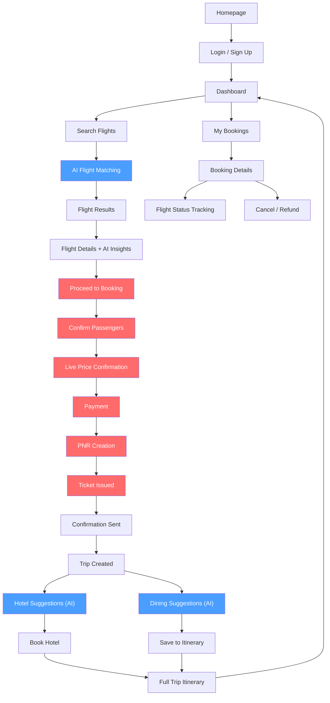

# Project Overview

## About the Project

Flight Booking System is a B2C platform targeting tourists and business travelers. Users search for and book plane tickets directly through the platform. The flight is the anchor of the entire experience — future milestones layer on hotel suggestions, restaurant discovery, and AI-powered trip assembly around the booked flight.

---

## The Problem It Solves

Booking flights involves juggling multiple airline sites, comparing prices, and navigating complex booking flows. This platform provides a unified search-and-book experience powered by the Amadeus Self-Service API, with AI-assisted guidance layered on top for smarter search results and edge-case handling — while keeping all transactional operations strictly deterministic and auditable.

---

## Target Audience

- **Primary**: Tourists and business travelers booking plane tickets.
- **Experience level**: Comfortable with a modern web application.
- **Future expansion**: Hotels and restaurants near the destination airport, full trip itinerary assembly.

---

## Pages

```
/                        → Homepage
/login                   → Auth page (OAuth providers)
/dashboard               → Trip overview, recent activity, analytics
/search                  → Flight search controls + results list
/search/[flightId]       → Individual flight details + AI insights
/trip/[tripId]           → Full trip itinerary (flight + hotel + dining)
/trip/[tripId]/hotels     → Hotel suggestions near destination
/trip/[tripId]/dining     → Restaurant suggestions near destination
/profile                 → Traveler profile, preferences, saved payment methods
/bookings                → All bookings list (upcoming, past, cancelled)
/bookings/[bookingId]    → Booking details, PNR, ticket, status tracking
```

---

## Navigation

Top navbar. Clean and minimal:

```
Dashboard    Search Flights    My Bookings    Profile
```

Full width layout on all pages. No sidebar.

---

## Core User Flow

### 1. Homepage

- Hero section with search quick-start (origin, destination, dates, passengers).
- Logged-in users → redirect to dashboard.
- Logged-out users → redirect to login.

### 2. Onboarding

- User signs up via OAuth (Google, GitHub, or other configured providers).
- On login → redirect to `/dashboard`.
- Dashboard shows an incomplete profile banner if traveler preferences are not set.

### 3. Traveler Profile Setup

- User fills traveler profile — name, nationality, passport details, frequent flyer programs, travel preferences.
- Preferences include:
  - **Seat preference**: window / aisle / no preference.
  - **Class preference**: economy / premium economy / business / first.
  - **Airline preference**: preferred airlines, blacklisted airlines.
  - **Dietary needs**: for in-flight meals.
  - **Hotel preferences**: star rating, budget range, amenities (pool, gym, WiFi).
  - **Dining preferences**: cuisine types, price range, dietary restrictions.
- Saved payment methods for faster checkout.
- Profile data powers AI-driven recommendations across the entire trip.

### 4. Flight Search & AI-Powered Matching

- User goes to Search Flights page.
- Enters origin, destination, dates, passenger count.
- Clicks **Search Flights**.
- Backend calls Amadeus Flight Offers API.
- **AI agent scores each flight** against the user's traveler profile:
  - Factors: preferred airlines, class, layover tolerance, departure time preference, price sensitivity.
  - Returns: **match score (0–100)**, match reason, matched preferences, trade-offs.
- Results appear in a list below, sorted by match score by default.
- After search completes: *"Found 12 flights — 5 strong matches for your preferences."*

> **The AI scoring is advisory only.** It never touches the booking/payment path. All Amadeus API calls for search and pricing are deterministic backend services.

### 5. Flight Results Page

- Search controls at top (editable for re-search).
- Filter controls:
  - Match level: All / Strong Match / Fair Match / Weak Match.
  - Stops: Non-stop / 1 Stop / 2+ Stops.
  - Airlines: multi-select.
  - Price range: slider.
  - Departure time: morning / afternoon / evening / red-eye.
- Sort: Match Score / Price (Low → High) / Duration / Departure Time.
- Each result row shows:
  - Airline logo, flight number, departure → arrival times, duration, stops.
  - Match score badge (color-coded).
  - Price.
  - Quick "Book" and "View Details" actions.
- Pagination — 20 results per page.

### 6. Flight Details Page

- Full structured flight information:
  - Airline, flight number, aircraft type.
  - Departure and arrival airports, times, terminals, gates.
  - Duration, stops (with layover details).
  - Fare class breakdown, baggage allowance, cancellation policy.
  - Seat map preview (if available from Amadeus).
- **AI Match Insights** section:
  - Score prominently displayed.
  - Matched preferences — green tags (e.g., "Preferred airline", "Non-stop").
  - Trade-offs — amber tags (e.g., "Red-eye departure", "1 stop").
  - Match reasoning paragraph from the AI agent.
- **Price Trend Analysis** section *(AI-powered, future)*:
  - Current price vs. historical average for this route.
  - AI recommendation: "Book now" / "Prices may drop" / "Likely to increase".
  - Trend chart (last 30 days).
- **Proceed to Booking** button.

### 7. Booking & Payment Flow (Deterministic — No AI)

> **This entire flow is handled by deterministic backend services. AI agents have zero involvement here — PCI-DSS compliance and auditability are non-negotiable.**

1. User confirms flight selection and passenger details.
2. System calls Amadeus Flight Price API to confirm live pricing.
3. User selects saved payment method or enters new card details.
4. Payment processed.
5. System calls Amadeus Flight Create Orders API → PNR created.
6. Ticket issued and confirmation displayed.
7. Confirmation email and SMS sent.
8. Booking appears in `/bookings`.

### 8. Trip Assembly — Hotels & Dining (Future)

After a flight is booked, the system uses the destination airport's coordinates to offer supplementary suggestions. The flight remains the anchor; hotels and dining are layered on top.

#### Hotel Suggestions

- System calls **Amadeus Hotel Search API** with destination airport lat/lng and travel dates.
- AI agent scores each hotel against the user's hotel preferences (star rating, budget, amenities).
- Results displayed on `/trip/[tripId]/hotels`:
  - Hotel name, star rating, price/night, distance from airport, match score.
  - Key amenities highlighted.
  - "Book Hotel" action → Amadeus Hotel Booking API (deterministic).
- User can skip — hotels are optional.

#### Restaurant Suggestions

- System calls **Google Places API** with destination airport lat/lng, radius, and user's cuisine/dietary preferences.
- AI agent curates a shortlist with reasoning (e.g., "Highly rated Vietnamese near your hotel, matches your preference for local cuisine").
- Results displayed on `/trip/[tripId]/dining`:
  - Restaurant name, cuisine, rating, price level, distance.
  - Photos from Google Places.
  - "Save to Itinerary" action — no transactional booking, just a bookmark.

#### Full Trip Itinerary

- `/trip/[tripId]` shows the assembled itinerary:
  - Flight details (confirmed booking).
  - Hotel (if booked).
  - Saved restaurants.
  - Timeline view: arrival → check-in → dining → departure.
- AI agent can suggest an optimized day-by-day plan based on all saved items.

### 9. Bookings Management

- `/bookings` shows all bookings:
  - Tabs: Upcoming / Past / Cancelled.
  - Each row: destination, dates, airline, PNR reference, status badge.
- `/bookings/[bookingId]` shows full booking details:
  - PNR reference, e-ticket number.
  - Flight status tracking (via **AviationStack** — real-time updates).
  - Passenger details, seat assignments.
  - Actions: Cancel Booking, Request Refund, Download Ticket PDF.
  - Refund and cancellation handled by deterministic backend (never AI).

### 10. Dashboard

- **Stats bar** — 4 cards:
  - Total Flights Booked
  - Total Trips Planned
  - Average Match Score
  - Upcoming Trips
- **Recent activity** — last 10 user actions (searches, bookings, cancellations, research).
- **Analytics section**:
  - Flights booked over time — line chart.
  - Match score distribution — bar chart.
  - Top destinations — bar chart.
  - Spending by month — bar chart.

### 11. AI Customer Support Chatbot (Future)

- Floating chat widget available on all pages.
- Handles:
  - Booking status inquiries.
  - FAQ and policy questions.
  - Flight change requests (surfaces options, user confirms, deterministic service executes).
  - Complaint routing.
- **Cannot execute transactions directly** — always hands off to deterministic services for any booking modification.

---

## Data Sources & APIs

| Concern | Provider | Notes |
|---|---|---|
| Flight search, pricing, booking | **Amadeus Self-Service API** | Free tier (2,000 calls/month). Supports search, pricing, PNR creation, and ticketing. Non-negotiable for v1. |
| Airport geolocation | **Static dataset** (e.g., OurAirports CSV) | IATA code → lat/lng mapping. Airports don't move — store in a DB table. |
| Hotels *(future)* | **Amadeus Hotel Search API** | Same provider, keeps booking pipeline unified. |
| Restaurants *(future)* | **Google Places API** | Rich restaurant data with ratings, photos, radius-based search. Free tier ($200/month credit). |
| Flight tracking *(optional)* | **AviationStack** | Supplementary real-time flight status data. Not used for booking. |

---

## Architecture: AI Agents vs. Deterministic Services


### AI Agent Roles (Advisory — Never Transactional)

| Agent | Trigger | Output |
|---|---|---|
| **Flight Match Agent** | After flight search results return | Match score, reasoning, preference alignment per flight |
| **Price Trend Agent** | On flight details page | Historical price analysis, buy/wait recommendation |
| **Hotel Match Agent** | After flight is booked | Scored hotel suggestions near destination |
| **Dining Curator Agent** | After flight is booked | Curated restaurant shortlist with reasoning |
| **Itinerary Planner Agent** | When trip has flight + hotel + dining | Optimized day-by-day trip plan |
| **Support Chatbot Agent** | User opens chat widget | Conversational support, hands off to backend for actions |
| **Fraud Detection Agent** | On every payment attempt (background) | Risk score flag — deterministic service decides to proceed or block |

### Deterministic Services (Transactional — Auditable)

| Service | Responsibility |
|---|---|
| **Flight Search Service** | Amadeus Flight Offers Search API |
| **Flight Pricing Service** | Amadeus Flight Price API (live price confirmation) |
| **Booking Service** | Amadeus Flight Create Orders API (PNR creation) |
| **Payment Service** | Payment processing, PCI-DSS compliant |
| **Ticketing Service** | Ticket issuance, confirmation, PDF generation |
| **Refund Service** | Cancellation processing, refund execution |
| **Hotel Booking Service** | Amadeus Hotel Booking API |
| **Auth Service** | User authentication, session management, OAuth |
| **Notification Service** | Email, SMS delivery |

---

## Data Architecture

### Traveler Profile

- Lives in `profiles` table.
- Only changes when user explicitly edits profile page.
- Powers AI matching across flights, hotels, and dining.
- Never modified by any agent operation.

### Flight & Booking Data

- `flights` table — cached search results with match scores.
- `bookings` table — confirmed bookings with PNR, e-ticket, status.
- `booking_events` table — audit log of every booking state change.

### Trip Data

- `trips` table — groups a flight booking with optional hotel and dining.
- `trip_hotels` table — hotel bookings or saved suggestions.
- `trip_restaurants` table — saved restaurant bookmarks.

### AI Outputs

- `flight_match_scores` — per-flight match analysis (advisory, never affects booking).
- `price_trends` — cached price trend data per route.
- `hotel_match_scores` — per-hotel match analysis.
- `ai_chat_logs` — support chatbot conversation history.

---

## Features In Scope (v1)

- Flight search by origin, destination, dates, and passengers.
- Search results browsing with pricing from Amadeus.
- Flight selection and booking (PNR creation).
- Payment processing and ticket issuance.
- Booking confirmation and notifications.
- User authentication and session management.
- AI-assisted search guidance and result interpretation.
- Static airport geolocation data (IATA → lat/lng).

---

## Features — Future Milestones

- Hotel search and booking near destination airport.
- Restaurant discovery and itinerary bookmarking.
- Full trip assembly (flight + hotel + dining itinerary).
- AI-powered flight match scoring (0–100) against traveler profile.
- Price trend analysis with buy/wait recommendations.
- AI customer support chatbot.
- Fraud pattern detection.
- Flight tracking / real-time status via AviationStack.
- Itinerary planner agent for optimized day-by-day trip plans.

---

## Flow Diagram



> 🔵 **Blue** = AI-powered (advisory only) · 🔴 **Red** = Deterministic (transactional, auditable)

---

## Open Questions

- **Tech stack**: Language, framework, database choice.
- **Authentication strategy**: OAuth, JWT, social login providers.
- **Search UX**: Filters (stops, airlines, price range), sorting, pagination.
- **Multi-currency / multi-language** support.
- **Rate limiting & caching** strategy for Amadeus API (2,000 calls/month is tight).
- **Hotel booking flow**: Full booking via Amadeus, or surface suggestions with external links?
- **Dining**: Booking integration (e.g., OpenTable) or bookmark-only?
- **Multi-city trips**: Support for complex itineraries with multiple flight legs?
- **Trip sharing**: Can a user share their itinerary with travel companions?
- **Loyalty programs**: Integration with airline/hotel loyalty point tracking?
- **Offline access**: Downloadable trip itinerary for offline use during travel?
- **Push notifications**: Real-time flight delay/gate change alerts?

---

## Success Criteria

- User can search for flights, view results, and complete a booking end-to-end.
- Amadeus API integration returns accurate pricing and supports PNR creation.
- AI advisory layer improves the search experience without touching transactional flows.
- AI match scores feel accurate and the reasoning makes sense against the traveler profile.
- All booking transactions are deterministic, auditable, and reproducible.
- Payment flow meets PCI-DSS compliance requirements.
- System gracefully handles Amadeus API rate limits within the free tier.
- Trip assembly surfaces useful hotel and restaurant suggestions based on destination coordinates.
- Dashboard analytics show meaningful data after several searches and bookings.
- UI is visually consistent across all pages.
