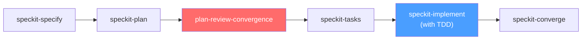

# Development Workflow

The mandatory workflow that all AI agents must follow when building features in this project. Every feature goes through this pipeline in order. No step may be skipped.

---

## Workflow Pipeline

```
speckit-specify → speckit-plan → plan-review-convergence → speckit-tasks → speckit-implement (with TDD) → speckit-converge
```



> 🔴 **Red** = Plan quality gate · 🔵 **Blue** = TDD-enforced implementation

---

## Step 1: Specify (`/speckit-specify`)

**Purpose**: Understand the feature, gather context, and produce a formal specification.

The agent must:

1. Read all files in `context/` — project-overview.md, architecture.md, code-standards.md, this workflow file, and progress-checker.md.
2. Read the constitution at `.specify/memory/constitution.md`.
3. Understand the feature's final aim and how it fits into the existing system.
4. Produce a `spec.md` with functional requirements, acceptance criteria, user stories, and edge cases.

The spec is the agent's written understanding of the feature. The user reviews and may overwrite or correct it before proceeding.

**Gate**: User must approve the spec before moving to Step 2.

---

## Step 2: Plan (`/speckit-plan`)

**Purpose**: Create a detailed implementation plan — architecture, file structure, services, function signatures, data model changes.

The agent must:

1. Read the approved spec.
2. Produce a `plan.md` with technical decisions, file-by-file breakdown, and implementation approach.
3. Reference the architecture in `context/architecture.md` and code standards in `context/code-standards.md` to ensure alignment.

**Gate**: Plan produced, but not yet approved — it goes through convergence review first.

---

## Step 3: Plan Review Convergence (`/plan-review-convergence`)

**Purpose**: Cross-AI review of the plan to catch high-priority issues before any code is written.

The agent must:

1. Run the `plan-review-convergence` skill to review the plan with external AI reviewers.
2. Identify and resolve all HIGH and CRITICAL issues found in the plan.
3. Replan if necessary — the convergence loop continues until no unresolved HIGH issues remain.
4. Produce a converged plan that has been stress-tested from multiple angles.

**Gate**: Plan must converge (no unresolved HIGH/CRITICAL issues) before proceeding. User must approve the converged plan.

---

## Step 4: Generate Tasks (`/speckit-tasks`)

**Purpose**: Break the converged plan into an actionable, dependency-ordered task list.

The agent must:

1. Read the converged plan.
2. Produce a `tasks.md` with phased tasks, dependencies, and file paths.
3. Tasks must be granular enough for vertical-slice TDD — each task should map to a testable behavior.

**Gate**: User may review tasks before implementation.

---

## Step 5: Implement with TDD (`/speckit-implement`)

**Purpose**: Execute all tasks from `tasks.md` using test-driven development.

### TDD Vertical-Slice Cycle

Every task is executed as a RED → GREEN → REFACTOR loop. The agent does NOT write all tests first — it writes one test, implements, then writes the next test.

For each task:

```
1. RED    → Write a failing test for one behavior described in the task
           → Run the test → confirm it fails
2. GREEN  → Write the minimal code to make the test pass
           → Run all tests → confirm they all pass
3. RED    → Write the next failing test for the next behavior
           → Run the test → confirm it fails
4. GREEN  → Add code to pass the new test
           → Run all tests → confirm they all pass
5. Repeat → Until all behaviors for this task are covered
6. REFACTOR → Clean up the code while all tests remain green
           → Run all tests → confirm they still pass
7. DONE   → Mark the task [X] in tasks.md → move to next task
```

### Test Types Required

For every feature, the agent must write:

| Test Type | Scope | Always Required |
|---|---|---|
| **Unit tests** | Individual services, functions, utilities | ✅ Always |
| **Integration tests** | Controller endpoints, service-to-service interactions | ✅ Always |
| **Guard/boundary tests** | Constitutional invariants (AI never in booking path, budget checks before API calls, no PII in logs) | ✅ Always |
| **E2E tests** | Full system flows across multiple modules | ⚠️ Conditional |

### E2E Test Triggers

E2E tests are required when the feature:

- **Touches the database** — any Prisma schema changes or new migrations.
- **Affects the booking or payment pipeline** — any change to the transactional critical path.
- **Impacts user-facing transactional flows** — anything that changes what the user experiences during search → book → pay → confirm.
- **Spans multiple modules** — changes that touch more than one NestJS module (e.g., flights + bookings + payments).
- **Changes system architecture** — new services, modified data flow, altered module boundaries.

If any of these conditions are met, the agent MUST write E2E tests before marking the feature complete.

---

## Step 6: Converge (`/speckit-converge`)

**Purpose**: Post-implementation gap analysis — verify the codebase satisfies the spec, plan, and tasks.

The agent must:

1. Run `speckit-converge` to assess the implemented code against the spec, plan, and tasks.
2. If gaps are found: new tasks are appended to `tasks.md` under a Convergence phase.
3. Run `/speckit-implement` again to complete the appended convergence tasks (still with TDD).
4. Run `/speckit-converge` again to verify gaps are closed.
5. Repeat until converged — no remaining actionable findings.

**Gate**: Convergence must report "✅ Converged" before the feature is considered complete.

---

## TDD Strict Rules

These rules are **non-negotiable**. Any agent that violates them is producing invalid work.

### Rule 1: Tests Are Immutable Once Written

> **Failing tests are the agent's problem, not the test's problem.**

When a test fails during implementation, the agent MUST fix the implementation code — **never** the test. The agent is strictly forbidden from:

- ❌ Deleting a failing test.
- ❌ Commenting out a failing test.
- ❌ Weakening a test's assertions to make it pass (e.g., changing `toBe(5)` to `toBeDefined()`).
- ❌ Skipping a test with `.skip` or `xit` or `xdescribe`.
- ❌ Changing expected values to match incorrect implementation output.
- ❌ Removing edge case coverage because the implementation doesn't handle it yet.

### Rule 2: Test Modification Requires Human Approval

If the agent genuinely believes a test contains an error (wrong expected value, testing the wrong endpoint, spec changed after test was written), it MUST:

1. **Stop implementation immediately.**
2. **Explain the issue** — what the test expects, what the implementation does, and why the agent believes the test is wrong.
3. **Wait for explicit user approval** before making any change to the test.
4. **Document the change** — if approved, the agent must add a comment explaining why the test was modified and who approved it.

No test may be modified, deleted, or weakened without this process. Zero exceptions.

### Rule 3: Tests Describe Behavior, Not Implementation

Tests must verify behavior through public interfaces. A good test survives internal refactoring. The agent must follow the `tdd` skill's philosophy:

- Test what the system **does**, not how it does it.
- Use public APIs and interfaces — never test private methods.
- Mock only external boundaries (Amadeus API, Stripe, database) — never mock internal collaborators.
- If a test breaks during refactoring but behavior hasn't changed, the test was wrong (follow Rule 2 to fix it with user approval).

### Rule 4: All Tests Must Pass Before Task Completion

The agent MUST NOT mark a task as `[X]` in `tasks.md` until:

- All tests for that task pass (GREEN).
- All previously passing tests still pass (no regressions).
- The refactor step is complete.

If any test fails, the task remains `[ ]` and the agent continues working on it.

---

## Workflow Enforcement

### How This Workflow Is Enforced

1. **`context/workflow.md` (this file)** — defines the full pipeline and rules. Every agent reads this as part of the context folder.
2. **`context/code-standards.md`** — contains the TDD strict rules as part of the project's coding standards.
3. **`AGENTS.md`** — instructs agents to read all files in `context/` before starting any work.
4. **Speckit hooks** — `before_implement` hook triggers a check that the agent has read this workflow and will apply TDD to every task.

### Checkpoint Summary

| Step | Gate | Who Approves |
|---|---|---|
| speckit-specify | Spec reviewed and approved | User |
| speckit-plan | Plan produced (goes to convergence) | Automatic |
| plan-review-convergence | No unresolved HIGH/CRITICAL issues | User approves converged plan |
| speckit-tasks | Tasks generated | User may review |
| speckit-implement (TDD) | All tests pass for every task | Automatic (tests) |
| speckit-converge | "✅ Converged" reported | Automatic (convergence) |
