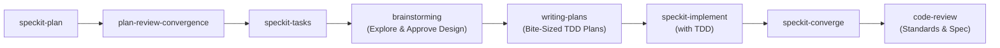

# Development Workflow

The mandatory workflow that all AI agents must follow when building features in this project. Every feature goes through this pipeline in order. No step may be skipped.

---

## Workflow Pipeline

```
speckit-plan → plan-review-convergence → speckit-tasks → brainstorming → writing-plans → speckit-implement (with TDD) → speckit-converge → code-review
```


```mermaid
flowchart LR
    A["speckit-plan"] --> B["plan-review-convergence"]
    B --> C["speckit-tasks"]
    C --> D["brainstorming\n(Explore & Approve Design)"]
    D --> E["writing-plans\n(Bite-Sized TDD Plans)"]
    E --> F["speckit-implement\n(with TDD)"]
    F --> G["speckit-converge"]
    G --> H["code-review\n(Standards & Spec)"]
```

> **Pipeline Stages**: Plan Quality Gate (`plan-review-convergence`) → Design Refinement & Task Planning (`brainstorming`, `writing-plans`) → TDD Implementation (`speckit-implement`) → Post-Implementation Convergence (`speckit-converge`) → Dual-Axis Quality Sign-Off (`code-review`).

---

## Step 1: Plan (`/speckit-plan`)

**Purpose**: Create a detailed implementation plan — architecture, file structure, services, function signatures, data model changes.

The agent must:

1. Understand the feature requirements and architectural boundaries.
2. Produce a `plan.md` with technical decisions, file-by-file breakdown, and implementation approach, ensuring alignment with project architecture and code standards.

**Gate**: Plan produced, but not yet approved — it goes through convergence review first.

---

## Step 2: Plan Review Convergence (`/plan-review-convergence`)

**Purpose**: Cross-AI review of the plan to catch high-priority issues before any code is written.

The agent must:

1. Run the `plan-review-convergence` skill to review the plan with external AI reviewers.
2. Identify and resolve all HIGH and CRITICAL issues found in the plan.
3. Replan if necessary — the convergence loop continues until no unresolved HIGH issues remain.
4. Produce a converged plan that has been stress-tested from multiple angles.

**Gate**: Plan must converge (no unresolved HIGH/CRITICAL issues) before proceeding. User must approve the converged plan.

---

## Step 3: Generate Tasks (`/speckit-tasks`)

**Purpose**: Break the converged plan into an actionable, dependency-ordered task list.

The agent must:

1. Read the converged plan.
2. Produce a `tasks.md` with phased tasks, dependencies, and file paths.
3. Tasks must be granular enough for vertical-slice TDD — each task should map to a testable behavior.

**Gate**: User may review tasks before implementation.

---

## Step 4: Brainstorming (`/brainstorming`)

**Purpose**: Turn slice or feature designs into structured, validated approaches before touching code.

The agent must:

1. **Classify the path**:
   - **Spike**: Feasibility inquiry with throwaway experiments (2–3 sentence probe plan, user nod).
   - **Bounded**: Scoped change to existing code/flow (ask clarifying questions, present short in-chat design, wait for approval).
   - **Architectural**: New subsystems, features, or interface restructuring (full exploration, 2–3 approaches with trade-offs, sectioned design, user approval per section).
2. **Explore Context & Intent**: Inspect files, docs, and recent commits. Ask focused clarifying questions one at a time.
3. **Propose Approaches**: Provide 2–3 options with explicit trade-offs and a clear recommendation.
4. **Hard Gate**: Do NOT invoke implementation skills or write code until the user gives explicit approval on the design.

---

## Step 5: Writing Plans (`/writing-plans`)

**Purpose**: Structure the approved design into a comprehensive, bite-sized, TDD-actionable implementation plan before writing any production code.

The agent must:

1. **Map File Structure & Boundaries**: Define exact file responsibilities, inputs, and outputs to maintain clean, deep module seams.
2. **Structure Bite-Sized TDD Tasks**:
   - Each step is a 2–5 minute focused action: Write failing test (RED) → Verify failure → Write minimal code (GREEN) → Verify pass → Commit.
   - Define exact consumed and produced interfaces for each task.
3. **Eliminate Placeholders**: Strictly no "TODO", "TBD", or vague instructions; provide exact code snippets, types, and commands.
4. **Self-Review Checklist**: Skim against plan coverage, placeholder scan, and type consistency across tasks.

**Gate**: Comprehensive plan produced and self-reviewed before task execution.

---

## Step 6: Implement with TDD (`/speckit-implement`)

**Purpose**: Execute all tasks from `tasks.md` using test-driven development.

### TDD Vertical-Slice Cycle

Every task is executed as a RED → GREEN → REFACTOR loop. The agent does NOT write all tests first — it writes one test, implements, then writes the next test.

For each task:

```
1. RED    → Write a failing test for one behavior described in the task
           → Run the test → confirm it fails
2. GREEN  → Write the minimal code to make the test pass
           → Run all tests → confirm they all pass
3. RED    → Write the next failing test for the next behavior
           → Run the test → confirm it fails
4. GREEN  → Add code to pass the new test
           → Run all tests → confirm they all pass
5. Repeat → Until all behaviors for this task are covered
6. REFACTOR → Clean up the code while all tests remain green
           → Run all tests → confirm they still pass
7. DONE   → Mark the task [X] in tasks.md → move to next task
```

### Test Types Required

For every feature, the agent must write:

| Test Type                | Scope                                                                                                | Always Required |
| ------------------------ | ---------------------------------------------------------------------------------------------------- | --------------- |
| **Unit tests**           | Individual services, functions, utilities                                                            | ✅ Always       |
| **Integration tests**    | Controller endpoints, service-to-service interactions                                                | ✅ Always       |
| **Guard/boundary tests** | Constitutional invariants (AI never in booking path, budget checks before API calls, no PII in logs) | ✅ Always       |
| **E2E tests**            | Full system flows across multiple modules                                                            | ⚠️ Conditional  |

### E2E Test Triggers

E2E tests are required when the feature:

- **Touches the database** — any Prisma schema changes or new migrations.
- **Affects the booking or payment pipeline** — any change to the transactional critical path.
- **Impacts user-facing transactional flows** — anything that changes what the user experiences during search → book → pay → confirm.
- **Spans multiple modules** — changes that touch more than one NestJS module (e.g., flights + bookings + payments).
- **Changes system architecture** — new services, modified data flow, altered module boundaries.

If any of these conditions are met, the agent MUST write E2E tests before marking the feature complete.

---

## Step 7: Converge (`/speckit-converge`)

**Purpose**: Post-implementation gap analysis — verify the codebase satisfies the plan and tasks.

The agent must:

1. Run `speckit-converge` to assess the implemented code against the plan and tasks.
2. If gaps are found: new tasks are appended to `tasks.md` under a Convergence phase.
3. Run `/speckit-implement` again to complete the appended convergence tasks (still with TDD).
4. Run `/speckit-converge` again to verify gaps are closed.
5. Repeat until converged — no remaining actionable findings.

**Gate**: Convergence must report "✅ Converged" before the feature is considered complete.

---

## Step 8: Dual-Axis Code Review (`/code-review`)

**Purpose**: Independent two-axis code review running parallel sub-agents to verify that the implementation adheres to repository standards and faithfully fulfills the originating spec and plan with zero unrequested scope creep.

The agent must:

1. **Pin the fixed point**: Determine the diff baseline against the feature branch base / merge-base (`git diff <fixed-point>...HEAD`).
2. **Spawn parallel review sub-agents**:
   - **Standards Sub-Agent**: Checks against `context/code-standards.md`, architecture invariants, and Fowler smell baseline (Mysterious Name, Duplicated Code, Feature Envy, Speculative Generality, etc.). Reports hard violations and judgment calls.
   - **Spec Sub-Agent**: Cross-checks the diff directly against the feature specification and plan. Flags missing/partial requirements, behavioral deviations, and unauthorized scope creep.
3. **Aggregate and Resolve**:
   - Present both reports under `## Standards` and `## Spec` side-by-side without merging or masking findings.
   - Fix all blocking findings (P0/P1/critical issues) before final completion.

**Gate**: Zero blocking findings across both Standards and Spec axes before PR creation and feature completion.

---

## TDD Strict Rules

These rules are **non-negotiable**. Any agent that violates them is producing invalid work.

### Rule 1: Tests Are Immutable Once Written

> **Failing tests are the agent's problem, not the test's problem.**

When a test fails during implementation, the agent MUST fix the implementation code — **never** the test. The agent is strictly forbidden from:

- ❌ Deleting a failing test.
- ❌ Commenting out a failing test.
- ❌ Weakening a test's assertions to make it pass (e.g., changing `toBe(5)` to `toBeDefined()`).
- ❌ Skipping a test with `.skip` or `xit` or `xdescribe`.
- ❌ Changing expected values to match incorrect implementation output.
- ❌ Removing edge case coverage because the implementation doesn't handle it yet.

### Rule 2: Test Modification Requires Human Approval

If the agent genuinely believes a test contains an error (wrong expected value, testing the wrong endpoint, spec changed after test was written), it MUST:

1. **Stop implementation immediately.**
2. **Explain the issue** — what the test expects, what the implementation does, and why the agent believes the test is wrong.
3. **Wait for explicit user approval** before making any change to the test.
4. **Document the change** — if approved, the agent must add a comment explaining why the test was modified and who approved it.

No test may be modified, deleted, or weakened without this process. Zero exceptions.

### Rule 3: Tests Describe Behavior, Not Implementation

Tests must verify behavior through public interfaces. A good test survives internal refactoring. The agent must follow the `tdd` skill's philosophy:

- Test what the system **does**, not how it does it.
- Use public APIs and interfaces — never test private methods.
- Mock only external boundaries (Amadeus API, Stripe, database) — never mock internal collaborators.
- If a test breaks during refactoring but behavior hasn't changed, the test was wrong (follow Rule 2 to fix it with user approval).

### Rule 4: All Tests Must Pass Before Task Completion

The agent MUST NOT mark a task as `[X]` in `tasks.md` until:

- All tests for that task pass (GREEN).
- All previously passing tests still pass (no regressions).
- The refactor step is complete.

If any test fails, the task remains `[ ]` and the agent continues working on it.

---

## Checkpoint Summary

| Step                    | Gate                                | Who Approves                 |
| ----------------------- | ----------------------------------- | ---------------------------- |
| speckit-plan            | Plan produced (goes to convergence) | Automatic                    |
| plan-review-convergence | No unresolved HIGH/CRITICAL issues  | User approves converged plan |
| speckit-tasks           | Tasks generated                     | User may review              |
| brainstorming           | Design & approach approved (hard)   | User                         |
| writing-plans           | Bite-sized TDD plan produced        | User / Plan Review           |
| speckit-implement (TDD) | All tests pass for every task       | Automatic (tests)            |
| speckit-converge        | "✅ Converged" reported             | Automatic (convergence)      |
| code-review             | Zero blocking findings (both axes)  | User / Dual-Axis Sub-agents  |
