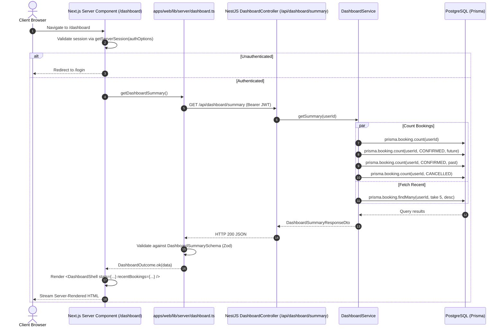

# Dashboard Architecture & Data Flow Decisions

> Captured from grilling session on 2026-08-28.

---

## Context

The navigation header in the web application links to `/dashboard` across all authenticated views, but currently resolves to a 404. Furthermore, the landing page (`/`) serves static marketing content without an automated entry point for authenticated users. This session established the architectural, domain, and data-flow decisions for introducing the Dashboard feature cleanly into the monorepo while avoiding premature complexity.

---

## 1. Dedicated Endpoint vs. Composed Client Calls

**Decision:** Implement a dedicated, purpose-built backend endpoint `GET /api/dashboard/summary` in NestJS.

**Rationale:**
- **Avoid Over-Fetching & Multi-Hop Latency:** Fetching upcoming bookings, past bookings, and profile readiness separately from Server Components incurs multiple server-to-server round-trips with excess payload overhead.
- **Contract Boundary:** The dashboard has distinct aggregate requirements. A purpose-built endpoint protects the dashboard contract from breaking when individual feature endpoints (like paginated booking management lists) evolve.

---

## 2. Stat Card Definitions & Domain Naming

**Decision:** Standardize stat metrics strictly on the core domain entity (`Booking`), and scope stats to what is deterministically computable today.

### Stat Metrics (4 Cards)

| Metric Card | Query Definition | Rationale |
| :--- | :--- | :--- |
| **`totalBookings`** | `prisma.booking.count({ where: { userId } })` | Lifetime booking count across all states |
| **`upcomingBookings`** | `prisma.booking.count({ where: { userId, status: 'CONFIRMED', departureAt: { gte: now } } })` | Confirmed upcoming flights |
| **`completedBookings`** | `prisma.booking.count({ where: { userId, status: 'CONFIRMED', departureAt: { lt: now } } })` | Past confirmed travel history |
| **`cancelledBookings`** | `prisma.booking.count({ where: { userId, status: 'CANCELLED' } })` | Explicit cancellation count |

### Excluded / Deferred Stats

- **`totalSpent` (Dropped):** Multi-currency bookings cannot be summed naively into a single numeric scalar without exchange rates or a user-preferred currency conversion service. Deferred until multi-currency conversion infrastructure exists.
- **`totalTripsPlanned` (Deferred):** The `trips` aggregate entity (flight + hotel + dining) is a future milestone.
- **`averageMatchScore` (Deferred):** AI advisory match scoring against traveler profiles is not yet active in the flight search pipeline.
- **Naming Rule:** Replaced all "Trips" and "Flights" labels with "Bookings" (e.g., `upcomingBookings`, `completedBookings`, `cancelledBookings`) to match canonical domain entities.

---

## 3. Direct PostgreSQL Queries (No Redis Caching)

**Decision:** Query PostgreSQL directly via Prisma in `DashboardService`. Do **not** introduce a Redis caching layer for the dashboard.

**Rationale:**
- **Indexed Single-Digit Latency:** All queries filter on `userId` and `status`, which are indexed in PostgreSQL. For realistic user booking volumes (1–100 rows), direct counts take < 2ms.
- **Invalidation Complexity:** Caching dashboard metrics in Redis would require invalidation hooks across 4+ mutation pathways (booking creation, payment confirmation, cancellation, schedule disruption) for virtually zero performance benefit.
- **Freshness Invariant:** Next.js Server Components fetch with `cache: 'no-store'`, guaranteeing accurate, real-time user stats on every navigation.

---

## 4. Decoupling vs. Duplication & Domain Guardrails

**Decision:** `DashboardService` injects `PrismaService` directly rather than depending on `BookingManagementService` or `ProfileService`.

### Principles & Guardrails

1. **Query Independence:** Small query repetition (e.g., direct `prisma.booking.count(...)`) is preferred over tight coupling across service modules.
2. **Zero Domain Definition Duplication (Hard Guardrail):**
   - Domain enums (e.g., `BookingStatus.CONFIRMED`, `BookingStatus.CANCELLED`) must be imported from Prisma client / shared packages.
   - Response shapes must be defined in `packages/shared/src/types/dashboard.types.ts` via strict Zod schemas (`DashboardSummarySchema`, `DashboardStatsSchema`) as the single source of truth.
   - The dashboard service implements these contracts and must never redefine custom status strings or ad-hoc domain representations.

---

## 5. Recent Bookings Feed Scope

**Decision:** Return the 5 most recent bookings (`take: 5`, ordered by `createdAt: 'desc'`) rather than introducing a generic user activity event stream.

**Rationale:**
- The system currently does not persist search or transient browsing history in an event audit log.
- A concise list of 5 recent bookings provides immediate value with a link to `/bookings` for full management.

---

## 6. Profile Completeness Banner (Omitted)

**Decision:** Do not compute or display a profile completeness banner on the dashboard in this iteration.

**Rationale:**
- Profile completeness is already strictly enforced downstream:
  1. The AI chatbot agent prompts users for missing profile fields interactively.
  2. The booking readiness check (`POST /api/bookings/intents/readiness`) gates intent creation before payment.
- Omitting this check keeps `DashboardService` purely focused on the `booking` table and eliminates unnecessary cross-table reads on `travelerProfile`.

---

## 7. Homepage & Authentication Routing

**Decision:** The root route (`/`) will automatically redirect authenticated users to `/dashboard`. Unauthenticated visitors continue to see the marketing landing page.

**Rationale:**
- For logged-in users, the landing page CTAs ("Login", "Register") are redundant.
- Establishes `/dashboard` as the central authenticated hub of the application.

---

## 8. Clean Separation of Data Plumbing & UI

**Decision:** The implementation focuses strictly on data contracts, server-side data fetching, authentication gating, and error handling. UI layout and visual components are decoupled into a clean `<DashboardShell>` component interface to allow independent prototyping and styling.

---

## 9. Visual Prototype & Stitch Artifact Reference

To ensure seamless alignment between architecture, API specifications, and visual implementation, this feature links directly to the interactive Next.js prototype and the authoritative Stitch design artifacts:

* **Interactive Prototype Route:** [`apps/web/app/prototype/dashboard/page.tsx`](file:///c:/Booking%20Systems/apps/web/app/prototype/dashboard/page.tsx) (`http://localhost:3000/prototype/dashboard`)
* **Prototype Design Notes:** [`apps/web/app/prototype/dashboard/NOTES.md`](file:///c:/Booking%20Systems/apps/web/app/prototype/dashboard/NOTES.md)
* **Stitch Project ID:** `projects/13084924633373309967`
* **Stitch Screen ID:** `projects/13084924633373309967/screens/69ae01acbacf4a6da08c37370416e52c` (Title: *"Wayfinder Dashboard"*)
* **Design System Token Asset:** `assets/f3a3a4a8638448bcaf25c6d4c42ed87c`
* **Design Preview:** [Stitch Screen Preview](https://lh3.googleusercontent.com/aida/AEtjO1UdF6EPyNJ0dELL14EyZt5vLcYwcqhV0hE5rJcsTOdFPtGPq2i8n8CgNz1mdzjmgB_yV970UFJuIqredDaqQsC6xhgh8lQpSQYz7TtmlQTuT4j45khJzY0Ra1eZhNGIGJrJ_QN-EhkPqFGOHojRC82u4qwt5bfy8PoN17pdV4-2sDqfwe4Ij5rP8siBJijnebWPCwEWzzFtRnbawMvSEtXFe6CYmYgJKlpwbV-YGmoRsCi5TawNRBzhYAHe)

### Visual Layout Breakdown

```
+-----------------------------------------------------------------------------------------+
| [SideNavBar]       | [TopNavBar: Search (⌘K) | Notifications | User Avatar]             |
|                    +--------------------------------------------------------------------+
|  🏠 Dashboard      | Hero: "Find Your Way. Do More."                                    |
|  ✈️ Search Flights | [Quick Search: Origin | Destination | Dates | Search Flights]     |
|  📅 My Bookings    +---------------------------------+----------------------------------+
|  🛡️ Disruption     | Stats (2x2 Grid)                | Quick Actions (2x2 Grid)         |
|  ⚙️ Settings       | - Total Bookings: 14            | - 🔍 Search Flights              |
|                    | - Upcoming: 2                   | - 📋 Manage Itinerary            |
|                    | - Completed: 11                 | - ✦ AI Travel Assistant          |
|                    | - Disruption Shield: 100%       | - ⚠️ Disruption Center           |
|                    +---------------------------------+----------------------------------+
|                    | Recent Activity Timeline        | Insights & Recommendations       |
|                    | - SGN → HND (VN 300) Confirmed  | - ✦ Tokyo Autumn Fares (-18%)    |
|                    | - HAN → DAD (VN 165) Completed  | - 💺 Window Seat 14A Available   |
|                    | - SGN → SIN (SQ 178) Cancelled  |                                  |
+--------------------+---------------------------------+----------------------------------+
```

---

## End-to-End Data Flow


