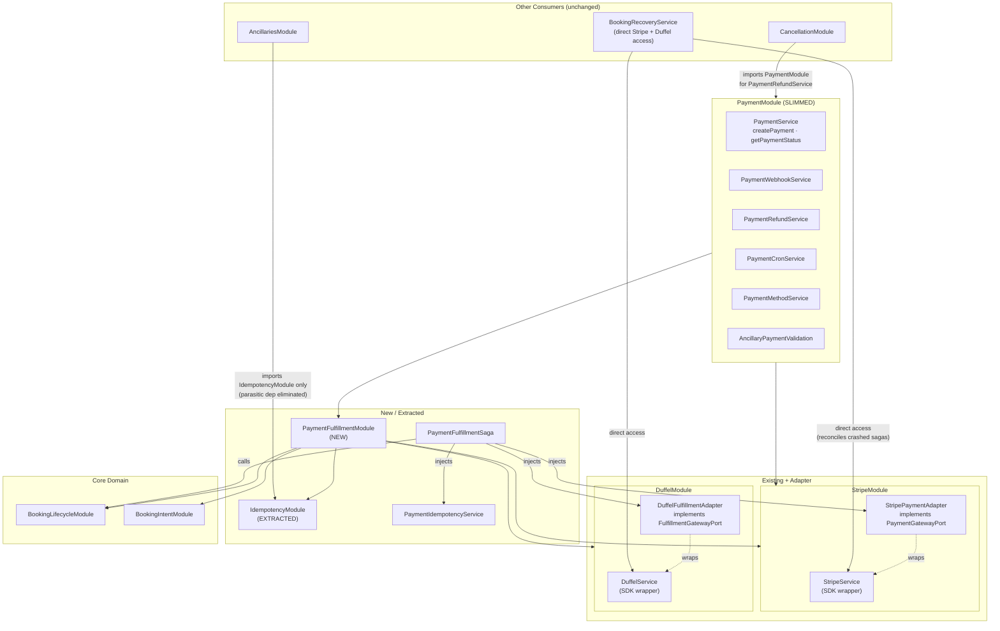
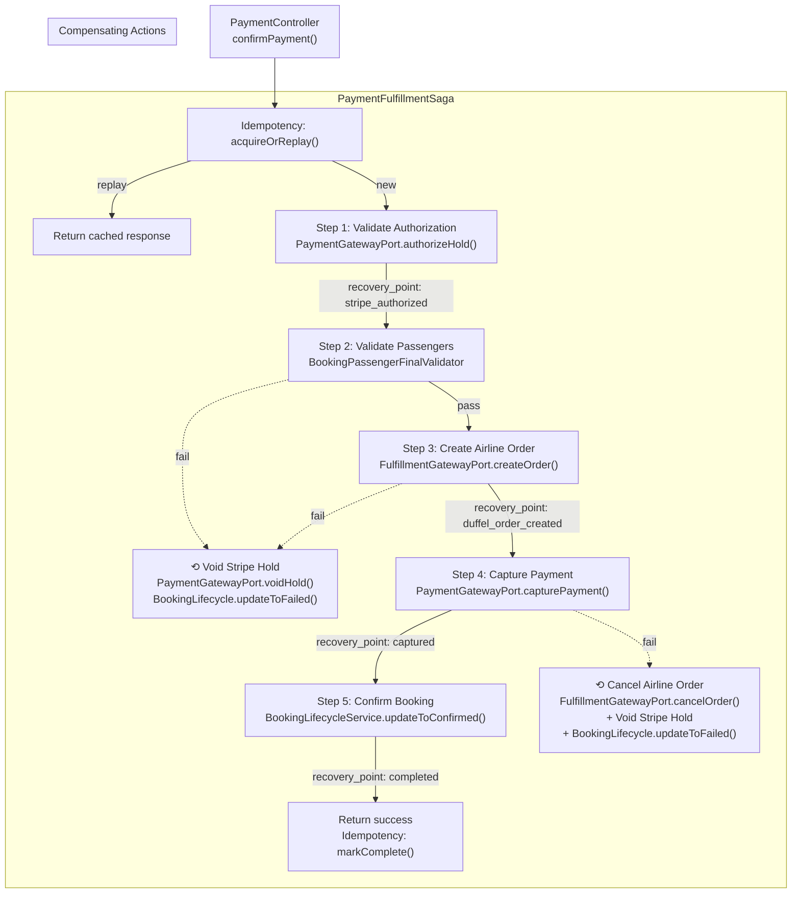
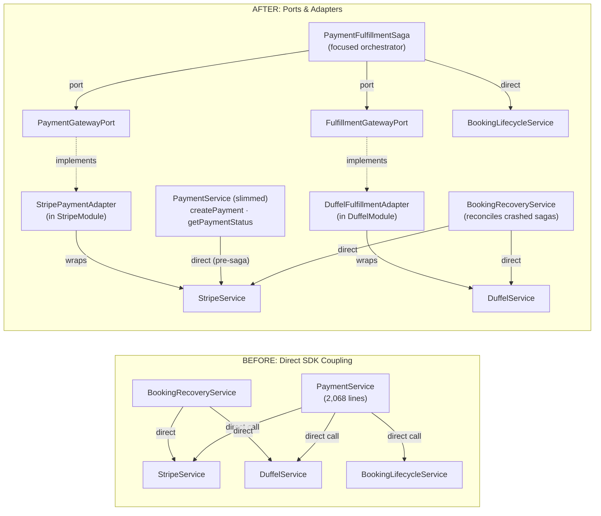

# Grilling Session — Payment Module Deepening & Saga Extraction

> Captured from grilling session on 2026-09-14.
> Source: architecture-review-2026-09-13.html (Candidate #1: Deepen Payment by extracting fulfillment).

---

## Context

`PaymentService` is 2,068 lines with 9 constructor dependencies. `executeConfirmPayment` is an 830-line procedural pipeline orchestrating Stripe authorization, passenger validation, Duffel order creation, Stripe capture, and booking lifecycle transitions — with compensating actions at each failure point. The module conflates payment processing, airline fulfillment, cancellation refunds, idempotency, and cron jobs behind one wide interface.

AncillariesModule imports PaymentModule solely for `PaymentIdempotencyService`. CancellationModule imports it solely for `PaymentRefundService`. Both are parasitic dependencies.

---

## Decision 1 — Extract PaymentFulfillmentSaga as Top-Level Orchestrator ✅

**Problem**: The payment-to-booking confirmation pipeline is a de facto saga hidden inside a god module. It already has recovery checkpoints (`started → stripe_authorized → duffel_order_created → captured → completed`), compensating actions, and idempotent replay — but they're buried in 830 lines of `executeConfirmPayment`.

**Decision**: Extract a focused `PaymentFulfillmentSaga` module that owns the 5-step orchestration pipeline:

1. Validate Stripe authorization
2. Validate and map passengers
3. Create airline order (Duffel)
4. Capture Stripe payment
5. Confirm booking via BookingLifecycleService

**Naming**: "Saga" — not "Pipeline." The term communicates that this module is an orchestrator managing distributed transactions with compensating actions (semantic undo), which helps other developers understand its role immediately.

**Key constraint**: This is a **concrete extraction, not a generic saga framework**. The codebase has exactly one saga-like workflow. A generic `SagaOrchestrator<TStep>` with step registries would be shallow — lots of interface for one implementation. If a second saga emerges (e.g., multi-city packages or ancillary-only purchases), that's when the generic framework earns its keep.

---

## Decision 2 — Saga is the Orchestrator, PaymentModule is Subordinate ✅

**Problem**: Initial design had PaymentModule triggering the saga. This inverts the orchestration — the saga should own the workflow.

**Decision**: The saga is the top-level entry point for `confirmPayment`. The call chain is:

```
PaymentController → PaymentFulfillmentSaga (orchestrator)
                        → PaymentGatewayPort (Stripe adapter)
                        → FulfillmentGatewayPort (Duffel adapter)
                        → BookingLifecycleService (state transitions)
```

PaymentModule becomes subordinate — it provides lower-level payment CRUD (`createPayment`, `getPaymentStatus`) and refund/webhook/cron services. The saga calls into PaymentModule services, not the reverse.

---

## Decision 3 — Ports & Adapters for Third-Party APIs ✅

**Problem**: `PaymentService` directly calls `StripeService` and `DuffelService`, coupling the saga pipeline to specific third-party SDKs.

**Decision**: Introduce port interfaces that the saga depends on. Concrete adapters implement them:

```typescript
interface PaymentGatewayPort {
  authorizeHold(intentId: string): Promise<AuthorizationResult>;
  capturePayment(intentId: string, idempotencyKey: string): Promise<CaptureResult>;
  voidHold(intentId: string): Promise<void>;
}

interface FulfillmentGatewayPort {
  createOrder(passengers, offer, ancillaries): Promise<FulfillmentResult>;
  cancelOrder(orderId: string): Promise<void>;
  retrieveOrderSnapshot(orderId: string): Promise<OrderSnapshot>;
}
```

**Implementations**:
- `StripePaymentAdapter implements PaymentGatewayPort`
- `DuffelFulfillmentAdapter implements FulfillmentGatewayPort`

**Extensibility**: Adding a new provider (e.g., Amadeus) means implementing `FulfillmentGatewayPort` in a new module and swapping the import. Zero saga changes.

**Key constraint**: The port interfaces ARE the abstraction layer. No additional umbrella "ExternalIntegrationsModule" wrapping all third-party adapters — that would couple unrelated domains (payment and airline) and break locality.

---

## Decision 4 — Adapter Scoping: What Belongs Inside the Saga ✅

**Problem**: StripeService is called by 7 different services; DuffelService by 7 different services. Not all calls belong in the saga.

**Decision**: Based on full dependency audit:

**Inside the saga** (via ports):
| Port Method | Stripe/Duffel Call | Purpose |
|---|---|---|
| `PaymentGatewayPort.authorizeHold` | `stripeService.retrievePaymentIntent` | Auth validation |
| `PaymentGatewayPort.capturePayment` | `stripeService.capturePaymentIntent` | Capture funds |
| `PaymentGatewayPort.voidHold` | `stripeService.cancelPaymentIntent` | Compensating action |
| `FulfillmentGatewayPort.createOrder` | `duffelService.createOrder` | Airline order |
| `FulfillmentGatewayPort.cancelOrder` | `duffelService.cancelOrder` | Compensating action |
| `FulfillmentGatewayPort.retrieveOrderSnapshot` | `duffelService.retrieveCompleteOrder` + `mapDuffelOrderToSnapshots` | Snapshot extraction |

**Stays in PaymentModule** (direct Stripe access, NOT through saga):
- `PaymentService.createPayment` — pre-saga setup, one-shot call with no compensating actions
- `PaymentWebhookService` — webhook signature verification + reconciliation
- `PaymentRefundService` — refund execution (`stripeService.createRefund`)
- `PaymentCronService` — stale payment void + refund retry sweeper
- `PaymentMethodService` — saved card management

**Stays in separate domains** (untouched):
- `FlightsService` → `duffelService.searchFlights`
- `AncillaryCatalogService` → `duffelService.getSeatMapsAndServices`
- `CancellationService` → `duffelService.createCancellationQuote/confirmCancellationQuote`
- `BookingIntentService` → `duffelService.getOfferById`
- `SupplierSyncService` → `duffelService.retrieveCompleteOrder`

**BookingRecoveryService** keeps direct Stripe + Duffel access (not through saga ports). It reconciles crashed sagas — routing it through the same saga that failed would be circular.

---

## Decision 5 — Backpressure at Adapter Level, No Message Queue ✅

**Problem**: Concern about flooding third-party APIs (Stripe, Duffel) under load. Considered introducing Kafka/RabbitMQ.

**Decision**: Handle backpressure at the adapter level with client-side rate limiters (semaphore or token bucket). No message queue for user-facing synchronous transactions.

**Rationale**:
1. `confirmPayment` is a user-facing synchronous transaction — the user is watching a spinner. A message queue makes every booking async by default, eliminating the Tier 1 instant confirmation experience.
2. The ADR established "Consistency over availability (CP); no eventual consistency in payment mutations." A queue introduces eventual consistency by nature.
3. Flight bookings are not high-frequency transactions — Stripe/Duffel rate limits are generous for this volume.
4. The recovery checkpoint system already handles crash recovery.

**Implementation**:
```typescript
class StripePaymentAdapter implements PaymentGatewayPort {
  private readonly semaphore = new Semaphore(20);

  async capturePayment(intentId: string, key: string): Promise<CaptureResult> {
    return this.semaphore.acquire(() =>
      this.stripeService.capturePaymentIntent(intentId, key)
    );
  }
}
```

**When to reconsider**: If genuinely async operations emerge (batch refund processing, bulk reconciliation sweeps) where the caller doesn't need an immediate answer, a queue may be justified for those specific workflows.

---

## Decision 6 — Module Boundaries: Adapters in Existing SDK Modules ✅

**Problem**: Three options for organizing adapters: (A) saga + adapters in one module, (B) separate adapter modules, (C) adapters co-located in existing SDK modules.

**Decision**: Option C — adapters live inside their existing SDK modules:

```
StripeModule (existing)
  ├── StripeService (existing SDK wrapper)
  └── StripePaymentAdapter implements PaymentGatewayPort (new)

DuffelModule (existing)
  ├── DuffelService (existing SDK wrapper)
  └── DuffelFulfillmentAdapter implements FulfillmentGatewayPort (new)

PaymentFulfillmentModule (new)
  ├── PaymentFulfillmentSaga
  └── imports: StripeModule, DuffelModule, BookingLifecycleModule, IdempotencyModule
```

**Rationale**:
- Option A bundles adapters with the saga — violates locality (Stripe API change → edit inside saga module)
- Option B creates shallow modules (interface = implementation)
- Option C: natural locality — Stripe adapter lives next to Stripe SDK wrapper

---

## Decision 7 — Idempotency + Checkpoint Tracking: One Deep Module ✅

**Problem**: Recovery checkpoints (`recovery_point`) and idempotency (`acquireOrReplay`) are conceptually linked. Both answer related questions:
- Idempotency: "Have we seen this transaction before?"
- Checkpoint: "Where did we leave off?"

Splitting them into separate modules creates a partial-write risk — one persists but the other fails.

**Decision**: Keep idempotency and checkpoint tracking combined in one deep `IdempotencyModule`, extracted from PaymentModule. The `idempotency_keys` table already stores both the idempotency key AND the `recovery_point` column on the same row. One write, one transaction, zero partial failure risk.

**Interface**:
```typescript
class PaymentIdempotencyService {
  acquireOrReplay(key: string, hash: string): Promise<AcquireResult>;
  advanceCheckpoint(key: string, checkpoint: RecoveryPoint): Promise<void>;
  markComplete(key: string, statusCode: number, response: any): Promise<void>;
}
```

**Side effect**: AncillariesModule can now import `IdempotencyModule` directly instead of importing all of PaymentModule for one service. Parasitic dependency eliminated.

---

## Decision 8 — BookingRecoveryService Keeps Direct Access ✅

**Problem**: `BookingRecoveryService` in BookingLifecycleModule calls both `StripeService` and `DuffelService` directly for reconciling stale bookings stuck in `PROCESSING` state.

**Decision**: Recovery keeps direct Stripe/Duffel access through existing services, not through saga ports. It's a fundamentally different workflow — "clean up crashed sagas" vs "run the pipeline." Routing it through the same saga that failed would be circular.

---

## Final Design

### Module Dependency Graph



### Saga Pipeline with Compensating Actions



### Ports & Adapters: Before → After



---

## Constraints That Must Not Be Re-Litigated

- **Stripe Auth → Duffel Order → Stripe Capture** ordering is fixed (ADR: research-payment-system-decisions.md)
- **One-way dependency**: Saga → BookingLifecycle, never reverse (ADR: research-architecture-review-deepening.md)
- **Provider-blind contracts**: BookingLifecycle and RefundSettlement consume normalized outcomes (ADR: research-architecture-review-deepening.md)
- **FAILED is terminal**: No in-place retry, new Payment record required (ADR: research-payment-system-decisions.md)
- **Max 2 payment attempts** per BookingIntent (ADR: research-payment-system-decisions.md)
- **PostgreSQL two-phase locking only**: No Redis distributed locks for payment concurrency (ADR: research-payment-system-decisions.md)
- **Consistency over availability (CP)**: No eventual consistency in payment mutations (ADR: research-payment-system-decisions.md)
- **No generic saga framework** until a second saga-like workflow emerges
- **No message queue** for user-facing synchronous payment transactions
