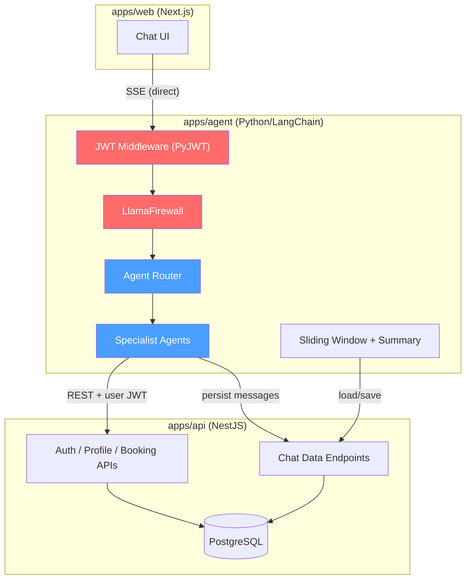

# Chatbot Backend Architecture — Grilling Session Decisions

> **Date**: 2026-06-28
> **Scope**: Backend conversational AI system — receives user questions, orchestrates API calls, persists conversations.

---

## Decision 1: LLM Orchestration Layer

**Choice**: Standalone Python/LangChain agent service (separate from NestJS).

**Rationale**: The system is intended as a multi-agent architecture with specialized agents (intent understanding, API calling, etc.). Python's LangChain/LangGraph ecosystem is better suited for this than embedding LLM orchestration in NestJS.

**Rejected**: Embedding the LLM orchestration directly in a NestJS `ChatModule`. Too limiting for a multi-agent system.

---

## Decision 2: Repo Placement

**Choice**: `apps/agent/` inside the existing monorepo.

**Rationale**: Co-located with `apps/api` and `apps/web`. Shared context docs, easier contract evolution, and a single `docker-compose.yml` orchestrates all 3 services (NestJS, Next.js, Python agent).

**Rejected**: Separate Git repo. Harder to keep contracts in sync.

---

## Decision 3: Communication Pattern

**Choice**: Frontend calls Python agent directly for chat (SSE streaming). Python agent calls NestJS for data.

**Rationale**: NestJS as a stream proxy creates double-connection overhead — every active chat holds two open SSE connections (frontend→NestJS + NestJS→Python). The proxy adds latency per token and complicates mid-stream error handling. Direct connection eliminates this.

**Traffic flow**:
```
Chat (SSE streaming):  Next.js  →  Python Agent (direct)
Data (REST):           Python Agent  →  NestJS API
All other APIs:        Next.js  →  NestJS API
```

**Rejected**:
- NestJS proxying the SSE stream (double-connection cost, added latency).
- Short-lived chat token issued by NestJS (added complexity without removing problems from the direct approach).

---

## Decision 4: Security Model — Three Layers

### Layer 1: Tool Scoping (Structural)
- Each agent only has access to **read-only** tools by default.
- Write operations (cancel booking, update profile) require explicit user confirmation through the UI, not through the chat.

### Layer 2: User-Bound Data Access (Structural)
- Every tool call the agent makes to NestJS includes the authenticated user's JWT.
- NestJS enforces that user A can only access user A's data.
- Even if the agent is prompt-injected, NestJS rejects cross-user access.

### Layer 3: Input Guardrails (Inference-Time)
- **LlamaFirewall** (Meta's open-source framework) runs as an input guardrail before the user message hits the LLM.
- Detects prompt injection, jailbreak attempts, and other malicious inputs.

### JWT Validation in Python
- The Python agent shares the same `JWT_SECRET` env var with NestJS.
- Uses `PyJWT` to decode and verify tokens in FastAPI middleware.
- Extracts `userId` from the token payload and passes it into the agent context.

---

## Decision 5: Chat Data Persistence

**Choice**: NestJS owns all chat data in PostgreSQL (single database).

**Rationale**: Single database = single migration pipeline, single backup strategy, single deployment concern. Adding a second database for the agent service creates two workflows to maintain in production.

**Implementation**: Python agent calls NestJS REST endpoints to read/write `ChatSession` and `ChatMessage` records. Prisma schema gets new models in `apps/api/prisma/schema.prisma`.

**Rejected**: Agent-owned database (SQLite or separate PostgreSQL). Two databases = two maintenance burdens.

---

## Decision 6: Conversation Memory Management

**Choice**: Manual sliding window + summary with controlled timing.

**Strategy**:
- Keep the last N messages (e.g., 20) in full.
- Everything older gets summarized by the LLM into a condensed paragraph.
- The summary is stored as a special `ChatMessage` with a `type: 'summary'` flag.
- On each new turn, the agent loads: **system prompt → summary → last N messages → new input**.

**Timing**: Summarization happens at a controlled point (between sessions, at session close, or on a scheduled job) — **never mid-conversation** where it adds latency and unpredictable behavior.

**Persistence**: Every raw message is persisted to NestJS/PostgreSQL for full audit trail. The working memory the LLM sees is the compressed version.

**Rejected**: LangChain's `ConversationSummaryBufferMemory`. Auto-compresses when token threshold is exceeded, which means compression can trigger mid-conversation without explicit control.

---

## Open Questions (Not Yet Decided)

### Multi-Agent Topology
How are the agents structured? Options discussed but not decided:
- **Router → Specialist agents**: Router classifies intent, dispatches to specialist (FlightSearchAgent, BookingAgent, etc.).
- **Single agent with all tools**: One agent, one prompt, all tools available.
- **Supervisor + worker graph (LangGraph)**: Full state graph with supervisor routing to worker sub-graphs.

### LLM Provider
Which LLM provider (OpenAI, Gemini, Anthropic, etc.) and model to use for the agents.

### Python Framework
Assumed FastAPI but not explicitly confirmed.

### Conversation Compression Threshold
The exact value of N (number of recent messages to keep in full) and the trigger for summarization.

---

## Architecture Diagram



> 🔵 **Blue** = AI-powered (advisory) · 🔴 **Red** = Security layers
