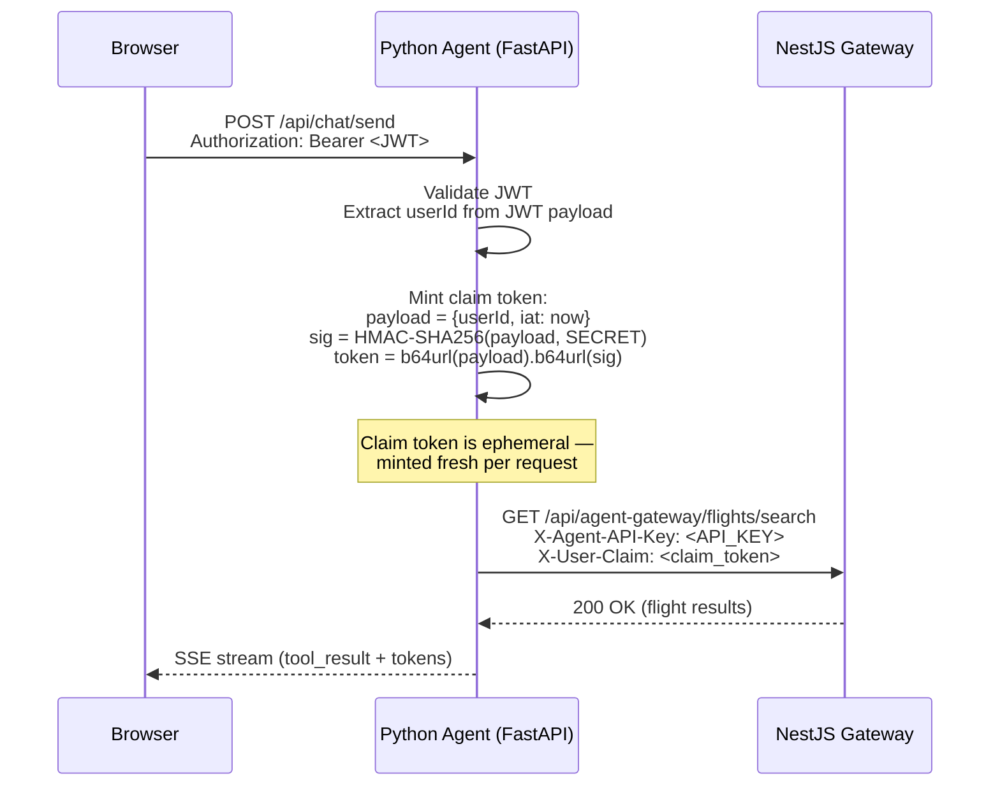
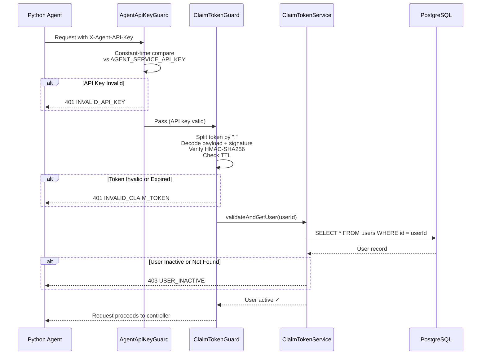

# Contract: Authentication Protocol

**Feature**: 003 — Agent Tool-Calling & Data Access
**Phase**: 1 — Design Contracts
**Date**: 2026-07-01

---

## Overview

Dual-layer authentication protects the Agent Gateway. Every request must present both:

1. **Service API Key** (`X-Agent-API-Key`) — proves the caller is the authorized agent service
2. **Claim Token** (`X-User-Claim`) — proves which user the agent is acting on behalf of

This design ensures the user's original JWT never crosses the FastAPI boundary, and the gateway independently verifies user identity and active status on every request.

**Maps to**: FR-006, FR-007, FR-008, FR-015, FR-017

---

## Layer 1: Service API Key

### Purpose

Static shared secret that authenticates the agent service itself — proving the caller is the legitimate Python agent, not an arbitrary client.

### Header

```
X-Agent-API-Key: <secret_value>
```

### Mechanism

- A single API key is shared between the Python agent and the NestJS gateway via environment variable.
- The `AgentApiKeyGuard` on the NestJS side compares the header value to the configured secret using constant-time comparison.

### Configuration

| Env Var                | Set On          | Description                            |
|------------------------|-----------------|----------------------------------------|
| `AGENT_SERVICE_API_KEY`| Agent + Gateway | Shared secret (same value on both sides)|

### Validation Rules

| Check                         | Failure Response                |
|-------------------------------|--------------------------------|
| Header missing                | `401 INVALID_API_KEY`          |
| Value does not match           | `401 INVALID_API_KEY`          |

### Guard Implementation

**Location**: `apps/api/src/agent-gateway/auth/agent-api-key.guard.ts`

```
AgentApiKeyGuard
├── canActivate(context)
│   ├── Extract X-Agent-API-Key from request headers
│   ├── Compare against AGENT_SERVICE_API_KEY (constant-time)
│   └── Return true or throw UnauthorizedException
```

---

## Layer 2: Claim Token

### Purpose

Short-lived, cryptographically signed token that carries the authenticated user's identity from the Python agent to the NestJS gateway. Contains only `userId` and `iat` — no permissions, no profile data, no active status.

### Header

```
X-User-Claim: <base64url(payload)>.<base64url(signature)>
```

### Token Format

```
{base64url(payload)}.{base64url(signature)}
```

| Segment                    | Content                                           |
|----------------------------|---------------------------------------------------|
| `base64url(payload)`       | Base64url-encoded JSON: `{"userId": "uuid", "iat": unix_timestamp}` |
| `base64url(signature)`     | Base64url-encoded HMAC-SHA256 of the **raw JSON payload string**  |

### Payload Schema

```json
{
  "userId": "string (UUID — the authenticated user's ID)",
  "iat": "integer (Unix timestamp — seconds since epoch, when token was minted)"
}
```

### Signature

```
signature = HMAC-SHA256(payload_json_string, CLAIM_TOKEN_SECRET)
```

- **Input**: The raw JSON string of the payload (e.g., `{"userId":"550e8400-e29b-41d4-a716-446655440000","iat":1751356800}`)
- **Key**: `CLAIM_TOKEN_SECRET` environment variable
- **Algorithm**: HMAC-SHA256
- **Output**: 32-byte digest, then base64url-encoded

### Configuration

| Env Var                    | Set On          | Description                                     |
|----------------------------|-----------------|--------------------------------------------------|
| `CLAIM_TOKEN_SECRET`       | Agent + Gateway | Shared HMAC signing key (same value on both sides)|
| `CLAIM_TOKEN_TTL_SECONDS`  | Gateway         | Maximum token age in seconds (default: `300`)     |

### Example Token Construction

**Step 1 — Build payload**:

```json
{"userId":"550e8400-e29b-41d4-a716-446655440000","iat":1751356800}
```

**Step 2 — Sign payload** (Python):

```python
import hmac, hashlib, base64, json, time

secret = "my-claim-token-secret"
payload = {"userId": "550e8400-e29b-41d4-a716-446655440000", "iat": int(time.time())}
payload_json = json.dumps(payload, separators=(",", ":"))

signature = hmac.new(
    secret.encode("utf-8"),
    payload_json.encode("utf-8"),
    hashlib.sha256
).digest()

token = (
    base64.urlsafe_b64encode(payload_json.encode("utf-8")).rstrip(b"=").decode()
    + "."
    + base64.urlsafe_b64encode(signature).rstrip(b"=").decode()
)
```

**Step 3 — Result**:

```
eyJ1c2VySWQiOiI1NTBlODQwMC1lMjliLTQxZDQtYTcxNi00NDY2NTU0NDAwMDAiLCJpYXQiOjE3NTEzNTY4MDB9.kR7x2Fj9Qs3mN...
```

### Validation Rules

| Check                                    | Failure Response                      |
|------------------------------------------|---------------------------------------|
| Header missing                           | `401 INVALID_CLAIM_TOKEN`             |
| Cannot split into exactly 2 parts by `.` | `401 INVALID_CLAIM_TOKEN`             |
| Base64url decode fails                   | `401 INVALID_CLAIM_TOKEN`             |
| Payload JSON parse fails                 | `401 INVALID_CLAIM_TOKEN`             |
| Missing `userId` or `iat` in payload     | `401 INVALID_CLAIM_TOKEN`             |
| HMAC signature does not match            | `401 INVALID_CLAIM_TOKEN` (tampering) |
| `now - iat > CLAIM_TOKEN_TTL_SECONDS`    | `401 INVALID_CLAIM_TOKEN` (expired)   |

### Guard Implementation

**Location**: `apps/api/src/agent-gateway/auth/claim-token.guard.ts`

```
ClaimTokenGuard
├── canActivate(context)
│   ├── Extract X-User-Claim from request headers
│   ├── Split token by "."
│   ├── Base64url-decode payload and signature
│   ├── Parse payload JSON → {userId, iat}
│   ├── Recompute HMAC-SHA256(payload_json, CLAIM_TOKEN_SECRET)
│   ├── Constant-time compare computed vs provided signature
│   ├── Check (now - iat) <= CLAIM_TOKEN_TTL_SECONDS
│   ├── Attach userId to request object
│   └── Return true or throw UnauthorizedException
```

---

## Layer 3: User Active Status Check

### Purpose

After claim token validation succeeds, the gateway independently verifies that the user's account is still active. This is **not** embedded in the claim token — it is checked against the database on every request.

**Why not in the claim token?** User status can change at any time (admin deactivation, account deletion). A claim token minted 30 seconds ago may reference a user who was deactivated 10 seconds ago. Database check is the only reliable source of truth.

### Mechanism

```
ClaimTokenService.validateAndGetUser(userId)
├── Query User table by userId
├── If user not found → 403 USER_INACTIVE
├── If user.active === false → 403 USER_INACTIVE
└── Return user record
```

### Failure Response

| Status | Code             | When                                    |
|--------|------------------|-----------------------------------------|
| 403    | `USER_INACTIVE`  | User not found, deleted, or deactivated |

---

## Minting Flow



---

## Validation Flow



---

## Environment Variables Summary

| Variable                   | Required | Default | Set On          | Description                                          |
|----------------------------|----------|---------|-----------------|------------------------------------------------------|
| `AGENT_SERVICE_API_KEY`    | ✅       | —       | Agent + Gateway | Shared API key for service-to-service authentication |
| `CLAIM_TOKEN_SECRET`       | ✅       | —       | Agent + Gateway | Shared HMAC-SHA256 signing key for claim tokens      |
| `CLAIM_TOKEN_TTL_SECONDS`  | ❌       | `300`   | Gateway         | Maximum claim token age (seconds) before rejection   |
| `AGENT_MAX_ITERATIONS`     | ❌       | `5`     | Agent           | Max tool-calling iterations per turn (loop cap)      |

---

## Security Properties

| Property                    | How Enforced                                                     |
|-----------------------------|------------------------------------------------------------------|
| No JWT forwarding           | Agent mints claim token from JWT payload; JWT stops at FastAPI   |
| Tamper resistance           | HMAC-SHA256 signature verified on every request                  |
| Replay window               | TTL-bounded (`CLAIM_TOKEN_TTL_SECONDS`, default 5 minutes)       |
| No privilege escalation     | Claim token contains only `userId` + `iat` — no roles/permissions|
| User status freshness       | Database check on every request — not cached in token            |
| Constant-time comparison    | Both API key and HMAC signature use constant-time comparison     |
| Scoped data access          | All queries filtered by `userId` from validated claim token      |
