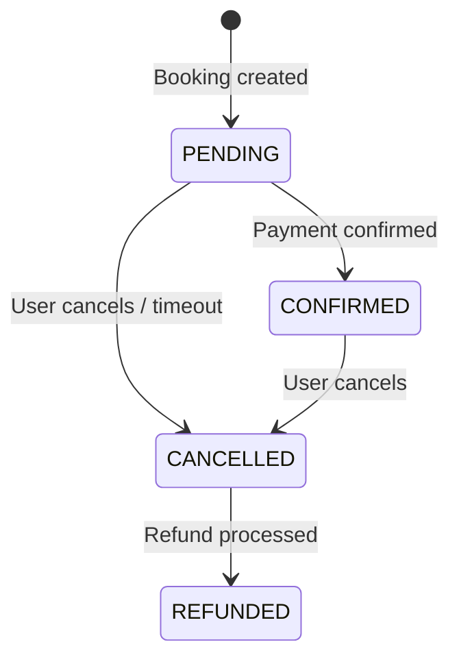
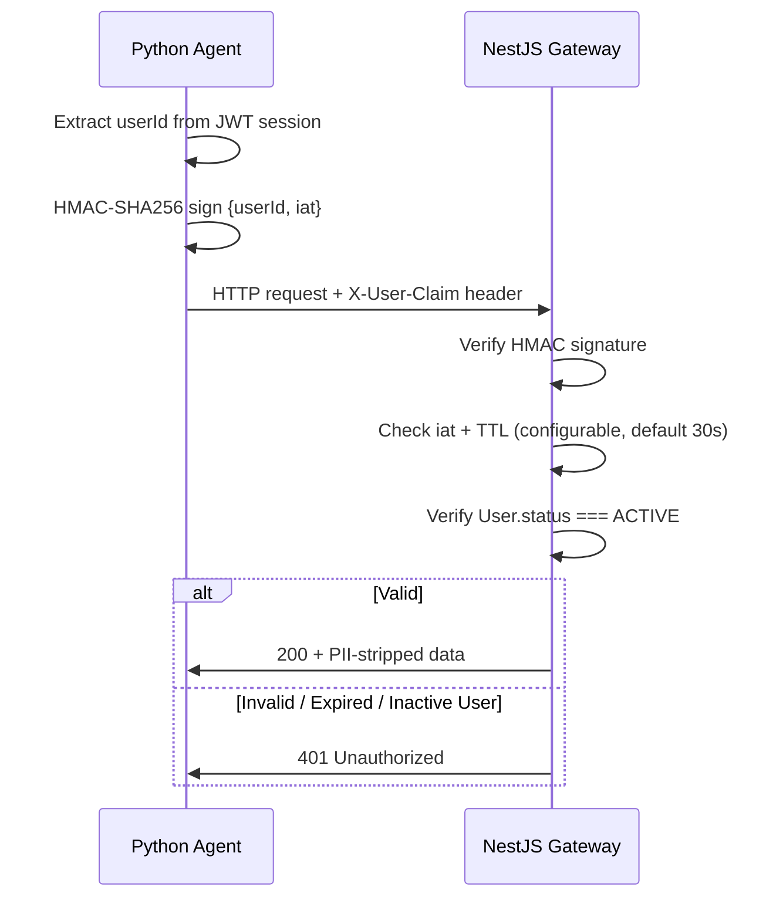

# Data Model: Agent Tool-Calling & Data Access

**Feature**: `003-agent-tool-calling` | **Phase**: 1 — Design | **Date**: 2026-07-01

**Spec**: [spec.md](file:///c:/Booking%20Systems/specs/003-agent-tool-calling/spec.md) | **Plan**: [plan.md](file:///c:/Booking%20Systems/specs/003-agent-tool-calling/plan.md)

---

## Entity Relationship Diagram

```mermaid
erDiagram
    User ||--o| TravelerProfile : "has profile"
    User ||--o{ Booking : "has bookings"
    User ||--o{ ChatSession : "has sessions"
    User ||--o{ AuditLog : "generates logs"
    ChatSession ||--o{ ChatMessage : "contains"

    User {
        String id PK
        String email UK
        String password
        UserStatus status
        DateTime createdAt
        DateTime updatedAt
        DateTime lastLogin
    }

    TravelerProfile {
        String id PK
        String userId FK_UK
        String seatPreference
        String classPreference
        String[] preferredAirlines
        String[] blacklistedAirlines
        String dietaryNeeds
        String nationality
        String passportNumber "PII"
        DateTime passportExpiry "PII"
        DateTime createdAt
        DateTime updatedAt
    }

    Booking {
        String id PK
        String userId FK
        String pnrCode "PII"
        String eTicketNumber "PII"
        BookingStatus status
        String airline
        String flightNumber
        String origin
        String destination
        DateTime departureTime
        DateTime arrivalTime
        Int duration
        Int stops
        String fareClass
        Decimal price
        String currency
        Int passengers
        String baggageAllowance
        String paymentReference "PII"
        DateTime createdAt
        DateTime updatedAt
    }

    AuditLog {
        String id PK
        String userId FK
        String action
        String resourceType
        String resourceId
        Json metadata
        String traceId
        String correlationId
        DateTime createdAt
    }

    ChatSession {
        String id PK
        String userId FK
        String title
        DateTime createdAt
        DateTime updatedAt
        DateTime lastActiveAt
    }

    ChatMessage {
        String id PK
        String sessionId FK
        MessageSender sender
        MessageType type
        String content
        DateTime createdAt
    }
```

---

## 1. TravelerProfile (NEW — Prisma Model)

Stores a traveler's persistent preferences and identity documents. One-to-one with `User`. Created lazily when a user first sets preferences or when seeded.

**Prisma location**: `apps/api/prisma/schema.prisma`
**Table name**: `traveler_profiles`

### 1.1 Fields

| Field | Type | Constraints | PII | Notes |
|-------|------|-------------|-----|-------|
| `id` | `String` | `@id @default(uuid())` | No | Primary key |
| `userId` | `String` | `@unique`, FK → `User.id` | No | Enforces one-to-one |
| `seatPreference` | `String?` | Optional | No | Enum-like: see allowed values below |
| `classPreference` | `String?` | Optional | No | Enum-like: see allowed values below |
| `preferredAirlines` | `String[]` | Default `[]` | No | Array of IATA 2-letter airline codes (e.g., `["VN", "SQ"]`) |
| `blacklistedAirlines` | `String[]` | Default `[]` | No | Array of IATA 2-letter airline codes |
| `dietaryNeeds` | `String?` | Optional | No | Free-text (e.g., `"vegetarian"`, `"halal"`) |
| `nationality` | `String?` | Optional | No | ISO 3166-1 alpha-2 country code |
| `passportNumber` | `String?` | Optional | **Yes** | **NEVER exposed through agent gateway** |
| `passportExpiry` | `DateTime?` | Optional | **Yes** | **NEVER exposed through agent gateway** |
| `createdAt` | `DateTime` | `@default(now())` | No | Immutable after creation |
| `updatedAt` | `DateTime` | `@updatedAt` | No | Auto-managed by Prisma |

### 1.2 Relationships

| Relation | Target | Cardinality | FK | On Delete |
|----------|--------|-------------|----|-----------|
| `user` | `User` | One-to-one | `userId` → `User.id` | `Cascade` |

Inverse: `User.travelerProfile` (optional back-relation).

### 1.3 Validation Rules

| Rule | Constraint | Enforcement Layer |
|------|-----------|-------------------|
| `seatPreference` must be one of: `window`, `aisle`, `no_preference` | Application-level enum check | `class-validator` DTO + service layer |
| `classPreference` must be one of: `economy`, `premium_economy`, `business`, `first` | Application-level enum check | `class-validator` DTO + service layer |
| `preferredAirlines` entries must be 2-character IATA codes | Regex `/^[A-Z0-9]{2}$/` per element | `class-validator` DTO |
| `blacklistedAirlines` entries must be 2-character IATA codes | Regex `/^[A-Z0-9]{2}$/` per element | `class-validator` DTO |
| `nationality` must be 2-character ISO country code | Regex `/^[A-Z]{2}$/` | `class-validator` DTO |
| `passportNumber` and `passportExpiry` are write-only from agent perspective | Gateway `select` clause excludes these fields | `AgentGatewayService` Prisma query |

### 1.4 PII Handling

The gateway **structurally excludes** PII fields when querying this model. The Prisma `select` clause in `AgentGatewayService` omits `passportNumber` and `passportExpiry` — they are never fetched, never serialized, never enter the agent context window. This satisfies FR-005.

### 1.5 Prisma Schema Addition

```prisma
model TravelerProfile {
  id                  String   @id @default(uuid())
  userId              String   @unique
  seatPreference      String?
  classPreference     String?
  preferredAirlines   String[]
  blacklistedAirlines String[]
  dietaryNeeds        String?
  nationality         String?
  passportNumber      String?
  passportExpiry      DateTime?
  createdAt           DateTime @default(now())
  updatedAt           DateTime @updatedAt
  user                User     @relation(fields: [userId], references: [id], onDelete: Cascade)

  @@map("traveler_profiles")
}
```

---

## 2. Booking (NEW — Prisma Model)

Represents a flight reservation for a user. Many-to-one with `User`. Contains both safe fields (airline, times, status) and PII fields (PNR, e-ticket, payment reference) that are structurally excluded from gateway responses.

**Prisma location**: `apps/api/prisma/schema.prisma`
**Table name**: `bookings`

### 2.1 Fields

| Field | Type | Constraints | PII | Notes |
|-------|------|-------------|-----|-------|
| `id` | `String` | `@id @default(uuid())` | No | Primary key |
| `userId` | `String` | FK → `User.id` | No | Many-to-one |
| `pnrCode` | `String?` | Optional | **Yes** | Passenger Name Record — **NEVER exposed through gateway** |
| `eTicketNumber` | `String?` | Optional | **Yes** | Electronic ticket number — **NEVER exposed through gateway** |
| `status` | `BookingStatus` | Required, default `PENDING` | No | See enum + state transitions below |
| `airline` | `String` | Required | No | IATA 2-letter airline code |
| `flightNumber` | `String` | Required | No | e.g., `"VN302"` |
| `origin` | `String` | Required | No | IATA 3-letter airport code |
| `destination` | `String` | Required | No | IATA 3-letter airport code |
| `departureTime` | `DateTime` | Required | No | UTC |
| `arrivalTime` | `DateTime` | Required | No | UTC |
| `duration` | `Int` | Required | No | Flight duration in minutes |
| `stops` | `Int` | Required, default `0` | No | Number of layovers |
| `fareClass` | `String?` | Optional | No | e.g., `"economy"`, `"business"` |
| `price` | `Decimal` | Required | No | Fare amount |
| `currency` | `String` | Required, default `"USD"` | No | ISO 4217 currency code |
| `passengers` | `Int` | Required, default `1` | No | Number of passengers |
| `baggageAllowance` | `String?` | Optional | No | e.g., `"23kg checked, 7kg carry-on"` |
| `paymentReference` | `String?` | Optional | **Yes** | Payment gateway reference — **NEVER exposed through gateway** |
| `createdAt` | `DateTime` | `@default(now())` | No | Immutable after creation |
| `updatedAt` | `DateTime` | `@updatedAt` | No | Auto-managed by Prisma |

### 2.2 Relationships

| Relation | Target | Cardinality | FK | On Delete |
|----------|--------|-------------|----|-----------|
| `user` | `User` | Many-to-one | `userId` → `User.id` | `Cascade` |

Inverse: `User.bookings` (array back-relation).

### 2.3 Validation Rules

| Rule | Constraint | Enforcement Layer |
|------|-----------|-------------------|
| `origin` must be exactly 3 uppercase characters | Regex `/^[A-Z]{3}$/` | `class-validator` DTO + service layer |
| `destination` must be exactly 3 uppercase characters | Regex `/^[A-Z]{3}$/` | `class-validator` DTO + service layer |
| `origin` ≠ `destination` | Custom validator | Service layer |
| `passengers` ≥ 1 | `@Min(1)` | `class-validator` DTO |
| `price` ≥ 0 | `@Min(0)` | `class-validator` DTO |
| `duration` ≥ 0 | `@Min(0)` | Service layer |
| `stops` ≥ 0 | `@Min(0)` | Service layer |
| `departureTime` < `arrivalTime` | Custom validator | Service layer |
| `airline` must be 2-character IATA code | Regex `/^[A-Z0-9]{2}$/` | `class-validator` DTO |

### 2.4 PII Handling

The gateway **structurally excludes** `pnrCode`, `eTicketNumber`, and `paymentReference` from all queries. The Prisma `select` clause in `AgentGatewayService` omits these three fields — they are never fetched, never serialized, never enter the agent context window. This satisfies FR-005.

### 2.5 Prisma Schema Addition

```prisma
model Booking {
  id               String        @id @default(uuid())
  userId           String
  pnrCode          String?
  eTicketNumber    String?
  status           BookingStatus @default(PENDING)
  airline          String
  flightNumber     String
  origin           String        @db.VarChar(3)
  destination      String        @db.VarChar(3)
  departureTime    DateTime
  arrivalTime      DateTime
  duration         Int
  stops            Int           @default(0)
  fareClass        String?
  price            Decimal
  currency         String        @default("USD")
  passengers       Int           @default(1)
  baggageAllowance String?
  paymentReference String?
  createdAt        DateTime      @default(now())
  updatedAt        DateTime      @updatedAt
  user             User          @relation(fields: [userId], references: [id], onDelete: Cascade)

  @@index([userId])
  @@index([userId, status])
  @@map("bookings")
}
```

---

## 3. BookingStatus (NEW — Prisma Enum)

Lifecycle states for a booking record.

### 3.1 Values

| Value | Description |
|-------|-------------|
| `PENDING` | Booking created but not yet confirmed by airline/payment system |
| `CONFIRMED` | Booking confirmed — seats reserved, payment processed |
| `CANCELLED` | Booking cancelled by traveler or system |
| `REFUNDED` | Booking cancelled and refund has been processed |

### 3.2 State Transitions



**Transition rules**:
- `PENDING → CONFIRMED`: Only via payment confirmation (future write tool).
- `PENDING → CANCELLED`: User-initiated or system timeout.
- `CONFIRMED → CANCELLED`: User-initiated cancellation (future write tool).
- `CANCELLED → REFUNDED`: Admin/system action after refund processed.
- `REFUNDED` is a terminal state — no further transitions.
- `CONFIRMED → PENDING` is **not allowed** (no backward transitions from confirmed).

> [!NOTE]
> In the current phase, all bookings are read-only from the agent's perspective. State transitions will be triggered by future write tools behind the confirmation gate.

### 3.3 Prisma Enum

```prisma
enum BookingStatus {
  PENDING
  CONFIRMED
  CANCELLED
  REFUNDED
}
```

---

## 4. ClaimTokenPayload (Non-Persisted — Runtime Type)

A short-lived, cryptographically signed payload that proves the agent is acting on behalf of a specific authenticated user. Exists only in transit between the Python agent and the NestJS gateway. **Never stored in a database.**

### 4.1 Fields

| Field | Type | Constraints | PII | Notes |
|-------|------|-------------|-----|-------|
| `userId` | `string` | Required, UUID format | No | The authenticated user's `User.id` |
| `iat` | `number` | Required, Unix timestamp (seconds) | No | Issuance time — used for TTL validation |

### 4.2 Lifecycle



### 4.3 Validation Rules

| Rule | Constraint | Enforcement Layer |
|------|-----------|-------------------|
| HMAC signature must be valid | `crypto.timingSafeEqual` comparison | `ClaimTokenService` (NestJS) |
| `iat` must be within TTL window | `now() - iat <= CLAIM_TOKEN_TTL_SECONDS` | `ClaimTokenService` (NestJS) |
| `userId` must reference an `ACTIVE` user | DB lookup: `User.status === ACTIVE` | `ClaimTokenService` (NestJS) |
| TTL must be configurable without code changes | `CLAIM_TOKEN_TTL_SECONDS` env var | `ConfigService` |

### 4.4 TypeScript Interface

```typescript
// apps/api/src/agent-gateway/auth/claim-token.types.ts
export interface ClaimTokenPayload {
  userId: string;  // UUID
  iat: number;     // Unix timestamp (seconds)
}
```

### 4.5 Python Dataclass

```python
# apps/agent/src/agent/auth/claim_token.py
@dataclass(frozen=True)
class ClaimTokenPayload:
    user_id: str   # UUID
    iat: int       # Unix timestamp (seconds)
```

---

## 5. AgentState (Non-Persisted — LangGraph Runtime)

The in-memory state object managed by the LangGraph `StateGraph`. Tracks conversation messages, tool-call iteration count, and any pending human-in-the-loop confirmation. Lives in `MemorySaver` checkpointer — **not persisted to database**.

### 5.1 Fields

| Field | Type | Constraints | PII | Notes |
|-------|------|-------------|-----|-------|
| `messages` | `list[BaseMessage]` | Required, default `[]` | No* | LangChain message history (HumanMessage, AIMessage, ToolMessage). *User-typed PII is scrubbed before persistence but may exist transiently.* |
| `iteration_count` | `int` | Required, default `0` | No | Tracks tool call iterations in the current turn. Reset per turn. |
| `pending_confirmation` | `Optional[dict]` | Optional | No | Populated when graph suspends at confirmation gate. Contains proposed action details. |

### 5.2 Constraints

| Rule | Constraint | Enforcement Layer |
|------|-----------|-------------------|
| `iteration_count` ≤ `MAX_TOOL_ITERATIONS` (default 5) | Router node checks before routing to tool node | `router.py` |
| When `iteration_count` exceeds cap, route to response node | Graph edge condition | `router.py` |
| `pending_confirmation` set only for `requires_confirmation=True` tools | Tool registry flag check | `router.py` |

### 5.3 Python TypedDict

```python
# apps/agent/src/agent/graph/state.py
from typing import Optional
from langchain_core.messages import BaseMessage
from langgraph.graph import add_messages

class AgentState(TypedDict):
    messages: Annotated[list[BaseMessage], add_messages]
    iteration_count: int
    pending_confirmation: Optional[dict]
```

### 5.4 `pending_confirmation` Shape (when populated)

```python
{
    "tool_name": "book_flight",           # Tool that triggered confirmation
    "tool_call_id": "call_abc123",        # LangChain tool call ID
    "proposed_action": {                  # Action-specific details for user display
        "action": "book_flight",
        "flight_number": "VN302",
        "price": 450.00,
        "currency": "USD"
    }
}
```

> [!NOTE]
> `pending_confirmation` is architecturally ready but dormant in this phase. No tools are flagged `requires_confirmation=True` at launch. The confirmation gate will activate when write tools (booking, cancellation) are introduced in a future phase.

---

## 6. ToolCallAuditEntry (Extends Existing AuditLog)

Every tool call made by the agent is logged to the existing `AuditLog` model. **No new model or migration needed.** The `AuditLog.metadata` JSON field carries tool-specific telemetry.

### 6.1 Existing AuditLog Model (Reference)

From [schema.prisma](file:///c:/Booking%20Systems/apps/api/prisma/schema.prisma):

```prisma
model AuditLog {
  id            String   @id @default(uuid())
  userId        String?
  action        String
  resourceType  String
  resourceId    String?
  metadata      Json
  traceId       String
  correlationId String
  createdAt     DateTime @default(now())
  user          User?    @relation(fields: [userId], references: [id], onDelete: SetNull)

  @@index([userId])
  @@map("audit_logs")
}
```

### 6.2 Convention for Tool Call Entries

| AuditLog Field | Value for Tool Call Entries | Notes |
|----------------|----------------------------|-------|
| `userId` | Claim token's `userId` | The user on whose behalf the tool was called |
| `action` | `"TOOL_CALL"` | Fixed string for all agent tool calls |
| `resourceType` | `"agent-gateway"` | Identifies the gateway module as the resource |
| `resourceId` | Tool-specific (e.g., `"search_flights"`, `"get_user_preferences"`) | The tool name |
| `metadata` | See JSON shape below | Structured telemetry |
| `traceId` | Request-scoped trace ID | From gateway request context |
| `correlationId` | Chat session ID or request correlation ID | Links to the originating conversation |

### 6.3 `metadata` JSON Shape

```json
{
  "toolName": "search_flights",
  "responseSize": 2048,
  "durationMs": 340,
  "claimTokenUserId": "550e8400-e29b-41d4-a716-446655440000",
  "parameters": {
    "origin": "HAN",
    "destination": "NRT",
    "date": "2026-07-15"
  },
  "success": true,
  "errorMessage": null
}
```

| Metadata Field | Type | Description |
|---------------|------|-------------|
| `toolName` | `string` | The tool invoked (e.g., `search_flights`, `get_user_preferences`, `list_user_bookings`) |
| `responseSize` | `number` | Response payload size in bytes |
| `durationMs` | `number` | End-to-end gateway processing time in milliseconds |
| `claimTokenUserId` | `string` | The userId extracted from the claim token (redundant with `AuditLog.userId` for cross-verification) |
| `parameters` | `object` | Sanitized tool input parameters (PII scrubbed) |
| `success` | `boolean` | Whether the tool call succeeded |
| `errorMessage` | `string?` | Error details if `success` is `false` |

### 6.4 Query Patterns

```sql
-- All tool calls for a specific user
SELECT * FROM audit_logs
WHERE action = 'TOOL_CALL' AND "userId" = $1
ORDER BY "createdAt" DESC;

-- All failed tool calls
SELECT * FROM audit_logs
WHERE action = 'TOOL_CALL' AND metadata->>'success' = 'false'
ORDER BY "createdAt" DESC;

-- Tool call frequency by tool name
SELECT metadata->>'toolName' AS tool, COUNT(*) AS calls
FROM audit_logs
WHERE action = 'TOOL_CALL'
GROUP BY metadata->>'toolName';
```

---

## 7. FlightSearchResult (Transient — Amadeus API Response)

Represents a single flight offer returned from the Amadeus Flight Offers Search API. **Not persisted** — returned directly from the gateway endpoint to the agent tool, consumed within the conversation turn, and discarded.

### 7.1 Fields (PII-Safe — Exposed Through Gateway)

| Field | Type | Constraints | PII | Notes |
|-------|------|-------------|-----|-------|
| `airline` | `string` | Required | No | IATA 2-letter airline code (e.g., `"VN"`) |
| `flightNumber` | `string` | Required | No | Full flight number (e.g., `"VN302"`) |
| `departureAirport` | `string` | Required | No | IATA 3-letter airport code (e.g., `"HAN"`) |
| `arrivalAirport` | `string` | Required | No | IATA 3-letter airport code (e.g., `"NRT"`) |
| `departureTime` | `string` (ISO 8601) | Required | No | UTC datetime |
| `arrivalTime` | `string` (ISO 8601) | Required | No | UTC datetime |
| `duration` | `number` | Required | No | Flight duration in minutes |
| `stops` | `number` | Required | No | Number of layovers (0 = direct) |
| `price` | `number` | Required | No | Fare amount |
| `currency` | `string` | Required | No | ISO 4217 currency code |
| `fareClass` | `string?` | Optional | No | Cabin class (e.g., `"ECONOMY"`, `"BUSINESS"`) |
| `baggageAllowance` | `string?` | Optional | No | Baggage info (e.g., `"23kg checked"`) |

### 7.2 Gateway Response Shape

The gateway returns an array of up to 5 results (FR-018):

```typescript
// apps/api/src/agent-gateway/dto/flight-result.dto.ts
export class FlightResultDto {
  airline: string;
  flightNumber: string;
  departureAirport: string;
  arrivalAirport: string;
  departureTime: string;     // ISO 8601
  arrivalTime: string;       // ISO 8601
  duration: number;          // minutes
  stops: number;
  price: number;
  currency: string;
  fareClass?: string;
  baggageAllowance?: string;
}
```

### 7.3 Source Mapping (Amadeus → FlightResultDto)

| FlightResultDto Field | Amadeus API Path | Transformation |
|-----------------------|------------------|----------------|
| `airline` | `flightOffers[].itineraries[0].segments[0].carrierCode` | Direct |
| `flightNumber` | `carrierCode + segments[0].number` | Concatenation |
| `departureAirport` | `segments[0].departure.iataCode` | Direct |
| `arrivalAirport` | `segments[-1].arrival.iataCode` | Last segment |
| `departureTime` | `segments[0].departure.at` | ISO 8601 passthrough |
| `arrivalTime` | `segments[-1].arrival.at` | Last segment, ISO 8601 |
| `duration` | `itineraries[0].duration` | Parse ISO 8601 duration to minutes |
| `stops` | `itineraries[0].segments.length - 1` | Computed |
| `price` | `flightOffers[].price.total` | Parse to number |
| `currency` | `flightOffers[].price.currency` | Direct |
| `fareClass` | `travelerPricings[0].fareDetailsBySegment[0].cabin` | First traveler, first segment |
| `baggageAllowance` | `travelerPricings[0].fareDetailsBySegment[0].includedCheckedBags` | Format to human-readable string |

---

## Schema Migration Impact

### New Prisma Additions

| Addition | Type | Migration Impact |
|----------|------|-----------------|
| `BookingStatus` | Enum | `CREATE TYPE "BookingStatus"` |
| `TravelerProfile` | Model | `CREATE TABLE "traveler_profiles"` |
| `Booking` | Model | `CREATE TABLE "bookings"` |

### Modified Models

| Model | Change | Details |
|-------|--------|---------|
| `User` | Add relations | `travelerProfile TravelerProfile?` and `bookings Booking[]` back-relations |

### User Model Back-Relations

```prisma
model User {
  // ... existing fields ...
  auditLogs        AuditLog[]
  chatSessions     ChatSession[]
  travelerProfile  TravelerProfile?   // NEW
  bookings         Booking[]          // NEW

  @@map("users")
}
```

### Existing Shared Types Impact

The existing `Booking` type in [packages/shared/src/types/index.ts](file:///c:/Booking%20Systems/packages/shared/src/types/index.ts) uses `flightId: string` and a 3-value status union. The new Prisma `Booking` model is **richer** (inline flight details, 4-value enum, financial fields). The shared type should be updated in Phase 2 implementation to align with the Prisma model, adding `REFUNDED` to the status union and replacing `flightId` with inline flight fields.

---

## PII Boundary Summary

All PII exclusion is **structural** — enforced by Prisma `select` clauses in the gateway service, not by post-query filtering or prompt instructions.

| Entity | PII Fields | Exclusion Mechanism |
|--------|-----------|---------------------|
| `TravelerProfile` | `passportNumber`, `passportExpiry` | Prisma `select` omits fields in gateway query |
| `Booking` | `pnrCode`, `eTicketNumber`, `paymentReference` | Prisma `select` omits fields in gateway query |
| `FlightSearchResult` | None | Transient; no PII in Amadeus response |
| `ClaimTokenPayload` | None | Contains only `userId` + `iat` |
| `AgentState.messages` | Potentially in user input | PII scrubbed before persistence by `pii_scrubber.py` |
| `AuditLog.metadata` | None allowed | `parameters` field is sanitized before logging |

> [!IMPORTANT]
> PII fields are excluded at the **query level**, not the serialization level. The data never leaves the database for gateway responses. This is the structural guarantee required by FR-005.
