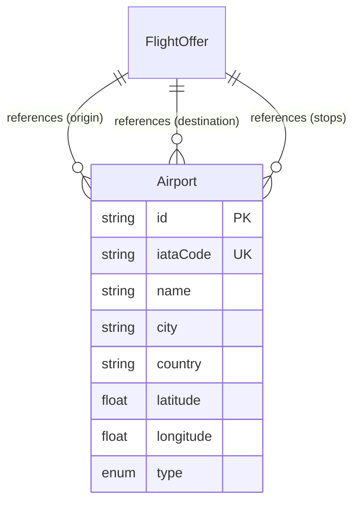

# Data Model: Map Integration

**Feature**: 005-map-integration | **Date**: 2026-07-05

---

## Entities

### Airport

Represents a commercial airport with geolocation data, seeded from the OurAirports open dataset.

| Field       | Type               | Constraints                 | Description                                               |
| ----------- | ------------------ | --------------------------- | --------------------------------------------------------- |
| `id`        | String (cuid)      | Primary key, auto-generated | Internal unique identifier                                |
| `iataCode`  | String(3)          | Unique, NOT NULL, indexed   | IATA airport code (e.g., "HAN", "NRT")                    |
| `icaoCode`  | String(4)          | Nullable, indexed           | ICAO airport code (e.g., "VVNB")                          |
| `name`      | String             | NOT NULL                    | Full airport name (e.g., "Noi Bai International Airport") |
| `city`      | String             | NOT NULL                    | Municipality/city name                                    |
| `country`   | String(2)          | NOT NULL, indexed           | ISO 3166-1 alpha-2 country code                           |
| `region`    | String             | Nullable                    | ISO 3166-2 region code                                    |
| `latitude`  | Float              | NOT NULL                    | Decimal degrees latitude                                  |
| `longitude` | Float              | NOT NULL                    | Decimal degrees longitude                                 |
| `elevation` | Int                | Nullable                    | Elevation in feet                                         |
| `type`      | Enum (AirportType) | NOT NULL                    | `LARGE_AIRPORT` or `MEDIUM_AIRPORT`                       |
| `timezone`  | String             | Nullable                    | IANA timezone identifier                                  |
| `createdAt` | DateTime           | Auto-set                    | Record creation timestamp                                 |
| `updatedAt` | DateTime           | Auto-update                 | Last update timestamp                                     |

**Indexes**:

- `iataCode` — unique index (primary lookup)
- `country` — standard index (filter by country)
- `icaoCode` — standard index (alternative lookup)
- `name` — text search index (autocomplete)
- Composite `(latitude, longitude)` — for proximity queries

### Prisma Schema Addition

```prisma
enum AirportType {
  LARGE_AIRPORT
  MEDIUM_AIRPORT
}

model Airport {
  id        String      @id @default(cuid())
  iataCode  String      @unique @db.VarChar(3)
  icaoCode  String?     @db.VarChar(4)
  name      String
  city      String
  country   String      @db.VarChar(2)
  region    String?
  latitude  Float
  longitude Float
  elevation Int?
  type      AirportType
  timezone  String?
  createdAt DateTime    @default(now())
  updatedAt DateTime    @updatedAt

  @@index([country])
  @@index([icaoCode])
  @@index([latitude, longitude])
  @@map("airports")
}
```

### FlightRoute (Computed — Not Persisted)

A flight route is computed on-the-fly from flight search/detail data. It is not stored in the database.

| Field         | Type           | Description                               |
| ------------- | -------------- | ----------------------------------------- |
| `origin`      | Airport        | Origin airport                            |
| `destination` | Airport        | Destination airport                       |
| `stops`       | Airport[]      | Intermediate stop airports (0 or more)    |
| `segments`    | RouteSegment[] | Arc segments between consecutive airports |

### RouteSegment (Computed)

| Field       | Type                         | Description                                |
| ----------- | ---------------------------- | ------------------------------------------ |
| `from`      | { lat: number, lng: number } | Segment start coordinates                  |
| `to`        | { lat: number, lng: number } | Segment end coordinates                    |
| `arcPoints` | [number, number][]           | Great-circle interpolated points (GeoJSON) |
| `type`      | 'direct' \| 'layover'        | Segment classification                     |

---

## Relationships



**Note**: `FlightOffer` is an existing concept from the Amadeus API integration. The relationship to `Airport` is a **lookup join** — flight offers contain IATA codes that map to airports in the local database.

---

## Validation Rules

| Field       | Rule                                                |
| ----------- | --------------------------------------------------- |
| `iataCode`  | Exactly 3 uppercase letters (A-Z)                   |
| `icaoCode`  | Exactly 4 uppercase alphanumeric characters         |
| `name`      | Non-empty, max 200 characters                       |
| `city`      | Non-empty, max 100 characters                       |
| `country`   | Exactly 2 uppercase letters (ISO 3166-1 alpha-2)    |
| `latitude`  | Range: -90.0 to 90.0                                |
| `longitude` | Range: -180.0 to 180.0                              |
| `elevation` | Range: -1,400 to 30,000 (feet, Dead Sea to Everest) |

---

## Seed Data Source

**Source**: [OurAirports](https://ourairports.com/data/) — `airports.csv`

**Filter Criteria**:

- `iata_code` IS NOT NULL AND `iata_code != ''`
- `type` IN ('large_airport', 'medium_airport')

**Expected Volume**: ~7,700 airports after filtering

**Mapping**:
| CSV Field | DB Field |
|-----------|----------|
| `iata_code` | `iataCode` |
| `ident` | `icaoCode` (if matches ICAO pattern) |
| `name` | `name` |
| `municipality` | `city` |
| `iso_country` | `country` |
| `iso_region` | `region` |
| `latitude_deg` | `latitude` |
| `longitude_deg` | `longitude` |
| `elevation_ft` | `elevation` |
| `type` → mapped | `type` (large_airport → LARGE_AIRPORT, medium_airport → MEDIUM_AIRPORT) |
