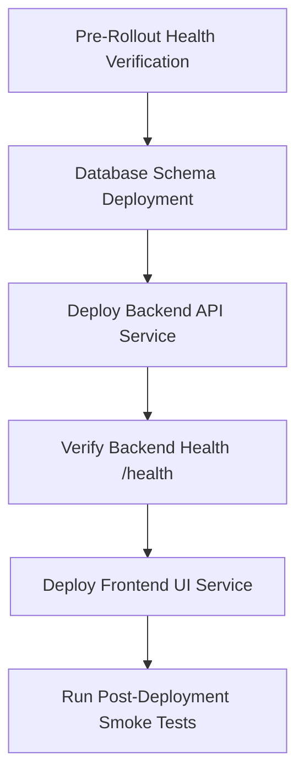

# Rollout & Rollback Operations Runbook: Flight Cancellation & Automated Refund System

This runbook outlines the deployment, verification, monitoring, and rollback operations for **Feature 12 (Flight Cancellation & Automated Refund System)**.

---

## 1. Prerequisites & Environment Check

Before proceeding with the rollout, ensure the following environment variables are synchronized across production containers:

### Required Variables
| Variable Name | Component | Expected Value / Purpose |
| --- | --- | --- |
| `DUFFEL_API_TOKEN` | API Backend | Authenticates synchronous Duffel order cancel & quote retrieve calls. |
| `STRIPE_SECRET_KEY` | API Backend | Authenticates Stripe Refund creation & reconciliation API calls. |
| `STRIPE_WEBHOOK_SECRET` | API Backend | Used to cryptographically verify `charge.refunded` webhook events. |

### Checklists
- [ ] Database credentials point to the production PostgreSQL cluster.
- [ ] Redis cluster is online and reachable.
- [ ] Stripe API is responding and webhook endpoints are configured to route to `/api/payments/webhook`.
- [ ] Duffel API credentials have sufficient permissions to create and retrieve cancellation quotes.

---

## 2. Step-by-Step Rollout Operations

Follow these steps in sequence to perform a zero-downtime deployment:



### Step 1: Pre-Rollout Health Verification
Verify that the current production deployment is healthy:
- Check that `GET /health` returns `200 OK` with all dependencies `up`.
- Confirm that error rates on `/api/bookings` are normal.

### Step 2: Database Schema Deployment
Run the Prisma migrations from the build server or release pipeline container:
```bash
npx prisma migrate deploy --schema=apps/api/prisma/schema.prisma
```
> [!IMPORTANT]  
> Do **NOT** use `prisma migrate dev` in production as it is interactive and could trigger database resets.

### Step 3: Deploy Backend API Service
Deploy the updated NestJS API backend package. 
- Ensure that the background worker/cron sweeps (`BookingIntentCron`, `PaymentCronService`) start up cleanly.

### Step 4: Verify Backend Health
Verify the backend deployment returns successful health signals:
- Hit `GET http://<backend_url>/health`.
- Assert that the database transaction response is within the `<150ms` range and reports status `ok`.

### Step 5: Deploy Frontend UI Service
Deploy the compiled Next.js production build package.
- Verify that standard page routing (/login, /register, /bookings) remains fully functional.

### Step 6: Post-Deployment Verification
Perform a quick manual smoke test using a staging or test booking:
1. Load a confirmed booking page `/bookings/<bookingId>`.
2. Confirm the **Cancel Booking** button is visible (and fare deadline is correctly displayed).
3. Request a cancellation quote, accept the terms, and confirm.
4. Verify the UI transitions to the `CANCELLED` or `CANCELLED_PENDING_REFUND` state.

---

## 3. Rollback Operations

In the event of critical failures (e.g. Stripe webhook failures, infinite retry loops, database contention), follow the rollback procedures below.

### Step 1: Roll Back Frontend UI
Revert the frontend service to the previous stable container image or git commit. This immediately stops users from requesting new cancellation quotes or submitting cancels.

### Step 2: Roll Back Backend API Service
Revert the API backend to the previous stable container image or git commit. This disables the cancellation endpoints and stops the background `PaymentCronService` from executing further refund retries.

### Step 3: Database Compatibility & Safe Rollback
Because the database migrations added nullable columns (`cancellationId`, `cancelledAt`, etc.) to the `Booking` and `Payment` tables, the previous stable backend version will continue to read and write database records cleanly without throwing runtime exceptions.
- **Do not roll back database migrations** immediately if customer data has already been written.
- If data cleanup is required, run targeted SQL queries to clear stuck claims:
  ```sql
  UPDATE "bookings"
  SET "status" = 'CONFIRMED'
  WHERE "status" = 'CANCELLATION_PENDING';
  ```

---

## 4. Monitoring & Telemetry Guidelines

Monitor production metrics and logs for 60 minutes post-deployment.

### Crucial Log Patterns to Watch
- **Successful Refund Recovery**: `[PaymentCronService] Background refund retry succeeded for refundId: <ID>`
- **Escalation Notification**: `[PaymentRefundService] Alert: Refund recovery failed terminally. Escalating refundId: <ID> to operator attention.`
- **CAS Claim Collision**: `[BookingService] Concurrency collision during cancellation quote claim. Refusing write for bookingId: <ID>`

### Alerting Thresholds
Set up automated notifications for the following conditions:
- **Refund Escalations**: Notify operators immediately if `Booking` status transitions to `REFUND_FAILED_NEEDS_ATTENTION`.
- **Duffel Failures**: Alert if Duffel API returns `5xx` error rate > `5%` over a 5-minute window.
- **Worker Crashes**: Alert if background cron logs show failures executing the sweep task.
