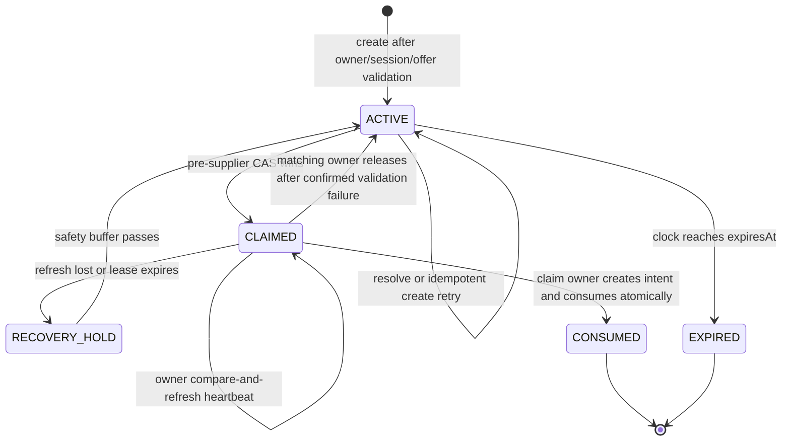

# Data Model: Chatbot Backend Infrastructure and Booking Handoff

## Authority Boundaries

| Store | Owned data | Explicit exclusions |
|---|---|---|
| PostgreSQL / NestJS | Soft-deletable ChatSession, encrypted ChatMessage/title envelopes, temporary inventoried legacy plaintext through reversible observation, BookingAgentProjection, ChatHandoff lifecycle, audit records | No plaintext handoff token or encryption key material; no ChatMessage/title plaintext after approved Phase 17/T102 |
| Redis / agent | Daily and burst counters, session lease, PII-free Trusted Search Snapshot | No message content, summary, token, passenger/contact/passport/payment data |
| LangGraph AgentState | Per-turn messages and typed routing/snapshot/handoff state | No service secret, raw JWT, API key, claim secret, payment data |
| Browser | Rendered messages and strict action-event state | No offer identifiers; token exists only transiently in the event/bootstrap POST and never in URL, browser storage, analytics, or readable cookies |

## Existing Durable Entities

### ChatSession

Existing Prisma model gains soft deletion so consumed handoff audit linkage remains representable.

| Field | Type | Rules |
|---|---|---|
| id | UUID | Primary key; used as correlation boundary, never accepted without owner validation |
| userId | UUID | Required relation to User; all access scoped by `{id, userId}` |
| titleCiphertext / titleNonce / titleAuthTag | nullable encrypted envelope | Record-bound AES-256-GCM title; prevents title-derived message/itinerary PII from remaining plaintext |
| titleKeyVersion | nullable positive int | External application key version |
| createdAt / updatedAt / lastActiveAt | timestamps | Existing lifecycle fields |
| deletedAt | nullable timestamp | Null while active; deletion revokes active handoffs and hides the session from ordinary queries without breaking consumed audit linkage |
| messages | ChatMessage[] | Durable raw messages and summaries |
| handoffs | ChatHandoff[] | New relation; cascade/restrict behavior described below |

### ChatMessage

Existing Prisma model is migrated from plaintext content to a record-bound authenticated-encryption envelope. Legacy plaintext column `content` dropped in approved Phase 8E / Phase 17 (T102).

| Field | Type | Rules |
|---|---|---|
| id | UUID | Primary key |
| sessionId | UUID | Required ChatSession relation |
| sender | USER or AGENT | Agent-authored batch endpoint must not permit a browser to forge AGENT messages |
| type | STANDARD or SUMMARY | Summary is additive; raw STANDARD messages remain |
| contentCiphertext | bytes/base64 string | AES-256-GCM ciphertext; associated data binds message id, session id, sender, type, and key version |
| contentNonce | bytes/base64 string | Unique 96-bit random nonce per encryption operation |
| contentAuthTag | bytes/base64 string | Authentication tag when not stored as part of ciphertext |
| contentKeyVersion | positive int | Selects the external application encryption key; key material never enters PostgreSQL |
| createdAt | timestamp | Immutable creation time |

Encryption and retention rules:

1. Only the NestJS chat domain and service-authenticated Agent Gateway may decrypt after owner/session authorization; controllers and repositories return no plaintext by default.
2. New writes are encrypted before persistence from the first live integration deploy. Backfill is restart-safe and verified decrypt/reencrypt equality.
3. Rotation writes with the active key version and re-encrypts old rows in bounded batches; retired keys remain only until database and backup retention windows no longer contain their ciphertext.
4. Legacy message/title plaintext dropped in migration `20260805010000_chat_message_plaintext_cleanup` (Phase 8E / T102); zero plaintext exists in database. Account/session retention cleanup removes ciphertext under policy; audits retain only value-free metadata.

### Booking and safe projection extension

Add a one-to-one `BookingAgentProjection` owned by NestJS rather than adding chatbot fields to Booking or deriving them from broad snapshots:

| Field | Type | Rules |
|---|---|---|
| bookingId | UUID | Private one-to-one Booking relation; never returned |
| agentReference | String | Unique opaque `bkref_<uuid>` lookup key |
| status | safe enum/string | Accepted summary status only |
| airline / origin / destination | strings | Accepted display logistics |
| departureAt / arrivalAt | timestamps | Accepted display logistics |
| durationMinutes / stopCount | integers | Accepted summary logistics |
| flightNumber / baggageSummary | nullable strings | Detail tier only |
| refundable / changeable | nullable booleans | Friendly detail-tier conditions only |
| createdAt / updatedAt | timestamps | Projection lifecycle |

The projection is populated transactionally at booking confirmation, updated on supplier synchronization, and backfilled before tool enablement. Agent gateway queries select only this table's allowlisted columns and include tests that fail if `flightSnapshot`, `passengerSnapshot`, payment, PNR, or provider payload columns are loaded.

Migration behavior:

1. Create one projection per existing Booking with a generated opaque reference and normalized allowlisted logistics extracted once during the controlled backfill.
2. Verify one-to-one completeness, reference uniqueness, accepted field shapes, and owner-scoped lookup before tool enablement.
3. New booking confirmation creates the projection in the same transaction; the application never accepts a client-supplied reference.
4. Booking primary key, PNR, provider identifiers, and raw snapshots remain excluded from agent projection queries.

## New Durable Entity: ChatHandoff

Suggested Prisma model shape:

| Field | Type | Rules |
|---|---|---|
| id | UUID | Random primary key; participates in token derivation but is never exposed |
| userId | UUID | Required User relation; indexed |
| chatSessionId | UUID | Required ChatSession relation; indexed with userId |
| flightOfferId | UUID | Required FlightOffer relation; prevents accepting arbitrary provider identifier |
| duffelOfferIdHash | String | SHA-256 of normalized Duffel offer ID for binding/audit without persisting another plaintext copy; exact ID remains on FlightOffer |
| snapshotVersion | Int | Positive version of the latest search snapshot |
| snapshotFingerprint | String | HMAC/SHA-256 fingerprint of normalized snapshot identity, not its display content |
| selectionAttestationHash | String | SHA-256 digest of the verified NestJS-signed attestation; plaintext attestation is not persisted on ChatHandoff |
| selectedOfferIndex | Int | One-based index, 1 through snapshot result count |
| tokenHash | String | Unique SHA-256 hash of normalized full token; plaintext never stored |
| tokenKeyVersion | Int | Positive version for HMAC secret rotation |
| idempotencyKeyHash | String | Unique hash of user/session/snapshot/result binding |
| expiresAt | DateTime | Must be later than creation and no later than configured max/offer freshness |
| claimedAt | nullable DateTime | Set by pre-supplier CAS claim |
| claimTokenHash | nullable String | Hash of an internal random claim token held only by the winning request |
| claimExpiresAt | nullable DateTime | Short lease bounding recovery after worker/supplier failure |
| claimRecoverAfter | nullable DateTime | Expiry plus uncertainty buffer; takeover is forbidden before this time after refresh loss |
| consumedAt | nullable DateTime | Set once by CAS when BookingIntent is created |
| consumedByBookingIntentId | nullable UUID | Unique optional BookingIntent relation; set atomically with consumedAt |
| createdAt | DateTime | Default now |
| updatedAt | DateTime | Updated automatically |

Recommended constraints and indexes:

- `@@unique([tokenHash])`
- `@@unique([idempotencyKeyHash])`
- `@@unique([consumedByBookingIntentId])` through the optional relation
- `@@index([userId, chatSessionId, expiresAt])`
- `@@index([flightOfferId, expiresAt])`
- `@@index([expiresAt, consumedAt])` for cleanup/telemetry
- `@@index([claimExpiresAt, consumedAt])` for abandoned-claim recovery
- `selectedOfferIndex > 0`, `snapshotVersion > 0`, `tokenKeyVersion > 0` enforced in service validation and migration SQL check constraints where supported

Relation deletion behavior:

- User deletion follows the documented account/booking retention policy and removes encrypted chat content while retaining only legally required value-free booking audit data.
- ChatSession uses `deletedAt`; soft deletion revokes active/claimed handoffs and ordinary session access, while the relation remains available for consumed handoff audit linkage. Physical cleanup occurs only after dependent retention permits it.
- FlightOffer deletion is restricted while an unexpired handoff references it; existing retention cleanup skips referenced offers.
- BookingIntent deletion is restricted by existing transactional retention; consumed handoff linkage is retained.

### Token derivation and verification

Normalized token format:

```text
chk_handoff_v{keyVersion}_{base64url(hmac_sha256(secret[keyVersion], id || idempotencyKeyHash))}
```

Persistence:

```text
tokenHash = sha256(normalized full token)
```

Rules:

- Use constant-time hash comparison after indexed lookup by hash.
- Never log the token, hash, HMAC input, query string, or idempotency key.
- An active idempotent retry finds the row by `idempotencyKeyHash` and re-derives the same token from `id`, binding, and key version.
- Key rotation keeps old configured verification keys until every token for that version has expired.

### Computed lifecycle state

`ChatHandoff` does not need a mutable status enum; compute it:

```text
ACTIVE        = consumedAt is null AND now < expiresAt AND (claimRecoverAfter is null OR now >= claimRecoverAfter)
CLAIMED       = consumedAt is null AND now < expiresAt AND claimExpiresAt > now
RECOVERY_HOLD = consumedAt is null AND claimExpiresAt <= now AND now < claimRecoverAfter
CONSUMED = consumedAt is not null
EXPIRED  = consumedAt is null AND now >= expiresAt
```

State transitions:



Invalid transitions:

- CONSUMED → ACTIVE is forbidden.
- EXPIRED → ACTIVE is forbidden; a fresh search/snapshot creates a new row.
- ACTIVE → CONSUMED without a claim is forbidden.
- CLAIMED → CONSUMED without a matching in-memory claim token and successfully created BookingIntent in the same transaction is forbidden.
- A non-owner or stale claim cannot call the supplier or mutate the handoff.
- Supplier hard timeout plus finalization margin must be less than the remaining claim lease. The owner watchdog compare-and-refreshes while work is live; refresh loss cancels the request, and a replacement cannot claim before `claimRecoverAfter`.
- Finalization revalidates the claim is unexpired and the bound ChatSession is active/not soft-deleted.

## Agent Runtime Models

### RouteDecision

Pydantic strict model returned by Router:

| Field | Type | Rules |
|---|---|---|
| intent | enum | GENERAL, SEARCH, BOOKING_INQUIRY, CHECKOUT only |
| confidence | float | Inclusive range 0.0–1.0; never trusted alone for checkout |
| commitment | bool | True only for explicit readiness to proceed, not preference/curiosity |
| selectionIndex | nullable int | One-based positive integer; only meaningful for checkout-like intent |

Unknown or extra properties fail validation. Raw reasoning is not requested or persisted.

### TrustedSearchResult

| Field | Type | Browser/LLM exposure |
|---|---|---|
| offerIndex | positive int | Number may be displayed |
| flightOfferId | UUID | Never |
| duffelOfferId | string | Never |
| airline | string | Allowed display |
| origin / destination | IATA strings | Allowed display |
| departureAt | ISO timestamp | Allowed display |
| arrivalAt | ISO timestamp | Allowed display |
| price | decimal string | Allowed for current search result display only |
| currency | ISO 4217 | Allowed display |

### TrustedSearchSnapshot

| Field | Type | Rules |
|---|---|---|
| schemaVersion | literal 1 | Reject unknown versions |
| snapshotVersion | positive int | Increment on each successful session search |
| userId | UUID | Must match authenticated request; not sent to model/browser |
| sessionId | UUID | Must match owned ChatSession; not sent to model/browser |
| createdAt / expiresAt | timestamps | TTL no longer than local offer freshness |
| fingerprint | string | HMAC/hash over normalized identity fields |
| selectionAttestation | signed opaque string | NestJS-issued, service-only binding of user/session/ordered offers/version/expiry; never sent to model/browser or persisted on ChatHandoff in plaintext |
| results | 1–5 TrustedSearchResult[] | Result index unique and contiguous from 1 |

Redis serialization is strict JSON. Before accepting it into AgentState, verify schema version, owner/session, expiry, result count/indexes, fingerprint, and absence of forbidden keys.

### CheckoutSignal

| Field | Type | Rules |
|---|---|---|
| requested | literal true | Present only after valid signal tool call |
| offerIndex | positive int | Must resolve in current snapshot |
| snapshotVersion | positive int | Copied from current snapshot |
| snapshotFingerprint | string | Copied from validated snapshot |

No token or service response is part of the signal.

### AgentState

```text
messages                 append-only list for this turn
routeDecision            RouteDecision | null
disambiguation           none | possible_checkout
trustedSearchSnapshot    TrustedSearchSnapshot | null
checkoutSignal           CheckoutSignal | null
actionHandoff            ActionHandoffEvent | null
iterationCount           per-specialist bounded counters
```

Removed fields: `pending_confirmation`, confirmation status, and broad `handoff_required` boolean.

### BookingSummaryProjection

Exact fields:

```text
bookingReference
airline
origin
destination
departureTime
arrivalTime
status
durationMinutes
stops
```

### BookingDetailProjection

Exact fields:

```text
all BookingSummaryProjection fields
flightNumber
baggageAllowance
changeable
refundable
```

Explicitly forbidden from both: Booking.id, PNR, Duffel IDs/payloads, price/currency, fare class, passenger count/details, passport/contact data, payment data.

### ActionHandoffEvent

Strict version 1 payload:

```text
version: 1
action: begin_checkout
handoffToken: chk_handoff_v...
expiresAt: ISO timestamp
display:
  airline
  origin
  destination
  departureAt
  arrivalAt
  price
  currency
```

Forbidden: URL, route, local/provider offer ID, session/user ID, raw response, PII, payment data, arbitrary metadata, unknown properties.

## Redis Records

### Daily budget

```text
key: chat:budget:{userId}:{UTC-YYYY-MM-DD}
value: integer accepted-message count
ttl: seconds until the next UTC date boundary plus a small cleanup cushion
```

One versioned Lua admission script evaluates burst and daily keys together and returns `allowed`, `reason`, `dailyUsed`, and `burstUsed`. It increments both counters only when both limits admit the request. A rejected request changes neither counter; Redis errors admit zero requests. The script derives/validates the caller-supplied UTC bucket and applies deterministic expiries so a date rollover cannot extend or shorten another bucket.

### Burst counter

```text
key: chat:burst:{userId}:{fixed-window-epoch}
value: integer
ttl: 60–120 seconds
```

The burst key is an input to the same Lua admission script; no sequential reserve/rollback implementation is permitted.

### Session lease

```text
key: chat:session-lock:{userId}:{sessionId}
value: {random lease token, monotonically increasing fencing token}
ttl: bounded above maximum turn duration
```

Acquire atomically with a per-session Redis sequence, `SET NX PX`, refresh only while owned, and release with compare-and-delete Lua. Every completed-turn/summary write and `ACTION_HANDOFF` emission carries the fencing token to NestJS or checks current ownership immediately before emission. Refresh loss cancels downstream work; a stale owner cannot persist or emit even if its model call returns after lease takeover. No recursive waiting beyond configured queue depth/timeout.

### Trusted snapshot

```text
key: chat:snapshot:{userId}:{sessionId}
value: strict TrustedSearchSnapshot JSON
ttl: min(snapshot expiry - now, configured maximum)
```

## Validation and Concurrency Invariants

1. A Router decision cannot create application state.
2. A CheckoutSignal cannot exist without a current validated snapshot and resolvable index.
3. A handoff cannot be created from conversation text, a browser/LLM-provided offer ID, an unsigned attestation, or a caller-provided idempotency key.
4. NestJS derives one idempotency binding from the verified attestation digest plus selected index; it has at most one ChatHandoff row.
5. One ChatHandoff has at most one consumed BookingIntent.
6. Resolution never sets consumedAt.
7. Only the active internal claim owner may call Duffel; final intent creation sets consumedAt and consumedByBookingIntentId only if the same transaction verifies that claim and creates the intent.
8. Losing/replayed requests make zero supplier/payment calls; the claim winner performs required supplier validation outside a database transaction, and payment/booking execution remains after committed intent creation under existing deterministic controls.
9. A token credential, even valid, is insufficient without the matching authenticated user and internally recovered owned ChatSession; client-supplied session IDs are ignored/rejected.
10. No durable or cached state introduced here contains passenger/contact/passport/payment PII in plaintext; ChatMessage content is authenticated ciphertext and no encryption key is stored with it.
11. Soft-deleting a ChatSession revokes active/claimed handoffs and prevents new writes while retaining consumed audit linkage.
