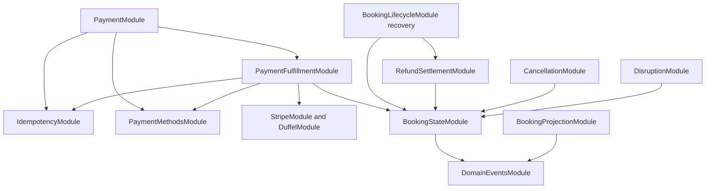

# Implementation Plan: Event-Driven Module Deepening

**Branch**: `024-event-driven-module-deepening` | **Date**: 2026-09-15 | **Spec**: [spec.md](spec.md)

**Review**: Converged 2026-09-16 with two Luna MAX reviewers; zero unresolved HIGH/CRITICAL findings. See [review record](reviews/convergence.md). Implementation remains unstarted.

## Summary

Extract payment confirmation into one concrete saga with provider ports, then replace direct booking projection calls with postcommit events. Preserve canonical financial transactions and public behavior. Reconciliation repairs the accepted commit-to-dispatch crash window.

## Technical Context

- TypeScript 5.4-compatible code, NestJS 10, Prisma 5/PostgreSQL, existing Stripe/Duffel wrappers and ScheduleModule.
- Add Nest-compatible `@nestjs/event-emitter` during implementation after peer-dependency verification; no dependency installed during planning.
- Add Booking.version and BookingAgentProjection.sourceVersion; retain existing payment/idempotency/ledger tables.
- Jest unit/database E2E, characterization suites and existing whole-stack smoke harness; Windows local development and CI.
- Preserve 25-second pending response and existing provider deadlines. Reconcile 100 candidates/pass, concurrency five, one-minute cadence.
- No financial eventual consistency, queues, generic saga/retry frameworks, distributed reconciliation lease or PII telemetry.

## Constitution Check

| Principle | Before and after design |
|---|---|
| Flight-first | Protects existing flight purchase; no supplementary scope |
| Deterministic boundary | Payment/ledger/status remain authoritative; events update derived views only |
| API budget | Reconciliation/hydration make no provider calls; adapters retain wrapper budgets |
| Observability/privacy | Bounded metrics and safe error codes; actual privacy verification is an implementation gate |
| Incremental delivery | US1 independently deployable; US2+US3 one complete projection cutover |

The constitution forbids big-bang releases; the user's supplied decision explicitly requests a nonproduction one-PR projection replacement without dual writes. Apply that specific scope only; do not amend the constitution globally. Keep additive schema and whole-slice rollback. All other gates pass by design and require implementation evidence.

## Project Structure

```text
specs/024-event-driven-module-deepening/
  spec.md plan.md research.md data-model.md quickstart.md tasks.md
  contracts/payment-fulfillment.md
  contracts/booking-events.md
  reviews/convergence.md
apps/api/src/
  payment-fulfillment/payment-fulfillment.module.ts
  payment-fulfillment/payment-fulfillment.saga.ts
  payment-fulfillment/ports/payment-gateway.port.ts
  payment-fulfillment/ports/fulfillment-gateway.port.ts
  idempotency/idempotency.module.ts
  idempotency/payment-idempotency.service.ts
  common/stripe-payment.adapter.ts
  duffel/duffel-fulfillment.adapter.ts
  payment/payment-methods.module.ts
  booking-lifecycle/booking-state.module.ts
  domain-events/domain-event.base.ts
  domain-events/booking.events.ts
  domain-events/refund.events.ts
  domain-events/domain-events.module.ts
  domain-events/booking-event-publisher.service.ts
  domain-events/booking-event-hydrator.service.ts
  booking-projection/booking-projection.module.ts
  booking-projection/booking-projection.listener.ts
  booking-projection/booking-projection.service.ts
  booking-projection/booking-projection.repository.ts
  booking-projection/booking-projection-reconciliation.service.ts
  booking-projection/booking-projection.metrics.ts
```

New paths are planned. Exact existing mutation/test paths are recorded in the contracts and tasks.

## Phase 0 — Research

Use [research.md](research.md) to resolve pseudocode omissions against current code. Nine external direct projection calls exist now, plus unprojected state mutations; the historical count of 12 is not a completion criterion. Re-inventory before editing.

## Phase 1 — Payment extraction (US1)

1. Characterize confirm HTTP 200/202, replay/error behavior, checkpoint recovery and compensation before moving code.
2. Move idempotency service/decorator into IdempotencyModule; update all consumers. Retain full service surface and add atomic fenced saga completion without changing create/ancillary completion semantics.
3. Define dependency-free port types/tokens; implement adapters in common/ and duffel/. Provider redaction/snapshot fallback remains adapter-owned. Preserve provider idempotency and metadata.
4. Extract confirmPayment, executeConfirmPayment, handleBackgroundError and confirmation-only helpers into saga. Keep createPayment/getPaymentStatus and create-only ancillary validation in PaymentService. Preserve canonical transaction bundles; no external calls while holding DB locks.
5. Register existing PaymentMethodService once in PaymentMethodsModule, imported by both PaymentModule and PaymentFulfillmentModule. Preserve consent and nonfatal save failure behavior.
6. PaymentController delegates confirmation directly to saga. PaymentModule imports PaymentFulfillmentModule; saga never imports PaymentModule. Cancellation retains PaymentModule for refunds. Recovery retains direct SDK wrappers.

Saga asserts acquired ownership immediately before every provider operation and again after queued adapter admission, using the full key/user/path/hash/lockedAt predicate. Losing ownership stops future effects and writes. Already-started remote effects still rely on existing provider idempotency, payment locks and authoritative recovery; see the payment contract.

### Adapter admission

Use a small per-adapter bounded semaphore, no new dependency. Defaults: Stripe 20 active calls, Duffel 10, each at most 100 waiters and five-second admission deadline; validate configurable positive bounded integers. Timeout/overflow means no provider call started. Release permits in finally and remove timed-out waiters. Existing SDK execution deadlines and provider budget/rate controls remain. This limits per-process concurrency, not fleet requests/second. Unknown external outcomes never become known failures merely because later admission failed.

## Phase 2 — Projection cutover (US2 with US3 ready)

### Acyclic ownership

BookingStateModule registers/exports existing provider-blind BookingLifecycleService with Prisma/DomainEventsModule. BookingLifecycleModule imports/re-exports it and retains recovery plus Stripe/Duffel/refund dependencies. Settlement/cancellation/disruption import BookingStateModule. This prevents lifecycle ↔ settlement recursion. PaymentMethodsModule similarly prevents saga ↔ controller-host recursion.



Projection writer imports no payment/cancellation/disruption/agent-gateway module. Safe readers retain their Prisma interface. AppModule registers EventEmitterModule.forRoot and BookingProjectionModule once.

### Transaction boundary

Lifecycle constructs booking events and increments version in the guarded mutation transaction. Caller-owned methods receive explicit transaction/event context and never flush. The outer transaction returns result plus events, then dispatches. Each retry creates a fresh collector; rollback discards it. Standalone methods own a transaction and use the same postcommit path. Saga passes context but never creates booking events. The contracts specify financial refund facts separately.

Publisher catches dispatch failures; listeners catch processing failures. Neither changes committed command results. Register listeners before accepting commands; test applications must initialize before mutation. In-process events are nondurable.

### Projection and repair

Hydrate booking plus chosen revision/ordered segments in a consistent snapshot. Cache the in-flight promise per processing cycle, not globally by booking ID. Persist hydrated version, never the older triggering version. Atomic conditional upsert only replaces lower sourceVersion; no optimistic retry framework. Preserve concurrent-insert winner's agentReference, extraction precedence and PII allowlist.

Reconciliation must exist before event-only activation: missing/stale rows, rotating keyset cursor across passes, 100 candidates per minute, concurrency five, no local overlapping passes, reset after range end. Multiple replicas may duplicate work safely. Missing unusable rows are observed/skipped. If an existing projection's current itinerary cannot be extracted, leave it stale and log failure; do not advance version using historical flight data or report repair. Backfill uses the same writer.

## Migration, activation and rollback

Versioned additive migration: Booking.version nonnull default 1, projection.sourceVersion nonnull default 0. Historical projections deliberately start stale. Retain table names/references. Stop old API writers before migration/cutover; no mixed versions. Activate all mutations, event routing and reconciliation together. Validate legacy fixtures and real module boot first; observe a full reconciliation traversal afterward.

Rollback: stop new API and run previous application against additive columns; do not roll back financial tables or drop columns. Old writers do not maintain Booking.version. Before reactivating new code after legacy writes, reset projection.sourceVersion to 0 in reviewed maintenance with writers stopped, then reconcile. Preserve all agent references.

## Validation

See [quickstart.md](quickstart.md). Required: provider order and ambiguity, all checkpoint resumes, HTTP parity, fencing, admission release, rollback/no-op suppression, nested transactions, retry collector isolation, coherent hydration, races, migration/backfill, fair repair, privacy and module boot. Real PostgreSQL proves transactional properties.

Run static CI contract, API lint/shared tests/typecheck/unit gates, database E2E and controlled-provider whole-stack smoke. Additional web/agent gates apply when their files/contracts change or smoke exposes regression. Record exit codes; planned tests are not executed evidence.

## Complexity Tracking

Two provider adapters implement approved isolation. BookingStateModule and PaymentMethodsModule resolve verified cycles without duplicating services. ProjectionRepository owns atomic writes and fair scans. Explicit postcommit context avoids nested premature emission. No generic transaction framework, event hierarchy, durable store or saga registry.
